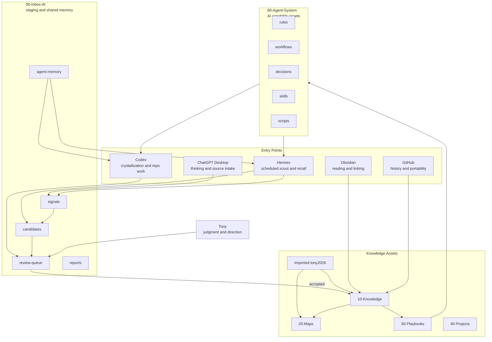

# 系统地图

## Reading Path

- Human daily entrance: [[Home]].
- AI shared memory entrance: [[00-Inbox-AI/MEMORY-PROTOCOL]].
- Agent capability entrance: [[90-Agent-System/README]].
- Cross-domain map entrance: [[20-Maps/总地图]].
- Legacy migration entrance: [[20-Maps/旧库迁移地图]].
