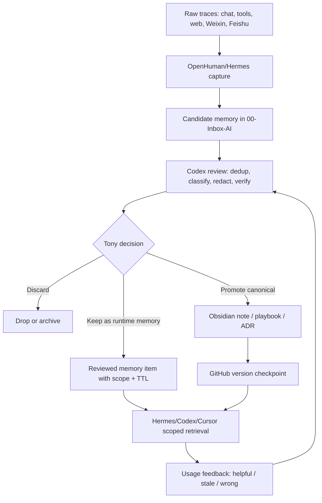

# Agent 记忆架构：持久化、上下文管理与隐私边界

## Executive Summary

本任务应进入 Tony review，建议决策为 `study -> build`：先沉淀正式学习笔记，再抽取一份 Hermes Memory 审查清单。

核心判断：

1. **Agent memory 不是“把聊天记录存起来”**。Microsoft Foundry、Mem0、Redis Agent Memory 和 Memory OS 都把记忆拆成捕获、抽取、合并、检索、注入、遗忘/治理几个阶段。
2. **长期记忆的关键质量指标不是召回量，而是可控性**。需要控制写入权限、记忆类型、作用域、来源、置信度、TTL、删除能力和注入预算。
3. **Tony 的 Cognitive OS 应把 Obsidian/GitHub 作为事实源，把 Hermes/OpenHuman memory 作为 recall/index 层**。Agent 记忆可以提升上下文恢复速度，但不能越权成为未经审查的长期真相。
4. **最值得优先落地的是“记忆晋升闸门”**：raw trace -> candidate memory -> reviewed memory -> canonical note / playbook / rule。这样能同时提升准确性、复用率和隐私控制。

## Learning Objectives

- 区分 session context、working memory、long-term memory、canonical knowledge。
- 建立四类记忆存储方案的比较框架：managed memory、dedicated memory layer、Redis-style memory/data layer、local Memory OS。
- 明确 Agent memory 的隐私和准确性风险：过度写入、跨任务污染、过期事实、prompt injection、memory poisoning、无法删除。
- 为 Hermes/Codex/OpenHuman/ECC 设计一套可执行的 memory promotion gate。

## Key Concepts

| Concept | Meaning | Design Implication |
|---|---|---|
| Session context | 当前会话窗口和临时状态 | 可自动注入；默认不长期保存 |
| Working memory | 当前任务中需要短期维持的目标、约束、步骤 | 应有 TTL，任务结束后总结或丢弃 |
| Long-term memory | 跨会话保留的偏好、项目状态、稳定事实、历史决策 | 必须有来源、作用域、更新时间和删除机制 |
| Canonical knowledge | 经 Tony/Codex review 后进入 vault 的正式知识资产 | 事实源；不能由 Hermes/OpenHuman 自动写入 |
| Memory extraction | 从对话、工具调用、文档中抽取候选记忆 | 应采用白名单和置信度，不应保存全量原文 |
| Memory consolidation | 合并重复、冲突和过期记忆 | 需要冲突处理策略和人工 review 面 |
| Memory retrieval | 根据当前任务取回小量相关记忆 | 应有 relevance threshold、scope filter 和 token budget |
| Memory injection | 把检索结果放入提示词或工具上下文 | 必须标注来源和可信级别，避免污染主任务 |
| Forgetting | 删除、TTL、降权、归档 | 是隐私能力，不是可选清理动作 |

## Source-Backed Research Notes

### Microsoft Foundry: 生产化记忆的基本框架

Microsoft Foundry Agent Service 将 memory 定义为跨会话保留的持久知识，并区分 short-term memory 与 long-term memory。它的 long-term memory 流程包括 extraction、consolidation、retrieval，并支持 item-level CRUD、store-level TTL、direct remember-or-forget 命令。它还明确提示 memory 存在 prompt injection 和 memory corruption 风险，需要做内容安全和对抗测试。

Source: https://learn.microsoft.com/en-us/azure/foundry/agents/concepts/what-is-memory?preserve-view=true&view=foundry

### Mem0: 专用长期记忆层

Mem0 将长期记忆定义为跨 session 保留并影响未来行为的事实、偏好和历史，而不是更大的 context window。它强调 memory layer 需要 event capture、representation、indexing/storage、retrieval、summarization/distillation、governance/privacy。它也指出直接把所有消息写入向量库会带来粒度混乱、写入不可控和检索噪音。

Source: https://mem0.ai/blog/how-to-create-ai-agents-with-long-term-memory

### Redis Agent Memory: 数据层和记忆层融合

Redis Agent Memory 主张 managed memory layer，覆盖 session-scoped working memory、跨会话 context、LLM-based extraction policies、semantic + metadata retrieval、自动总结和修剪。它的价值在于把 agent memory 与低延迟数据存储、向量检索、缓存能力合并到一个数据基础设施里。

Source: https://redis.io/agent-memory/

### Memory OS: Hermes 本地记忆系统的参考实现

Memory OS 是面向 Hermes Agent 的本地 memory operating system，提出 6 层结构：workspace prompt memory、session FTS、structured facts、cross-session fabric、Qdrant hybrid vector search、自维护 wiki。它的关键启发是“surgical context injection”：不是把所有记忆塞进 prompt，而是通过多源检索、阈值过滤、去重和上下文预算注入必要信息。

Source: https://github.com/yiyu404/memory-os

### Azure AI Foundry 持久记忆实践

Azure AI Foundry developer guide 类文章显示，agent memory 正在从概念变为工程实现问题：如何创建 memory store、如何写入和检索、如何把 profile / history / preferences 用于个性化。这类材料可作为实现参考，但不能替代正式架构原则。

Source: https://dev.to/monuminu/persistent-agent-memory-with-azure-ai-foundry-a-complete-developer-guide-1pom

## Comparison Map

| Pattern | Strength | Weakness | Fit For Tony |
|---|---|---|---|
| Generic vector DB memory | 快速上线；语义搜索简单 | 容易全量写入、粒度混乱、重复/过期事实堆积 | 只能做原型，不适合作为长期事实层 |
| Microsoft Foundry managed memory | 有 memory type、CRUD、TTL、remember/forget、preview 级治理能力 | 云平台绑定；preview 变化风险；与本地 vault 的事实源边界需额外设计 | 可作为生产化概念模型和云实现参考 |
| Mem0-style memory layer | 专注长期记忆；支持 user/agent scope、抽取、检索、维护 | 需要额外服务/API；事实源和隐私边界仍需自建规则 | 适合作为 OpenHuman/Hermes 的候选记忆层参考 |
| Redis Agent Memory | 低延迟数据层 + 向量/metadata retrieval + working memory | 容易被当成“万能状态库”；需设计 promotion/forgetting | 适合高频 agent runtime memory，不适合直接替代 Obsidian |
| Memory OS / local stack | 本地优先、Hermes-native、结构化事实、Qdrant、wiki pipeline | 项目成熟度和安全审计不足；运维复杂度高 | 适合作为 Tony 本地实验参考，但必须隔离测试 |
| Obsidian + GitHub canonical memory | 可读、可迁移、可审查、版本化 | 写入慢，需要人工确认 | 必须保持唯一长期事实源 |

## Hermes Gap Analysis

当前 Cognitive OS 已经有正确边界：

- Hermes/OpenHuman 写 `00-Inbox-AI/`。
- Codex 做 review、改写、去重、脱敏、归类。
- Tony 确认后才进入正式知识库。
- Obsidian + GitHub 是长期事实源。

主要缺口不是“缺一个记忆数据库”，而是缺少可执行的 memory quality loop：

| Gap | Risk | Proposed Control |
|---|---|---|
| 候选记忆缺少类型 | 偏好、事实、任务状态、观点混在一起 | memory_type: preference / fact / project_state / decision / workflow / source_note |
| 缺少作用域 | 一个项目的上下文污染另一个项目 | scope: personal / project / domain / tool / temporary |
| 缺少来源链 | Agent 不知道记忆从哪来 | source_url / source_note / source_conversation / captured_at |
| 缺少置信度 | 推断和事实混用 | confidence: asserted / inferred / unverified / contradicted |
| 缺少过期策略 | 旧事实长期误导 | ttl / review_after / deprecated_by |
| 缺少删除/遗忘流程 | 隐私风险不可控 | explicit forget queue + audit log |
| 缺少注入预算 | prompt 被历史记忆淹没 | max_memory_items + relevance threshold + per-task injection |

## Proposed Memory Promotion Gate



## Recommended Memory Schema

For `00-Inbox-AI/agent-memory/` or future reviewed memory queue:

```yaml
memory_id: ""
memory_type: preference | fact | project_state | decision | workflow | source_note
scope: personal | project | domain | tool | temporary
owner: tony | hermes | codex | openhuman
content: ""
source:
  kind: chat | web | file | tool | manual
  path_or_url: ""
captured_at: 2026-06-05
confidence: asserted | inferred | unverified | contradicted
sensitivity: public | internal | private | secret-adjacent
review_after: 2026-06-13
ttl: ""
status: candidate | reviewed | deprecated | forgotten
canonical_link: ""
```

## Practical Rules For Accuracy

- Do not store raw transcripts as long-term memory by default.
- Store small, typed, source-linked memory items.
- Treat inferred preferences as lower confidence than explicit user statements.
- Never let memory override direct current user instructions.
- Include `last_verified` or `review_after` for facts that can go stale.
- Add negative memory: “do not do X” should be first-class, not hidden in prose.
- Keep tool/runtime memory separate from canonical wiki knowledge.
- Every memory injected into a prompt should be explainable: source, scope, and reason for retrieval.

## Expert Review Questions

- Tony 是否希望 Hermes 记住“个人偏好”时需要显式确认，还是允许低风险偏好自动进入 reviewed runtime memory？
- 哪些记忆类型可以自动过期？例如临时项目状态、今日任务、搜索主题。
- 哪些记忆类型必须人工确认？例如身份、长期目标、公司/客户信息、架构决策。
- Hermes 的记忆注入是否应区分“当前任务相关”和“全局个性化”两条通道？
- OpenHuman Memory Tree 是否只作为 recall index，不作为事实源？

## Recommended Canonical Destination

If Tony approves:

- `10-Knowledge/AI-Cognitive-System/Agent 记忆架构.md`
- `30-Playbooks/Agent 记忆晋升与遗忘流程.md`
- `90-Agent-System/decisions/2026-06-xx-hermes-memory-boundary.md`

## Tony Review Request

建议决策：`study -> build`

```text
study: 继续补全成正式 Agent Memory 学习笔记
build: 生成 Hermes Memory 审查清单和 memory schema
watch: 保留观察，暂不改变系统流程
defer: 暂缓，先处理模型架构或业务成长主题
discard: 不继续处理
```

## Follow-Up Reminder Proposal

- First review: 2026-06-13 — Tony 选择是否进入正式知识库。
- Second review: 2026-06-20 — 如果 approved，检查 memory schema 是否已用于一个实际 Hermes/Codex 流程。
- Later review: 2026-07-05 — 复盘记忆准确性：哪些 memory 被复用、哪些误导、哪些应删除。

## Blockers / Verification Notes

- 已核验：Microsoft Foundry memory 文档、Mem0 长期记忆文章、Redis Agent Memory、Memory OS GitHub README、Azure AI Foundry 持久记忆实践文章。
- Towards AI 原文可能有访问限制，未作为强依据写入本包。
- Memory OS 目前看起来是早期项目，GitHub 页面显示提交和社区信号都很少；只能作为架构参考，不能直接作为生产推荐。
- 本包没有修改正式 `10-Knowledge/`、`20-Maps/`、`30-Playbooks/`、`40-Projects/` 或 `90-Agent-System/`。
