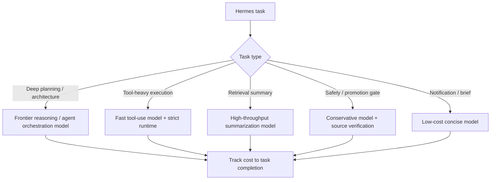

# 面向 Agent 的模型架构：从对话模型到长期执行模型

## Executive Summary

本任务应进入 Tony review，建议决策为 `study -> build`：先沉淀“Agent-friendly model”判断框架，再抽取 Hermes 模型路由清单。

核心结论：

1. **模型竞争正在新增一个维度：task completion under long-horizon agent workflows**。NVIDIA Nemotron 3 Ultra 和 Qwen3.7-Max 都把 agent workflows、长期执行、工具调用、编程/办公任务作为显式定位。
2. **“长上下文”不是 Agent 友好性的充分条件**。Agent 负载还要求多轮规划、工具调用稳定性、错误恢复、低延迟、高吞吐、低 token waste、可控成本和安全 runtime。
3. **推理瓶颈正在从单纯算力转向 memory bandwidth、KV cache、prefill/decode 调度和 continuous batching**。这直接影响 Hermes 这类长任务 agent 的成本和可靠性。
4. **Hermes 的模型选择不应只看通用榜单**。需要按任务类型路由：深度规划、代码执行、工具调用、检索总结、通知生成、长文压缩、安全审查，应使用不同模型/参数/上下文策略。

## Learning Objectives

- 区分对话型模型、推理型模型、Agent orchestration 模型和高吞吐执行模型。
- 建立 Agent-friendly model 的评价维度。
- 理解 KV cache、prefill/decode、multi-token prediction、MoE、hybrid Mamba-Transformer 对长任务 Agent 的影响。
- 为 Hermes/Codex/Claude Code/Cursor 建立模型路由与推理成本判断框架。

## Key Concepts

| Concept | Meaning | Agent Impact |
|---|---|---|
| Agent-friendly model | 为多轮规划、工具调用、长上下文、错误恢复和任务完成优化的模型 | 比单轮聊天质量更贴近 Hermes 负载 |
| Long-running workflow | 需要多轮推理、工具调用、观察、修正、委派和验证的任务 | token 数、状态漂移、成本和延迟都会快速上升 |
| Cost to task completion | 完成任务的总成本，而不是单 token 成本 | Agent 场景应看“完成一次任务花多少” |
| KV cache | 保存 attention key/value 以支持后续 token 生成 | 长上下文和长输出会放大显存压力 |
| Prefill | 处理输入 prompt 并构建 KV cache | compute-bound，适合大规模并行 |
| Decode / generation | 逐 token 生成输出 | memory-bound，低延迟场景难以靠堆算力解决 |
| Continuous batching | 推理服务动态插入/移除请求以提高利用率 | 提高吞吐，但可能与交互延迟冲突 |
| Prefill/decode disaggregation | 将 prefill 和 decode 分给不同资源池 | 降低相互干扰，但增加调度和 KV cache 传输复杂度 |
| Multi-token prediction | 单次前向预测多个未来 token | 可降低长输出和多轮任务生成时间 |
| Model routing | 按任务类型选择模型和推理策略 | Hermes 降成本、降延迟、提可靠性的核心机制 |

## Source-Backed Research Notes

### NVIDIA Nemotron 3 Ultra: Agent orchestration model signal

NVIDIA 官方技术博客明确将 Nemotron 3 Ultra 定位为服务 long-running agents 的开放模型。该模型是 550B 参数 MoE、55B active parameters，强调 frontier reasoning、agent orchestration、高吞吐、长上下文和工具链适配。博客还明确指出 long-running agent workflows 会使 token counts 快速增长，并带来成本和 goal drift 风险。

NVIDIA 的技术点包括：hybrid Mamba-Transformer layers、NVFP4 quantization、LatentMoE、multi-token prediction、Multi-Teacher On-Policy Distillation、Dynamo recipes for KV-aware routing / MTP / disaggregated prefill-decode。它还提到 Hermes Agent 是支持的 agent harness 之一。

Source: https://developer.nvidia.com/blog/nvidia-nemotron-3-ultra-powers-faster-more-efficient-reasoning-for-long-running-agents/

### Qwen Conference 2026: Agent-centric model positioning

Qwen Conference 2026 官方页面把 Steven Hoi 的 keynote 标为 “Qwen: Foundation Models for the Agent Era”，并将 Qwen3.7-Max 描述为面向 agent-centric era 的旗舰模型，强调 programming、office/productivity tasks 和 long-term autonomous execution。该页面还把 Agent Engine、Agentic Cloud、Agent Security Center、QoderWork、MuleRun 等放在同一场景里，说明 Qwen 不是只发布聊天模型，而是在构建 agent-native stack。

Source: https://www.qwencloud.com/events/qwen-conference-2026

### EDN: 推理瓶颈从 FLOPS 转向 memory bandwidth

EDN 的 LLM inference 分析将推理拆成 prefill 和 generation 两个阶段：prefill 阶段构建 KV cache，适合 GPU 并行；generation 阶段逐 token 生成，必须反复读取模型参数和 KV cache，因而更容易 memory-bound。文章还指出，在有实时延迟要求时，吞吐型 benchmark 可能掩盖 GPU 架构与 autoregressive inference 的不匹配。

Source: https://www.edn.com/the-hidden-bottleneck-in-llm-inference-and-the-impact-on-mlperf-benchmarking/

### Hermes captured signals

Hermes curated-scout 在 2026-06-04 至 2026-06-08 多轮扫描中反复捕获 Nemotron、Qwen、KV-cache、MTP、KVarN、AibleClaw、U2 native agent model 等信号。对本包来说，这些是趋势线索；正式判断仍以 NVIDIA、Qwen 官方页面和推理基础文章为依据。

Captured evidence:

- `00-Inbox-AI/hermes/curated-scout/20260604-210047-summary.md`
- `00-Inbox-AI/hermes/curated-scout/20260605-090000-morning-digest.md`
- `00-Inbox-AI/hermes/curated-scout/20260606-090023-summary.md`
- `00-Inbox-AI/hermes/curated-scout/20260608-090000-morning-digest.md`

## Comparison Map

| Dimension | General Chat Model | Agent-Friendly Model |
|---|---|---|
| Primary objective | Helpful response quality | Task completion across many turns |
| Context use | Long window as input capacity | Long window + stable state tracking + selective recall |
| Tool use | Can call tools when prompted | Tool call planning, validation, retry, recovery |
| Planning | Single answer or short chain | Multi-step decomposition and progress maintenance |
| Latency target | Human conversation feel | Long task throughput + acceptable interactive checkpoints |
| Cost metric | cost/token | cost/task, cost/successful-run, token waste |
| Reliability | Factuality, style, instruction following | no goal drift, no tool loop, no hidden state corruption |
| Runtime needs | API endpoint | KV-aware routing, prefill/decode strategy, safe sandbox, observability |
| Evaluation | Chat benchmarks, knowledge, coding | SWE-bench, Terminal-Bench, agent harness, long-horizon planning, recovery |



## Hermes Model Routing Implications

Hermes should not use one default model for every automation. Recommended first-pass routing:

| Hermes Workload | Model Requirement | Runtime Requirement |
|---|---|---|
| Daily scout summarization | cheap, high-throughput, stable summarizer | dedup, freshness window, source links |
| Learning task generation | reasoning + synthesis, moderate context | source trace + priority scoring |
| Codex promotion gate handoff | conservative reasoning, source verification | no canonical writes, no hidden memory changes |
| Deep research package | frontier reasoning, long context, tool use | checkpointing, source quality labels |
| Long-running coding agent | strong planning + code execution | sandbox, rollback, test loop |
| Memory consolidation | high precision extraction | provenance, sensitivity, TTL |
| Notification delivery | concise, low latency | rate limit and no noisy pushes |

## Practical Rules

- Evaluate models by `cost_to_correct_task_completion`, not raw chat quality.
- Long context should be used as a budgeted resource, not as a dumping ground.
- Use smaller models for high-volume extraction and notification.
- Use stronger models only for planning, ambiguity resolution, promotion gates, and safety-sensitive review.
- Track `tokens_per_successful_task`, `retry_count`, `tool_error_recovery`, `wall_clock_time`, and `human_correction_needed`.
- Treat vendor “agent model” claims as positioning until verified against your own Hermes tasks.
- Separate model capability from runtime safety: a strong agent model still needs sandbox, permissions, logs, and rollback.

## Expert Questions For Tony Review

- Hermes 是否需要一张正式的 model routing matrix？
- 当前哪些 Hermes cron 任务最浪费高阶模型调用？
- Codex promotion gate 是否必须固定使用“保守、强 source verification”的模型，而不是最快模型？
- 哪些任务应该以 `cost/task` 计费和复盘，而不是 `cost/token`？
- 是否需要建立一个 Hermes 模型评测集：每日 scout、学习任务、memory review、网页调研、代码修复各 3 个样例？

## Recommended Canonical Destination

If Tony approves:

- `10-Knowledge/AI-Model-Architecture/Agent 友好型模型架构.md`
- `10-Knowledge/AI-Engineering/LLM 推理瓶颈与 KV Cache.md`
- `30-Playbooks/Hermes 模型路由清单.md`
- `90-Agent-System/decisions/2026-06-xx-hermes-model-routing.md`

## Tony Review Request

建议决策：`study -> build`

```text
study: 继续补全成正式 Agent 模型架构学习笔记
build: 生成 Hermes 模型路由矩阵和评测样例
watch: 保留观察，等待更多 Qwen/Nemotron/Unisound U2 独立评测
defer: 暂缓，优先处理安全治理或可信记忆任务
discard: 不继续处理
```

## Follow-Up Reminder Proposal

- 2026-06-14: Tony review 是否需要建立 Hermes model routing matrix。
- 2026-06-21: 用 3 个真实 Hermes/Codex 任务测试模型路由：scout、learning package、promotion gate。
- 2026-07-01: 复盘模型调用成本、任务成功率、重试次数和人工修正次数。

## Blockers / Verification Notes

- 已核验：NVIDIA Nemotron 3 Ultra 官方技术博客、Qwen Conference 2026 官方页面、EDN 推理瓶颈文章。
- YouTube keynote 原视频在本环境中被 throttled，未直接打开；Qwen 官方 conference 页面足以确认“Foundation Models for the Agent Era”和 Qwen3.7-Max 的 agent-centric positioning。
- Qwen3.7 的具体 benchmark 和 35 小时执行演示未做一级来源核验；本包只使用官方页面中可验证的定位，不把第三方 benchmark 作为事实基础。
- 本包没有修改正式 `10-Knowledge/`、`20-Maps/`、`30-Playbooks/`、`40-Projects/` 或 `90-Agent-System/`。
