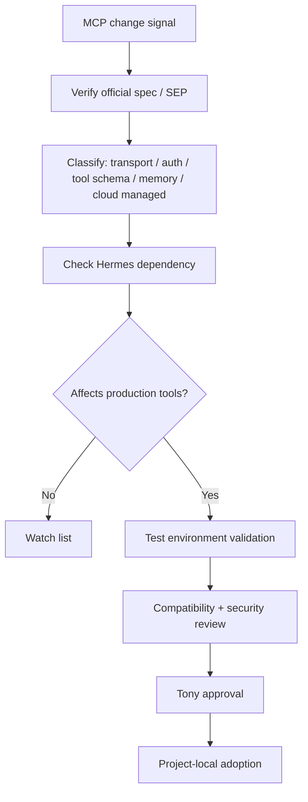

# MCP 协议深度研究：Streamable HTTP 与无状态化演进

## Executive Summary

本任务值得进入 Tony review，但不应直接进入正式知识库。原因有三点：

1. **MCP 已经从本地工具协议走向生产基础设施协议**：官方 transport 文档显示 Streamable HTTP 已替代旧的 HTTP+SSE transport，并要求处理版本协商和兼容性。
2. **无状态化是关键架构方向**：SEP-2575 明确指出 MCP 当前 stateful initialization handshake 会带来扩展、容错和实现复杂度问题，并提出让请求尽量 self-contained。
3. **云厂商正在把 MCP 接入数据与 Agent 平台**：Google Cloud Storage MCP server、Azure Cosmos DB MCP Toolkit / Agent Memory Toolkit 都显示 MCP 正成为 Agent 访问企业数据、记忆和工具的标准接口之一。

但本任务中的部分来源存在验证风险：`agentmarketcap.ai/blog/2026/06/07/...` 是未来日期 URL，当前未能直接验证；`byteiota.com/mcp-stateless-2026-release-candidate/` 与可访问 URL 不完全一致。建议先将本包作为 `study` / `decision memo` 候选，而不是直接沉淀为 active 架构判断。

## Learning Objectives

- 理解 MCP transport 从 HTTP+SSE 到 Streamable HTTP 的实际变化。
- 理解 MCP stateful -> stateless 的架构动机和生产影响。
- 建立 Hermes/Codex/Cursor 工具链的 MCP 升级观察清单。
- 区分“官方规范事实”“云厂商落地信号”“二级技术媒体分析”。

## Key Concepts

| Concept | Meaning | Why It Matters |
|---|---|---|
| Streamable HTTP | MCP 新 transport，替代 2024-11-05 版本的 HTTP+SSE transport | 影响远程 MCP server 的部署、兼容性、恢复能力 |
| Protocol version header | HTTP 请求中携带 `MCP-Protocol-Version` | 多版本兼容和渐进升级的基础 |
| Stateless MCP | 每个请求携带足够上下文，尽量不依赖服务端会话状态 | 允许普通负载均衡、水平扩展、故障恢复 |
| `Mcp-Method` / `Mcp-Name` headers | SEP-2243 提出的 HTTP header 标准化 | 让代理、LB、observability 工具不用解析 JSON body 也能路由和观测 |
| Remote MCP Server | 由云厂商托管的 MCP endpoint | 减少自建运维，但增加平台依赖和数据治理要求 |
| Local MCP Server | 本地或自管 MCP server | 适合自定义业务逻辑、脱敏和内部系统接入 |

## Domain Structure Map

- Goal: 评估 MCP 升级对 Hermes Cognitive OS 的影响。
- Roles:
  - Hermes: MCP client / gateway / scheduled automation consumer.
  - Codex: MCP 配置审查、工具接入边界、promotion gate。
  - Cloud providers: MCP server / managed connector provider。
  - Tony: 审查哪些 MCP 工具可以进入长期运行系统。
- Core process:
  - 发现 MCP 变化 -> 验证官方规范 -> 检查 Hermes 当前依赖 -> 建立迁移/观察清单 -> 只在测试环境验证 -> 再考虑正式接入。
- Metrics:
  - latency, reliability, tool-call success rate, auth/audit coverage, context overhead, recovery behavior。
- Key problems:
  - stateful session stickiness, reconnect complexity, tool schema bloat, auth/audit gaps, secret exposure, vendor-specific MCP behavior。
- Solution families:
  - Streamable HTTP, stateless requests, header-based routing, remote managed servers, local custom servers, registry/security scanning。
- Failure modes:
  - premature upgrade, incompatible clients, sensitive fields mirrored into headers, remote MCP over-permission, broken version negotiation。

## Expert Questions

- Hermes 当前使用的 MCP servers 是否依赖 session affinity 或 `Mcp-Session-Id`？
- 哪些 MCP servers 必须保持 local/self-managed，哪些可以试 remote managed endpoint？
- MCP 工具参数里是否有 token、PII、内部路径等不应暴露到 headers/logs 的字段？
- Codex promotion gate 是否应该新增 MCP 接入审查清单？
- 是否需要为 MCP server 建立 allowlist、version pinning、security review 和 rollback plan？

## Research Notes

### 官方 transport 事实

Model Context Protocol 官方 transport 文档说明，Streamable HTTP replaces the HTTP+SSE transport from protocol version `2024-11-05`，并提供 backwards compatibility 做法：旧客户端可先 POST `InitializeRequest`，失败后再尝试旧 SSE endpoint。文档还规定 HTTP 请求应携带 `MCP-Protocol-Version`，否则服务器可按兼容策略假设旧版本。

Source: https://modelcontextprotocol.io/docs/concepts/transports

### 无状态化动机

SEP-2575 将 “Make MCP Stateless” 标为 Final Standards Track。它的核心论点是：当前 MCP 的 initialization handshake 形成 server-side session state，使普通 L4/L7 round-robin load balancing 变困难，并增加故障恢复、重连和服务端内存管理复杂度。SEP 的目标是把复杂度变成 pay-as-you-go：默认请求尽量 self-contained，只有确实需要时才引入 stateful 长连接。

Source: https://modelcontextprotocol.io/seps/2575-stateless-mcp

### Header 标准化与安全边界

SEP-2243 说明，Streamable HTTP transport 会将关键 routing/context 字段映射到 HTTP headers，比如 `Mcp-Method` 和 `Mcp-Name`。这有利于 load balancer、proxy 和 observability 系统处理请求，但也引入信息暴露风险。该 SEP 明确建议不要把 password、API key、token、PII 标记为 header 参数。

Source: https://modelcontextprotocol.io/seps/2243-http-standardization

### 2026-07-28 RC 状态

NewReleases 的 MCP 2026-07-28-RC 页面显示该版本是 release candidate，spec 仍未 final，且可能在 final release 前发生变化；SDK 也会按自身节奏采用该版本。因此 Hermes 不应在没有测试的情况下立即切换核心 MCP 依赖。

Source: https://newreleases.io/project/github/modelcontextprotocol/modelcontextprotocol/release/2026-07-28-RC

### 云厂商落地信号

Google Cloud 的 GCS MCP server 案例强调用 MCP 将 Agent 连接到非结构化数据，并区分 Remote MCP server 和 Local MCP server。Remote 适合减少基础设施负担，Local 适合自定义业务逻辑和安全处理。Google 还强调 IAM、Cloud Audit Logs、Model Armor 等治理能力。

Source: https://cloud.google.com/blog/topics/developers-practitioners/build-ai-agents-faster-with-gcs-google-cloud-storage-mcp-server

Microsoft Azure Cosmos DB 文章显示，Azure Cosmos DB MCP Toolkit 已 GA，Agent Memory Toolkit 处于 Public Preview，MCP 正被用于 agent data access、memory 和 retrieval quality。这个信号与 Tony 的 Agent memory / Hermes memory 方向高度相关。

Source: https://devblogs.microsoft.com/cosmosdb/announced-at-ms-build-2026-azure-cosmos-db-mcp-toolkit-semantic-reranking-global-secondary-indexes-and-more/

## Map Or Comparison

| Layer | Current / older pattern | Streamable HTTP / stateless direction | Hermes implication |
|---|---|---|---|
| Transport | HTTP+SSE, local stdio, session-oriented flows | Streamable HTTP, versioned HTTP endpoint | Remote MCP becomes more practical |
| State | Initialization handshake + session state | Self-contained request metadata | Less sticky-session complexity |
| Routing | Proxy may need body inspection or sticky routing | `Mcp-Method`, `Mcp-Name`, optional param headers | Better observability, but header leak risk |
| Compatibility | Old clients/servers vary | Need version negotiation and fallback | Pin versions; test per server |
| Security | Tool boundary often implicit | Headers and remote managed servers broaden exposure surface | Add MCP security gate before adoption |



## Practice Questions

- 如果某个 MCP server 需要 session affinity，它在 stateless migration 后会坏在哪里？
- 如果工具参数 `customer_id`、`region`、`api_key` 都可以映射到 header，哪些允许，哪些必须禁止？
- Hermes 如果要接入 GCS Remote MCP Server，应优先审查 IAM、Audit Logs 还是 tool schema？
- 什么情况下 local MCP server 比 remote managed endpoint 更适合 Tony 的 Cognitive OS？

## Recommended Canonical Destination

- `10-Knowledge/AI-Engineering/MCP 协议演进与生产化.md`
- `30-Playbooks/MCP 接入审查清单.md`
- `90-Agent-System/decisions/2026-06-xx-mcp-upgrade-watchlist.md`

## Tony Review Request

建议决策：`study`

请 Tony 选择：

```text
study: 继续补全成正式学习笔记 + MCP 接入审查清单
watch: 只保留观察，等 2026-07-28 final spec 后再行动
build: 立即生成 Hermes MCP 安全审查 playbook
defer: 暂缓，先处理 Agent Memory 或业务成长主题
discard: 不继续处理
```

## Follow-Up Reminder Proposal

- First review: 2026-06-11 — 检查官方 RC、Hermes 当前 MCP 依赖、是否需要 watchlist。
- Second review: 2026-07-29 — 2026-07-28 final spec 后复核 breaking changes。
- Later review: 2026-08-15 — 如果 SDK / Hermes / Codex 工具链开始采用新版本，生成迁移计划。

## Blockers / Verification Notes

- 已核验：MCP 官方 transport 文档、SEP-2575、SEP-2243、NewReleases RC 页面、Google Cloud GCS MCP 文章、Microsoft Azure Cosmos DB MCP Toolkit 文章。
- 原 Hermes task 中 `agentmarketcap.ai/blog/2026/06/07/...` 为当前日期之后的 URL，未直接验证。
- 原 Hermes task 中 `byteiota.com/mcp-stateless-2026-release-candidate/` 未直接命中；可访问的相近 URL 是 `https://byteiota.com/mcp-stateless-spec-2026-release-candidate/`。
- 本包没有修改正式 `10-Knowledge/`、`20-Maps/`、`30-Playbooks/`、`40-Projects/` 或 `90-Agent-System/`。
