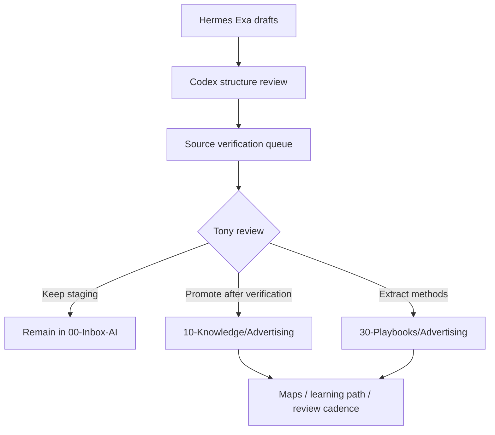

# 广告投放领域知识结晶：Hermes 草稿到正式知识库的入库审查包

## Executive Summary

本任务是一个**知识结晶 gate**，不是普通调研任务。Hermes 已经基于 Exa 搜索生成 5 个广告投放 draft，并且 Tony 已确认方向可行。本次 Codex 处理的结论：

1. **结构质量可进入 review**：5 个 draft 覆盖了领域全貌、专家问题、一页复习卡、新手误区/高手权衡、MOC，总体符合 [[30-Playbooks/领域专家感学习法]] 的输出包要求。
2. **正式入库前必须补来源校验**：所有 5 个 draft 都带有 `source_status: needs-url-verification` 或等价风险，尤其是 benchmark、比例、渠道 ROAS、CPI、IVT、CAPI 恢复比例等数字。
3. **当前仓库里已存在 Advertising canonical tree**：`10-Knowledge/Advertising/` 已有一批正式目录和种子笔记，但本次 heartbeat 禁止 canonical 写入，因此只记录审查结论，不修改正式区。
4. **建议 Tony 决策为 `review -> promote-with-verification`**：先确认结构和学习路径，再让 Codex 做一次 bounded source-verification pass；验证后再决定是否将现有 canonical tree 接受为正式资产。

## Source Drafts Reviewed

| Draft | Role | Size / Shape | Codex Assessment |
|---|---|---|---|
| `00-Inbox-AI/hermes/广告投放领域全貌图.md` | 领域 master map | 12 节，目标/角色/流程/指标/问题/架构/方案/趋势/学习路径 | 可作为 MOC/全貌图源材料；数字和趋势需校验 |
| `00-Inbox-AI/hermes/广告投放专家问题解答.md` | 专家问题深答 | 10 问，覆盖 UA、SKAN、增量、PMP、IVT、Cookie、组织 KPI | 价值高；应拆成主题笔记/场景案例/playbook，不宜整篇原封入库 |
| `00-Inbox-AI/hermes/广告投放一页复习卡.md` | 快速复习卡 | 一页框架，生态/指标/三板斧/五坑/锚点 | 适合作为 playbook；所有数字锚点必须标注适用范围 |
| `00-Inbox-AI/hermes/广告投放新手误区与高手权衡.md` | 误区/权衡 | 10 个误区 + 6 个权衡 | 适合作为训练“专家问题感”的 playbook |
| `00-Inbox-AI/hermes/广告投放专题总览.md` | MOC | 快速入口、主线、进阶层、实战层级 | 适合作为 Advertising domain 入口，但依赖大量目标 wikilink |

## Learning Objectives

- 把广告投放从“平台操作知识”提升为一个可学习的领域系统。
- 明确哪些内容适合进入 `10-Knowledge/Advertising/`，哪些适合进入 `30-Playbooks/Advertising/`。
- 建立一个 source-verification queue，防止未核验 benchmark 污染正式知识库。
- 为后续 Hermes 自动搜集广告领域资料提供更精确的任务类型。

## Domain Structure Map

广告投放领域应按 6 层组织：

| Layer | Meaning | Canonical Target |
|---|---|---|
| 生态与链路层 | Advertiser / DSP / SSP / ADX / Publisher / MMP / RTB | `10-Knowledge/Advertising/05-Topics/RTB 与程序化广告链路.md` |
| 指标与经营层 | ROAS / CAC / LTV / Payback / Margin / Cash Constraint | `10-Knowledge/Advertising/05-Topics/指标体系与口径治理.md` |
| 归因与实验层 | MMP / SKAN / CAPI / Incrementality / MMM / Geo Holdout | `10-Knowledge/Advertising/05-Topics/归因、SKAN 与信号损失.md` |
| 流量质量层 | IVT / Ad Fraud / Brand Safety / Viewability / SPO | `10-Knowledge/Advertising/05-Topics/广告欺诈与品牌安全.md` |
| 组织治理层 | UA / Product / Data / Finance / Incentive Alignment | `10-Knowledge/Advertising/05-Topics/UA、产品与财务指标协同.md` |
| Playbook 层 | 复习卡、误区、预算、巡检、异常排查 | `30-Playbooks/Advertising/` 或 domain-local playbook folder |



## Promotion Target Recommendation

Do not promote as five raw files. Split by knowledge type:

| Source | Recommended Handling |
|---|---|
| `广告投放专题总览.md` | Domain MOC: `10-Knowledge/Advertising/专题总览.md` |
| `广告投放领域全貌图.md` | Map: `10-Knowledge/Advertising/06-Maps/广告投放总览图.md` plus topic backlinks |
| `广告投放专家问题解答.md` | Split into topic/case notes: SKAN, incrementality, UA budget, IVT, KPI governance |
| `广告投放一页复习卡.md` | Playbook: `30-Playbooks/Advertising/广告投放一页复习卡.md` |
| `广告投放新手误区与高手权衡.md` | Playbook: `30-Playbooks/Advertising/广告投放新手误区与高手权衡.md` |

## Current Canonical Tree Observation

The repository currently contains a non-trivial Advertising tree under `10-Knowledge/Advertising/`, including:

- `05-Topics/`
- `06-Maps/`
- `08-Onboarding/`
- `10-Playbooks/`
- `11-Combo-Cases/`
- `12-Runbooks/`
- `13-Incident-Cases/`
- `学习路径.md`
- `学习进度.md`
- `恢复笔记.md`
- `来源与校验.md`

This looks like the intended crystallized structure, but it is currently outside this heartbeat's allowed action scope. Treat it as **pre-existing or separately generated material requiring Tony review**, not as material accepted by this run.

## Source Verification Queue

High-risk claims to verify before final acceptance:

| Claim Type | Examples | Required Source Level |
|---|---|---|
| Industry benchmark | CPI, D7/D30 ROAS, payback thresholds | L2: AppsFlyer / Adjust / Singular / Liftoff / Sensor Tower reports |
| Fraud rates | IVT %, CTV fraud %, Open Exchange fraud rate | L2/L1: DoubleVerify / IAS / HUMAN / MRC / IAB |
| Platform signal recovery | Meta CAPI 20-35%, Google EC 5-15% | L1/L2: Meta / Google docs or credible measurement partner reports |
| SKAN mechanics | conversion windows, fine/coarse values | L1: Apple docs / MMP docs |
| Incrementality guidance | Geo Holdout length, sample/budget thresholds | L2/L3: platform docs, MMP methodology, measurement papers |

## Expert Questions For Tony Review

- 你希望 Advertising 这个领域优先服务哪类目标：理解领域、指导业务决策、还是训练专家问题感？
- 是否接受当前结构把“程序化广告 / 移动 UA / 测量归因 / 反作弊 / 组织治理”放在同一个 Advertising 领域下？
- 是否需要把移动游戏 UA 单独拆成子领域？
- 复习卡里的数字锚点是否应该保留为“记忆锚点”，还是全部降级到“待校验案例数据”？
- 是否允许 Codex 下一步做 URL-level source verification，然后再建议正式 promote？

## Recommended Tony Decision

建议决策：`review -> verify -> promote`

```text
review: Tony 先确认领域结构和学习路径是否符合预期
verify: Codex 对关键 benchmark 和比例做 URL 级来源校验
promote: 校验后接受/修正当前 Advertising canonical tree
defer: 暂缓广告领域，优先处理 AI Agent P1 任务
discard: 不继续处理这批广告 draft
```

## Follow-Up Reminder Proposal

- 2026-06-08: Tony review Advertising 结构和学习路径。
- 2026-06-10: Codex source-verification pass，优先校验 10 个关键数字。
- 2026-06-12: 决定是否正式接受 Advertising canonical tree，并建立后续 Hermes 专题任务。

## Blockers / Verification Notes

- 本次未写入或修改 `10-Knowledge/Advertising/`，因为 heartbeat 明确禁止 canonical promotion。
- Drafts 的结构可用，但 source status 仍是 `needs-url-verification`。
- 当前仓库已有 Advertising canonical 文件，但本次未判断其是否应被接受为正式版本。
- `30-Playbooks/Advertising/` 在当前命令检查中不存在，但 `10-Knowledge/Advertising/10-Playbooks/` 已存在；需要 Tony/Codex 后续决定 playbook 是全局存放还是 domain-local 存放。
