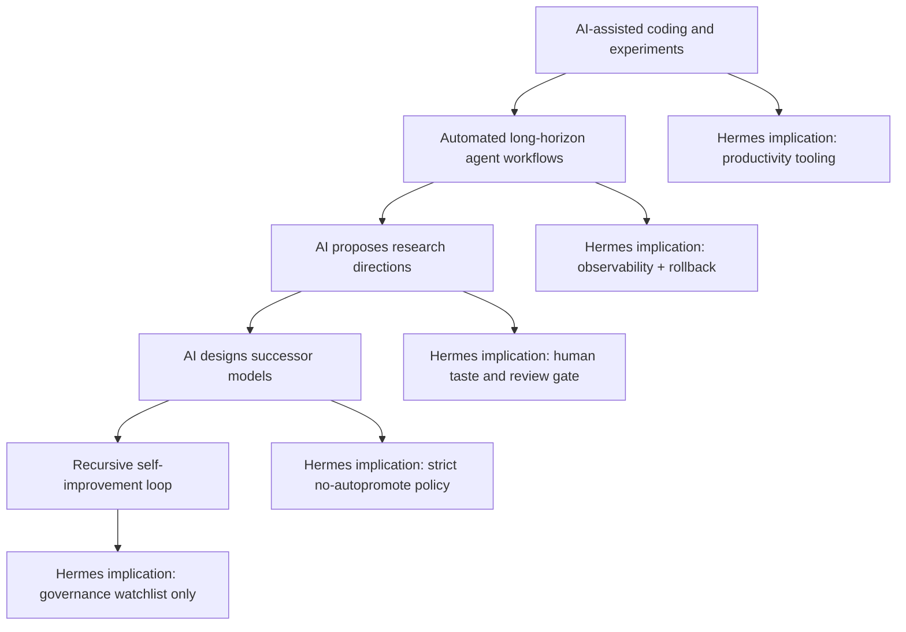

# AI 递归自我改进：从能力加速到治理闸门

## Executive Summary

本任务应进入 Tony review，建议决策为 `study -> watchlist`，不建议直接写成确定性判断。

核心结论：

1. **递归自我改进（recursive self-improvement, RSI）仍未被证明已经完整发生**。Anthropic 官方明确说“尚未到达 full recursive self-improvement”，但同时认为 AI 已在加速 AI 系统开发。
2. **更确定的事实是“AI-assisted AI development”正在形成生产现实**。Anthropic 披露其工程和研究流程中 AI 编码、实验执行、代码审查、长任务处理能力快速提升。
3. **Son / SoftBank 关于 OpenAI 下一代模型由 AI 设计的说法是高价值信号，但不是已验证事实**。OpenAI 目前没有公开确认该描述。应作为 watch signal，而不是 canonical fact。
4. **对 Hermes Cognitive OS 的直接启示不是“让 Agent 自我改进”，而是建立 self-improvement gate**：任何自动生成 skill、rule、memory、workflow、MCP 接入、模型路由规则，都必须经过可观测、可回滚、可审查的闸门。

## Learning Objectives

- 区分 `AI-assisted development`、`automated AI R&D`、`recursive self-improvement` 三个层级。
- 理解为什么“AI 写更多代码”不等于“AI 自主改进自身”。
- 建立 Hermes/Codex/Claude Code/Cursor 的自我改进安全边界。
- 把 RSI 话题从宏观叙事转成可执行的 agent system review checklist。

## Key Concepts

| Concept | Working Definition | Evidence Level |
|---|---|---|
| AI-assisted AI development | AI 辅助人类写代码、跑实验、做代码审查、分析结果 | High：Anthropic 官方披露、行业普遍可见 |
| Automated AI R&D | AI 能在给定目标和评分函数下独立执行研究项目 | Medium：已有实验和 benchmark，但仍由人定义问题/评价 |
| Recursive self-improvement | AI 系统能自主设计、训练、评估并部署其 successor | Low/Watch：Anthropic 明确称未达到；Son/OpenAI 说法未被 OpenAI 确认 |
| Capability acceleration | AI 开发 AI 带来的研发周期压缩 | High：工程产能、长任务能力、benchmark 趋势支持 |
| Loss of control risk | 当模型参与自身后继系统开发时，人类监督、验证、对齐能力可能跟不上 | Medium：安全推理强，但具体路径仍不确定 |
| Governance gate | 对 self-improvement 类动作设置权限、审查、日志、回滚和停机边界 | High：对 Tony 系统可直接落地 |

## Source-Backed Research Notes

### Anthropic 官方：尚未 full RSI，但 AI 正加速 AI development

Anthropic Institute 的 “When AI builds itself” 是本任务最强来源。它明确区分当前状态和未来 RSI：当前 AI 正在加速 Anthropic 的开发流程，但 full recursive self-improvement 尚未发生，也不是必然。其公开证据包括：AI 参与工程编码、长任务能力增长、研究实验执行能力提升、代码审查成为瓶颈等。

Source: https://www.anthropic.com/institute/recursive-self-improvement

### Anthropic / AP：提出“可协调暂停”的治理需求

AP 对 Anthropic 文章的报道确认了核心治理主张：Anthropic 希望行业有可协调、可验证的暂停或放缓机制，以便社会结构和 alignment research 跟上能力增长。AP 也提到 OpenAI 公开主张民主政府应最终决定规则、保障和问责机制。

Source: https://apnews.com/article/anthropic-artificial-intelligence-ai-938c99158e5953601cf3322f1cec12af

### OpenAI 官方：强调民主治理和 frontier safety framework

OpenAI 在 2026-06-03 发布 frontier AI governance blueprint，提出美国应建立 durable federal framework、强化 CAISI，并动员政府层面的 resilience plan。OpenAI 另在 Frontier Governance Framework 中覆盖 cyber offense、CBRN、harmful manipulation、loss of control、model reporting、incident response、external expert input 等风险。

Sources:

- https://openai.com/index/frontier-safety-blueprint/
- https://openai.com/index/openai-frontier-governance-framework/

### SoftBank / Son 信号：高影响但低可验证度

TechBuzz 汇总报道称，Masayoshi Son 在 CNBC 采访中称 AI 正在设计 OpenAI 下一代模型，并将 ASI 时间线判断前移。这个信号对行业叙事影响很大，但它来自投资人和媒体转述；OpenAI 尚未公开确认其内部模型开发流程被准确描述。因此该信号应进入 watchlist，而不是作为事实写入 canonical note。

Source: https://www.techbuzz.ai/articles/ai-now-designing-openai-s-models-son-revises-asi-timeline

### Mythos / cyber capability 信号：能力加速的安全侧证据

TechCrunch 报道称 NSA 正准备或已在评估 Anthropic Mythos 用于 cyber operations，且该报道引用 Financial Times 匿名来源；Anthropic 自身的 red-team cyber range 页面也显示模型在受控网络模拟中的自主 cyber workflow 能力增长。这个信号不直接证明 RSI，但说明更强模型 + 工具链会加速高风险技术任务。

Sources:

- https://techcrunch.com/2026/06/05/nsa-said-to-be-readying-anthropics-mythos-for-use-in-cyber-operations/
- https://red.anthropic.com/2026/cyber-toolkits-update/claude_hacking_evolution_v4

## Comparison Map

| Dimension | Human-led AI R&D | AI-assisted AI R&D | Full RSI |
|---|---|---|---|
| Goal selection | Humans decide research directions | Humans decide most goals; AI proposes options | AI may define goals and successors |
| Implementation | Humans write/train/evaluate | AI writes code, runs experiments, drafts analysis | AI executes most R&D loop |
| Evaluation | Humans own scoring and judgement | AI assists review; humans approve | Evaluation may itself be AI-mediated |
| Bottleneck | Human labor and compute | Human review, taste, verification, governance | Compute, alignment, oversight, global coordination |
| Current evidence | Historical baseline | Strong | Not yet established |
| Risk | Slow, understandable failure modes | Automation bias, review bottleneck, hidden coupling | Loss of control, opaque successor chain, rapid capability jump |



## Hermes Cognitive OS Implications

### 1. Treat self-improvement as a gated workflow, not an autonomy feature

Hermes can discover, propose, draft, and schedule. It should not silently upgrade its own rules, skills, MCP servers, memory policies, or notification logic.

### 2. Codex remains the engineering gate

Codex should review proposed changes for:

- source validity;
- safety and privacy boundary;
- duplication with existing rules/skills;
- rollback path;
- effect on canonical knowledge;
- whether the proposal is a runtime behavior change or only a draft.

### 3. Claude Code / Cursor can consume approved playbooks, not raw Hermes signals

Hermes signals should become `00-Inbox-AI` candidates first. Claude Code/Cursor/Codex should only consume stable playbooks, skills, and rules that passed review.

### 4. Memory and skill updates require provenance

Any self-improvement artifact should include:

```yaml
artifact_type: skill | rule | memory | playbook | workflow | mcp-config
source_signal: ""
proposed_by: hermes | codex | claude | cursor | tony
reviewer: codex | tony
scope: project-local | global
risk_level: low | medium | high
rollback_path: ""
expires_or_review_after: ""
status: candidate | approved | active | deprecated
```

## Safety / Governance Checklist

- No autonomous global rule installation.
- No autonomous MCP server installation.
- No autonomous canonical wiki promotion.
- No silent memory updates for sensitive facts.
- No self-modifying automation without versioned diff.
- Every proposed change must have source, scope, owner, and rollback.
- High-impact changes require Tony approval, even if Hermes/Codex recommends them.
- Recursive/self-improvement claims must be labeled as `verified`, `reported`, `inferred`, or `speculative`.

## Expert Questions For Tony Review

- Should Hermes be allowed to create candidate skills automatically if Codex must approve them before activation?
- Which artifacts are allowed to self-improve locally: prompts, skills, playbooks, memory items, search topics, cron schedules?
- What is the minimum review threshold for changing a running Hermes automation?
- Should “self-improvement proposals” have a dedicated review queue separate from generic learning tasks?
- What signals would justify escalating RSI from watchlist to active architecture redesign?

## Recommended Canonical Destination

If Tony approves:

- `10-Knowledge/AI-Cognitive-System/05-Topics/AI 递归自我改进.md`
- `10-Knowledge/AI-Safety/递归自我改进治理风险.md`
- `30-Playbooks/Agent 自我改进审查清单.md`
- `90-Agent-System/decisions/2026-06-xx-self-improvement-gate.md`

## Tony Review Request

建议决策：`study -> watchlist`

```text
study: 继续补全成正式 RSI 学习笔记
watchlist: 建立每周追踪项，等待 OpenAI/Anthropic/独立研究进一步证据
build: 立即生成 Agent 自我改进审查清单
defer: 暂缓，优先处理模型架构或安全治理任务
discard: 不继续处理
```

## Follow-Up Reminder Proposal

- 2026-06-12: 检查 OpenAI 是否回应 Son 的说法；Tony 决定是否 canonicalize。
- 2026-06-19: 复查 Anthropic Institute 是否发布后续 coordination / pause 研究。
- 2026-07-05: 检查是否有独立来源验证 AI 参与 frontier model design 的具体技术细节。

## Blockers / Verification Notes

- CNBC 原始页面在本次环境中未能直接打开；已通过 TechBuzz 转述和 Hermes captured digest 记录该信号，但不把它写成已确认事实。
- Today.com 视频页面未能直接打开；已使用 Anthropic 官方原文和 AP 报道作为更强来源。
- NSA/Mythos 信号主要来自 TechCrunch 转述 FT 匿名来源；只能作为安全侧证据，不应作为已确认部署事实。
- 本包没有修改正式 `10-Knowledge/`、`20-Maps/`、`30-Playbooks/`、`40-Projects/` 或 `90-Agent-System/`。
