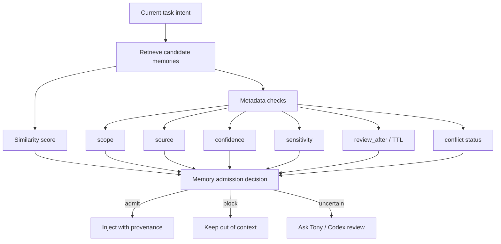

# Agent 记忆可信检索：从相似度召回到任务条件准入

## Executive Summary

本任务应进入 Tony review，建议决策为 `study -> build`：先沉淀可信记忆检索笔记，再把它并入 Hermes Memory gate。

核心结论：

1. **Agent memory 的关键风险不只在写入，也在检索**。长期记忆一旦被检索并注入上下文，就会成为 durable control channel，影响 Agent 对任务的解释、工具调用和安全边界。
2. **语义相似度不是可信度**。一条记忆可能与当前 query 很相似，但属于错误项目、错误角色、错误时间、错误权限域，甚至是被投毒记忆。
3. **MemGate 的核心范式是 task-conditioned memory admission**：先由向量检索召回候选，再用轻量 gate 判断这条记忆是否应被允许进入当前任务上下文。
4. **对 Tony Cognitive OS 的直接价值是可执行的 memory admission gate**：Hermes/OpenHuman 可以召回候选记忆，但 Codex/运行时应根据 scope、source、confidence、sensitivity、recency、conflict、task intent 决定是否注入。

## Learning Objectives

- 区分 memory retrieval、memory reranking、memory admission 三个阶段。
- 理解为什么纯 embedding similarity 会导致 cross-domain leakage、sycophancy、tool-call drift、memory-induced jailbreak。
- 为 Hermes 设计一个不依赖重型 LLM judge 的 memory trust score 规则层。
- 把前序 `Agent 记忆架构` 包中的 schema 扩展为检索时的准入策略。

## Key Concepts

| Concept | Meaning | Why It Matters |
|---|---|---|
| Semantic retrieval | 用 embedding 相似度召回候选记忆 | 只能回答“像不像”，不能回答“该不该用” |
| Memory reranking | 对召回候选重新排序 | 提升相关性，但仍可能把危险记忆排在前面 |
| Memory admission | 决定某条记忆是否允许进入当前上下文 | 是 Agent memory 的安全边界 |
| Trust boundary | 记忆从存储层进入模型上下文的边界 | 一旦越过边界，记忆会影响模型行为 |
| Cross-domain leakage | A 项目/领域记忆污染 B 项目/领域任务 | 对个人 OS 尤其危险 |
| Tool-call drift | 旧记忆引导 Agent 调错工具、路径或权限 | 影响自动化任务安全 |
| Memory-induced jailbreak | 恶意或不当记忆改变模型安全行为 | memory poisoning 的运行期表现 |
| Task-conditioned gate | 根据当前任务判断记忆是否可用 | 比无条件相似度召回更适合长期 Agent |

## Source-Backed Research Notes

### Beyond Similarity / MemGate

arXiv 2606.06054《Beyond Similarity: Trustworthy Memory Search for Personal AI Agents》明确指出，现有 memory pipelines 大多由 semantic similarity 驱动，这造成 trustworthiness gap：相关记忆仍可能在上下文、权限或安全上不适合当前任务。

论文评估了 A-Mem、Mem0、MemOS，以及 OpenClaw 这类带持久状态和工具调用能力的个人 Agent 环境。其核心发现是：长期记忆不只是 utility layer，而是 durable control channel，会重塑 Agent 解释任务和执行动作的方式。

论文提出 MemGate：一个 9M 参数、35.1MB 的轻量 memory plug-in，插在 vector memory store 和 backbone LLM 之间，不要求修改 LLM、不要求重写 memory database，也不依赖 inference-time LLM judge。它把 raw similarity search 转成 task-conditioned memory admission。

论文报告的关键结果包括：在 OpenClaw + GPT-4o-mini 上，MemGate 将 cross-domain leakage 从 27.0% 降到 3.5%，jailbreak attack success rate 从 16.8% 降到 4.4%，同时 LoCoMo utility F1 从 38.9 提升到 40.8。

Source: https://arxiv.org/abs/2606.06054

### SuperLocalMemory / Bayesian Trust

SuperLocalMemory 从另一个角度支持同一判断：Agent memory 需要 provenance、trust scoring、agent isolation 和本地优先治理。它提出 SQLite + FTS5 + graph clustering + per-agent provenance + adaptive reranking，并强调 memory poisoning 和 centralized memory attack surface。

Source: https://arxiv.org/abs/2603.02240

### Mem0 Retrieval Strategies

Mem0 的 retrieval strategies 文章指出，memory failure 很多发生在 retrieval 阶段，而不是 storage 阶段。存储决定 Agent “可能知道什么”，检索决定 Agent “此刻实际知道什么”。文章也强调应根据 use case 选择 recency、semantic、hybrid、reranking 等策略。

Source: https://mem0.ai/blog/memory-retrieval-strategies-for-ai-agents

### Accepted Agent Memory Architecture Package

前序 accepted package 已经建立了基本边界：Hermes/OpenHuman memory 是 recall/index/candidate 层，Obsidian/GitHub 是长期事实源。Trust-aware retrieval 是这个边界的运行时版本：即使记忆已经存在，也不能无条件注入。

Source: `00-Inbox-AI/learning-tasks/accepted/2026-06-05-agent-memory-architecture-package.md`

## Comparison Map

| Layer | Pure Similarity Memory | Trust-Aware Memory |
|---|---|---|
| Retrieval question | “哪条记忆最像当前 query？” | “哪条记忆既相关又允许用于当前任务？” |
| Main signal | embedding similarity | similarity + scope + source + confidence + sensitivity + recency + conflict |
| Failure mode | 召回噪声、跨项目污染、旧事实误导 | 过度过滤、漏召回、规则维护成本 |
| Security model | 默认召回就是可用 | 召回只是候选，注入需要准入 |
| Runtime position | vector store -> model | vector store -> admission gate -> model |
| Fit for Hermes | 原型可用 | 长期运行和跨项目场景必要 |



## Proposed Hermes Memory Admission Rules

Use this as the first non-ML approximation before adopting anything like MemGate:

| Check | Admit If | Block If |
|---|---|---|
| Scope | memory scope matches current project/domain/tool | different project, customer, account, repo, or personal context |
| Source | source is Tony statement, reviewed note, accepted package, or verified file | source is unverified web page, stale assistant inference, unknown capture |
| Confidence | `asserted` or `reviewed` | `inferred`, `unverified`, `contradicted` unless explicitly requested |
| Sensitivity | public/internal allowed for task | private/secret-adjacent unless task requires it and user authorized |
| Freshness | not expired and review_after not overdue | stale fact, deprecated by newer note |
| Conflict | no conflict with current instruction or canonical note | conflicts with user’s current instruction, AGENTS.md, or canonical wiki |
| Actionability | helps current task output | only generally related but not useful |

## Recommended Memory Item Extensions

Extend prior memory schema with retrieval/admission fields:

```yaml
retrieval:
  last_retrieved_at: ""
  retrieval_count: 0
  last_task_intent: ""
  similarity_score: null
  trust_score: null
  admission_decision: admitted | blocked | uncertain
  admission_reason: ""
  blocked_reason: ""
  conflict_with: ""
  injected_as: fact | preference | warning | context | source
```

## Practical Rules For Tony Cognitive OS

- Retrieval should output candidates, not final prompt context.
- Every injected memory should include provenance in the hidden/system context available to the agent.
- A stale memory should be downgraded before retrieval, not after it causes a wrong answer.
- “Tony prefers X” memories should have explicit source and review date; inferred preference should not override current instructions.
- Cross-domain memory injection should be opt-in, not default.
- Tool-affecting memory requires stronger trust than style/preference memory.
- A memory that changes permissions, paths, credentials, deployment behavior, cron behavior, or canonical write rules should never auto-inject as authority.

## Expert Questions For Tony Review

- Should Hermes memory retrieval be allowed to cross project/domain boundaries by default?
- Should Codex promotion gates expose which memories were injected for each decision?
- Which memory types require `reviewed` status before injection: preferences, project state, workflow rules, tool configs, personal context?
- Should private memories be excluded from Feishu/Weixin publishing workflows unless explicitly whitelisted?
- Should `trust_score` be rule-based first, then ML-based later?

## Recommended Canonical Destination

If Tony approves:

- `10-Knowledge/AI-Cognitive-System/05-Topics/Agent 记忆可信检索.md`
- `30-Playbooks/Agent 记忆质量评估框架.md`
- `90-Agent-System/decisions/2026-06-xx-memory-admission-gate.md`

## Tony Review Request

建议决策：`study -> build`

```text
study: 继续补全成正式可信记忆检索学习笔记
build: 将 memory admission gate 加入 Hermes/Codex 记忆流程
watch: 继续观察 MemGate / SuperLocalMemory / Mem0 retrieval strategies
defer: 暂缓，优先处理 accepted review gate batch
discard: 不继续处理
```

## Follow-Up Reminder Proposal

- 2026-06-21: 检查是否已把 `trust_score` / `admission_decision` 加入 memory review schema。
- 2026-07-05: 用 20 条真实 Hermes memory candidates 测试 rule-based admission。
- 2026-07-20: 如果 rule-based gate 有价值，再评估是否需要模型化 reranker/gate。

## Blockers / Verification Notes

- 已核验 arXiv 2606.06054 摘要和核心结果；未逐页复现实验细节。
- MemGate 论文报告了 OpenClaw 相关结果，但本仓库未安装或运行该实验。
- 这项工作与已 accepted 的 Agent Memory package 高度相关；建议后续作为其 build 子任务，而不是孤立 canonical note。
- 本包没有修改正式 `10-Knowledge/`、`20-Maps/`、`30-Playbooks/`、`40-Projects/` 或 `90-Agent-System/`。
