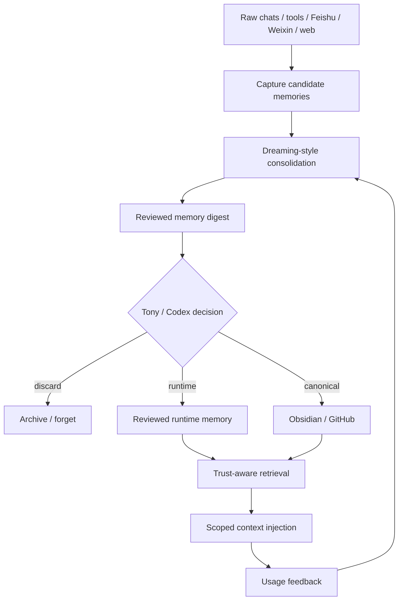

# OpenAI Dreaming 记忆范式：从被动保存到主动巩固

## Executive Summary

本任务建议进入 Tony review，决策建议为 `study -> build`。

核心判断：

1. **Dreaming 的关键不是“记更多”，而是“后台合成并更新记忆状态”**。OpenAI 将它描述为一种基于聊天历史的后台记忆整理过程，用于提升 freshness、continuity、relevance。
2. **这和传统 saved memory 不同**。saved memory 依赖显式保存或强提示，容易过期；dreaming 更像一个周期性 consolidation layer，把多轮上下文合成为更当前、更可用的记忆状态。
3. **对 Tony Cognitive OS 的启示不是照搬 OpenAI 内部实现**。公开信息不足以复现 Dreaming；可落地的是一个 Hermes/Codex 的“记忆巩固作业”：定期合并、去重、降权、纠错和生成 review item。
4. **Dreaming 必须和 trust-aware retrieval 配套**。主动巩固解决写入和更新质量，memory admission gate 解决检索和注入安全。两者合在一起才是可长期运行的个人记忆系统。

## Source Check

已核验的公开来源：

- OpenAI release: https://openai.com/index/chatgpt-memory-dreaming/
- OpenAI Memory FAQ: https://help.openai.com/en/articles/8590148-memory-faq
- Local source task: `00-Inbox-AI/learning-tasks/pending/2026-06-06-openai-dreaming-memory-paradigm.md`
- Related accepted package: `00-Inbox-AI/learning-tasks/accepted/2026-06-05-agent-memory-architecture-package.md`
- Related in-progress package: `00-Inbox-AI/learning-tasks/in-progress/2026-06-14-trust-aware-agent-memory-package.md`

公开事实边界：

- OpenAI 公开说明 Dreaming 是基于聊天历史的后台记忆整理过程。
- OpenAI 公开说明 2026 版本用于处理记忆的 stale、correctness、scalability 问题。
- OpenAI 公开说明 memory summary 可供用户查看、编辑、纠正，并提供 memory sources 视图。
- OpenAI 没有公开足以复现 Dreaming 的完整训练、存储、调度、评估和权限实现。

因此，本包只把 Dreaming 抽象为架构模式，不声称知道 OpenAI 内部实现。

## Learning Objectives

- 区分 `saved memory`、`chat-history reference`、`dreaming consolidation`、`canonical knowledge`。
- 理解主动记忆巩固为何能减少 stale memory 和重复上下文恢复成本。
- 设计 Tony 系统可执行的 memory consolidation job，而不是直接修改 Hermes 全局记忆。
- 明确 Dreaming 与昨日 trust-aware memory retrieval 的互补关系。

## Key Concepts

| Concept | Meaning | Tony System Implication |
|---|---|---|
| Saved memory | 显式保存的稳定记忆或偏好 | 适合少量高置信、长期偏好 |
| Chat-history reference | 从历史对话中检索相关上下文 | 适合临时上下文恢复，但必须有作用域 |
| Dreaming | 后台合成、更新和巩固记忆状态 | 可映射为 Hermes/Codex 定期 memory consolidation job |
| Memory summary | 用户可查看和纠正的记忆摘要 | Tony 系统应有可审查的 memory digest |
| Memory sources | 展示个性化响应所用来源 | Hermes/Codex 应记录被注入记忆的来源和理由 |
| Freshness | 记忆随时间和新事实更新 | 需要 `review_after`、`last_verified`、`deprecated_by` |
| Continuity | 跨会话保持项目和偏好上下文 | 需要 project/domain/tool scope |
| Relevance | 只在有帮助时使用记忆 | 需要 retrieval admission gate |

## Known Facts From OpenAI

OpenAI 在 2026-06-04 发布的 Dreaming 说明中，把目标归纳为提升记忆合成的 freshness、continuity 和 relevance。它提到 memory first launched in April 2024 as saved memories；2025 年通过 reference chat history 引入了第一版 dreaming；2026 年发布的是更强、更具计算效率的 memory architecture。

OpenAI 还强调了几个产品层控制点：

- 用户可以通过 memory summary 查看和纠正 ChatGPT 记得的内容。
- Memory sources 可以解释某次回答用了哪些个人上下文来源。
- Temporary Chats 不使用现有 memories，也不会创建新 memories。
- 如果要完全删除某类个人信息，可能需要删除 memory summary、相关历史聊天、文件或连接应用里的来源。
- Memory 可能包含敏感信息，因此需要可关闭、可删除、可纠正的用户控制面。

这些公开信息说明 Dreaming 至少包含三类能力：后台合成、时间更新、用户可审查控制。但具体模型、存储、评分和调度机制未公开。

## Architecture Comparison

| Dimension | Passive Memory Store | Dreaming-Style Consolidation |
|---|---|---|
| Trigger | 用户显式说“记住”或系统抽取 | 后台周期性分析历史上下文 |
| Unit | 单条事实、偏好、项目状态 | 综合后的 memory state / summary |
| Main Benefit | 简单、可解释、低成本 | 更能处理自然对话、时间变化和重复上下文 |
| Main Risk | stale、碎片化、容量满、重复 | 黑箱合成、误归纳、隐私边界复杂 |
| Review Surface | 单条 memory list | memory summary + memory sources |
| Fit for Hermes | runtime memory candidate store | daily/weekly memory consolidation job |
| Fit for Obsidian | 不应直接进入 canonical | 只能生成 review item 或 candidate note |

## Fit With Existing Tony Memory Packages

### Relation to Agent Memory Architecture

前序 accepted package 已经定义：

- Hermes/OpenHuman memory 是 recall/index/candidate 层。
- Obsidian/GitHub 是长期事实源。
- Codex 负责 review、去重、脱敏、归类。

Dreaming-style consolidation 应该放在这条链路中间：

```text
Raw traces / candidate memories
  -> Hermes/OpenHuman capture
  -> Dreaming-style consolidation job
  -> Codex review package
  -> Tony decision
  -> reviewed runtime memory or canonical wiki
```

它不应绕过 Codex/Tony review 直接写入 `10-Knowledge/`。

### Relation to Trust-Aware Retrieval

昨日 `trust-aware-agent-memory` package 解决的是：

```text
已有记忆被召回后，是否允许进入当前上下文？
```

本包解决的是：

```text
原始历史和候选记忆如何被周期性合成、更新、去重和降权？
```

两者配套后，Tony 系统的记忆链路应变为：



## Proposed Hermes/Codex Dreaming Job

先做 rule-based / Codex-reviewed 版本，不做黑箱自动记忆。

### Job Name

`hermes-memory-consolidation`

### Frequency

- Daily lightweight pass: 只处理最近 24 小时的候选记忆和 review feedback。
- Weekly deep pass: 合并重复记忆、检查 stale/conflict、生成 Tony review panel。

### Inputs

- `00-Inbox-AI/agent-memory/`
- `00-Inbox-AI/hermes/`
- `00-Inbox-AI/review-queue/accepted/`
- `00-Inbox-AI/feedback-log/`
- `00-Inbox-AI/codex-requests/done/`
- Optional: OpenHuman candidate outputs, if later接入

### Outputs

- `00-Inbox-AI/agent-memory/digests/YYYY-MM-DD-memory-digest.md`
- `00-Inbox-AI/review-queue/pending/YYYY-MM-DD-memory-consolidation-review.md`
- Optional package updates under `00-Inbox-AI/learning-tasks/in-progress/`

### Non-Outputs

The job must not directly write:

- `10-Knowledge/`
- `20-Maps/`
- `30-Playbooks/`
- `40-Projects/`
- `90-Agent-System/`

unless Tony explicitly approves a promotion action.

## Memory Consolidation Rules

| Rule | Action |
|---|---|
| Duplicate memories | Merge into one item with source list |
| Conflicting memories | Mark `conflict_status: needs_review` |
| Stale time-sensitive facts | Lower confidence or create review item |
| Inferred preferences | Keep as candidate unless Tony explicitly confirms |
| Tool/path/security memories | Require reviewed status before injection |
| Private or secret-adjacent content | Do not publish to Feishu/Weixin; require redaction |
| Canonical note exists | Link memory to canonical note and lower runtime priority |
| Memory repeatedly useful | Candidate for playbook/rule/agent capability |
| Memory repeatedly harmful/wrong | Candidate for forget/deprecate |

## Recommended Schema Extensions

For reviewed runtime memory:

```yaml
consolidation:
  source_window_start: ""
  source_window_end: ""
  consolidation_run_id: ""
  consolidation_method: rule_based | codex_review | human_review | model_assisted
  merged_from: []
  supersedes: []
  conflict_status: none | possible | confirmed | resolved
  freshness_status: current | stale | time_sensitive | unknown
  last_consolidated_at: ""
  next_review_after: ""
  user_visible_summary: ""
  deletion_requirements: []
```

For usage feedback:

```yaml
usage_feedback:
  used_in_task: ""
  injected_at: ""
  helpfulness: helpful | neutral | harmful | unknown
  correction: ""
  should_remember: yes | no | needs_review
```

## Decision Memo: Should Hermes Have A Dreaming Layer?

Recommended answer: **yes, but only as a reviewed consolidation layer, not autonomous truth-writing**.

### Build Now

- Daily/weekly memory digest generation.
- Duplicate/conflict/stale memory detection.
- Review queue item for Tony.
- Explicit source and deletion metadata.

### Do Not Build Yet

- Fully autonomous memory rewriting.
- Hidden memory updates that Tony cannot inspect.
- Direct canonical promotion.
- Cross-domain memory synthesis without task/domain scope.

### Success Criteria

After two weeks, the job is useful only if it reduces:

- repeated context setup;
- stale Hermes assumptions;
- duplicate memory candidates;
- noisy review items;
- incorrect personalization.

If it only creates more Markdown, it should be paused.

## Suggested Canonical Destinations

If Tony approves:

- `10-Knowledge/AI-Cognitive-System/05-Topics/主动记忆巩固.md`
- `30-Playbooks/Agent 记忆巩固与遗忘流程.md`
- `90-Agent-System/decisions/2026-06-xx-hermes-memory-consolidation-layer.md`

## Tony Review Request

建议决策：`study -> build`

```text
study: 整理为正式 Agent memory consolidation 笔记
build: 设计 Hermes/Codex memory consolidation job 的最小实现
watch: 继续观察 OpenAI/Anthropic/Google 是否公开类似机制
defer: 等 Agent Memory gate 先落地
discard: 不继续处理
```

## Follow-Up Reminder Proposal

- 2026-06-22: 检查是否已有 `agent-memory/digests/` 目录和 memory digest 模板。
- 2026-07-01: 用最近 30 条 Hermes/Codex 记忆候选跑一次人工 consolidation dry-run。
- 2026-07-15: 复盘 consolidation 是否减少了重复上下文和 stale memory。

## Blockers / Verification Notes

- 已核验 OpenAI Dreaming release 和 OpenAI Memory FAQ。
- OpenAI 未公开完整技术实现；本包中的 Hermes 方案是工程推断，不是 OpenAI 实现复刻。
- 本包与 `Agent 记忆架构` accepted package、`Agent 记忆可信检索` in-progress package 高度相关；后续应合并进同一条 Agent Memory build line。
- 未修改正式 `10-Knowledge/`、`20-Maps/`、`30-Playbooks/`、`40-Projects/` 或 `90-Agent-System/`。
