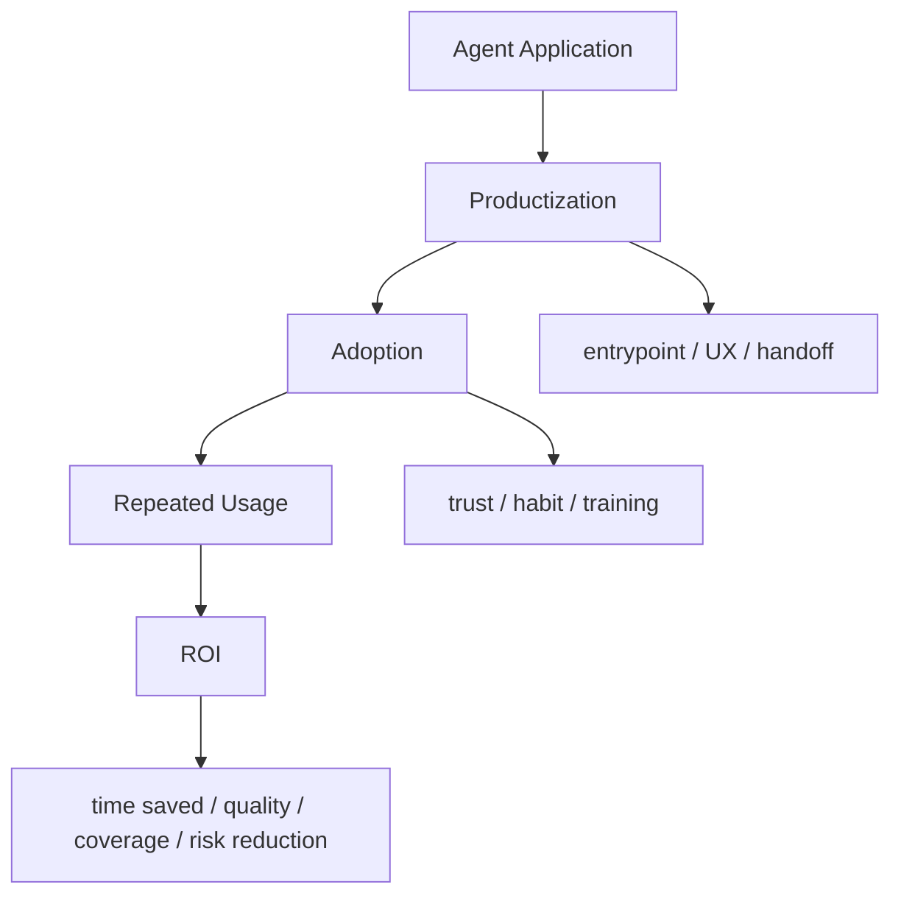

# Agent Adoption and ROI Map

## 怎么读这张图

- 没有好的产品化，就很难形成 adoption
- 没有 adoption，就很难稳定产生 ROI
- ROI 不是单看模型成本，而是看整个工作流的价值捕获

## 关联

- [[../05-Topics/Agent Productization|Agent Productization]]
- [[../05-Topics/Agent Adoption and Change Management|Agent Adoption and Change Management]]
- [[../05-Topics/Agent ROI and Value Capture|Agent ROI and Value Capture]]
- [[Agent Application Landscape Map]]
