# Agent Organizational Rollout Map

```mermaid
graph TD
    A["Agent Rollout"] --> B["Use Case Selection"]
    A --> C["Operating Model"]
    A --> D["Training and Adoption"]
    A --> E["Evaluation and Guardrails"]
    A --> F["Scale and Portfolio"]

    B --> B1["Business Value"]
    B --> B2["Workflow Clarity"]
    B --> B3["Measurement Readiness"]

    C --> C1["Use Case Owner"]
    C --> C2["Platform Owner"]
    C --> C3["Risk Legal Security"]
    C --> C4["Enablement Owner"]

    D --> D1["Seed Teams"]
    D --> D2["Usage Norms"]
    D --> D3["Feedback Loops"]

    E --> E1["Evals"]
    E --> E2["Approval Gates"]
    E --> E3["Audit Logs"]
    E --> E4["Fallback Paths"]

    F --> F1["Pilot"]
    F --> F2["Scale"]
    F --> F3["Platform Candidate"]
    F --> F4["Hold or Stop"]
```

## 怎么看这张图

- 这张图回答的不是“agent 能做什么”，而是“组织怎样把 agent 真正跑起来”
- 左边是用例选择，中间是组织与治理，右边是规模化与组合管理
- 它适合和行业页、workflow 页一起看：行业告诉你值不值，workflow 告诉你怎么跑，rollout map 告诉你怎么组织起来

## 关联

- [[../05-Topics/Agent Operating Model and Governance|Agent Operating Model and Governance]]
- [[../05-Topics/Agent Rollout and Change Program|Agent Rollout and Change Program]]
- [[../05-Topics/Agent Portfolio and Use Case Prioritization|Agent Portfolio and Use Case Prioritization]]
