# Agent Product and Workflow Map

```mermaid
graph TD
    A["Products"] --> B["ChatGPT Agent"]
    A --> C["Claude Code"]
    A --> D["Cursor"]
    A --> E["Codex"]
    A --> F["OpenClaw"]

    B --> W1["Research Workflow"]
    B --> W3["Enterprise Operations Workflow"]
    B --> W5["Customer Support Triage Workflow"]
    B --> W6["Financial Services Workflow"]
    B --> W7["Education Workflow"]
    B --> W8["Healthcare Workflow"]
    B --> W9["Legal and Compliance Workflow"]
    B --> W10["Public Sector Workflow"]
    B --> W11["HR and Recruiting Workflow"]
    B --> W12["Internal Knowledge Work Workflow"]
    B --> W13["Finance Operations Workflow"]
    B --> W14["Contract Operations Workflow"]
    B --> W16["Revenue Operations Workflow"]
    B --> W17["Analytics Operations Workflow"]
    B --> W18["Procurement Workflow"]
    B --> W19["Vendor Onboarding Workflow"]
    B --> W20["Supplier Risk Workflow"]
    B --> W21["Renewal and Obligation Workflow"]
    B --> W22["Supplier Concentration Risk Workflow"]

    C --> W2["Coding Agent Workflow"]
    D --> W2
    E --> W2

    F --> W1
    F --> W4["Personal Assistant Workflow"]
    F --> W6
    F --> W9
    F --> W10
    F --> W12
    F --> W13
    F --> W14
    F --> W15["IT and Security Operations Workflow"]
    F --> W17
    F --> W18
    F --> W19
    F --> W20
    F --> W21
    F --> W22

    W1 --> G["Research / Analysis Use Cases"]
    W2 --> H["Software Engineering Use Cases"]
    W3 --> I["Enterprise Ops Use Cases"]
    W4 --> J["Personal Assistant Use Cases"]
    W5 --> K["Customer Support Use Cases"]
    W6 --> L["High-Trust Knowledge Work"]
    W7 --> M["Teacher-Enablement and Learning Support"]
    W8 --> N["Clinical and Administrative Support"]
    W9 --> O["Citation-Backed Review Work"]
    W10 --> P["Secure Public Service and Admin Work"]
    W11 --> Q["Talent and Employee Operations"]
    W12 --> R["Internal Knowledge and Data Work"]
    W13 --> S["Finance and Close Support Work"]
    W14 --> T["Contract and Obligation Operations"]
    W15 --> U["IT / Security Runbooks and Incident Ops"]
    W16 --> V["Revenue Operations and CRM Execution"]
    W17 --> X["Analytics and Reporting Operations"]
    W18 --> Y["Procurement and Vendor Review Work"]
    W19 --> Z["Supplier Onboarding and Data Completion"]
    W20 --> AA["Supplier Risk and Third-Party Governance"]
    W21 --> AB["Renewal Planning and Obligation Tracking"]
    W22 --> AC["Portfolio Concentration and Dependency Governance"]
```

## 怎么看这张图

- 先看一个产品更自然地落到哪类 workflow
- 再看 workflow 对应的是哪类应用价值
- 这样可以避免只按“产品名字”学习，而忽略真正的使用路径
- 现在这张图已经同时覆盖高信任行业、组织效率类场景，以及 back-office workflow 分支

## 关联

- [[../02-Products/产品索引|产品索引]]
- [[../03-Workflows/工作流索引|工作流索引]]
- [[Agent Application Landscape Map]]
- [[Regulated Industry Agent Map]]
- [[Agent Vendor Fit Map]]
- [[Assistant-to-Runtime Migration Map]]
- [[Migration-Stage Vendor Selection Map]]
