# Assistant-to-Runtime Migration Map

```mermaid
graph TD
    A["Stage 1: Read-only Assistant"] --> B["Stage 2: Workflow Assistant"]
    B --> C["Stage 3: Approval-Gated Action Agent"]
    C --> D["Stage 4: Runtime with Control Plane"]

    A --> A1["Knowledge assist"]
    A --> A2["Meeting prep"]
    A --> A3["Policy navigation"]

    B --> B1["Review packet"]
    B --> B2["Risk memo"]
    B --> B3["Case draft / triage"]

    C --> C1["Ticket or case routing"]
    C --> C2["Low-risk write actions"]
    C --> C3["Human approval gates"]

    D --> D1["Session and memory control"]
    D --> D2["Tool policy and orchestration"]
    D --> D3["System of record / control tower"]

    E["Cross-Cutting Controls"] --> E1["Source grounding"]
    E --> E2["Audit trail"]
    E --> E3["Failure recovery"]
    E --> E4["Role and access boundary"]

    F["Financial Services"] --> F1["Starts with advisor and analyst assist"]
    G["Healthcare"] --> G1["Starts with documentation and admin relief"]
    H["Legal and Compliance"] --> H1["Starts with citation-backed review"]
    I["Public Sector"] --> I1["Starts with approved knowledge workflows"]

    J["Typical Product Fit"] --> J1["ChatGPT Agent: early stages, bounded workflows"]
    J --> J2["OpenClaw: later-stage private runtime exploration"]
    J --> J3["Claude Code / Cursor / Codex: build layer"]
    J --> J4["Workday / ServiceNow: governance and control plane archetypes"]
```

## 怎么看这张图

- 这不是从左到右的强制升级路线，而是帮助判断什么时候该继续停留在 assistant，什么时候值得走向 runtime
- 高信任领域里，真正决定迁移的通常不是模型本身，而是 governance、auditability 和 approval model
- 如果阶段 2 的 workflow assistant 还没稳定，通常没必要急着进入阶段 3 或 4

## 关联

- [[../05-Topics/Assistant-to-Runtime Migration in High-Trust Domains|Assistant-to-Runtime Migration in High-Trust Domains]]
- [[High-Trust Agent Vendor Map]]
- [[Regulated Industry Agent Map]]
- [[Agent Organizational Rollout Map]]
