# High-Trust Agent Vendor Map

```mermaid
graph TD
    A["High-Trust Domains"] --> B["Financial Services"]
    A --> C["Healthcare"]
    A --> D["Legal and Compliance"]
    A --> E["Public Sector"]

    B --> B1["Need: evidence, approval, deployment boundary"]
    B --> B2["Often fit: ChatGPT Agent for front-end assist"]
    B --> B3["Often fit: OpenClaw for private internal runtime"]

    C --> C1["Need: privacy, bounded workflow, low-side-effect tasks"]
    C --> C2["Often fit: ChatGPT Agent for operator-facing assist"]
    C --> C3["Often fit: internal runtime for tighter control"]

    D --> D1["Need: citation, review handoff, source grounding"]
    D --> D2["Often fit: document-heavy assistant surface"]
    D --> D3["Build layer: Claude Code / Cursor / Codex for internal tooling"]

    E --> E1["Need: governance compatibility, auditability, deployment fit"]
    E --> E2["Often fit: approved cloud assistant if policy allows"]
    E --> E3["Often fit: self-hosted or tightly controlled runtime otherwise"]

    F["Cross-Cutting Decision"] --> F1["Front-end assistant vs internal runtime"]
    F --> F2["Read-only vs action-taking"]
    F --> F3["Human approval gates"]
    F --> F4["Evidence and audit trail"]
    F --> F5["Build layer vs end-user layer"]
```

## 怎么看这张图

- 这张图不是在排产品名次，而是在提示：高信任场景里先看什么约束
- 同一个产品在不同组织里可能结论不同，因为 deployment boundary 和 governance policy 经常决定最终方案
- 如果要进一步看“同一组织在不同迁移阶段为什么会换产品角色”，请配合 [[Migration-Stage Vendor Selection Map]] 一起看
- 这里的产品适配是基于官方文档和案例做的应用层推断，不是厂商官方排名

## 关联

- [[../05-Topics/High-Trust Agent Vendor Selection|High-Trust Agent Vendor Selection]]
- [[../05-Topics/Financial Services Agent Vendor Choice|Financial Services Agent Vendor Choice]]
- [[../05-Topics/Healthcare Agent Vendor Choice|Healthcare Agent Vendor Choice]]
- [[../05-Topics/Legal and Compliance Agent Vendor Choice|Legal and Compliance Agent Vendor Choice]]
- [[../05-Topics/Public Sector Agent Vendor Choice|Public Sector Agent Vendor Choice]]
- [[Regulated Industry Agent Map]]
- [[Agent Vendor Fit Map]]
- [[Migration-Stage Vendor Selection Map]]
