# Migration-Stage Vendor Selection Map

```mermaid
graph TD
    A["Stage 1: Read-only Assistant"] --> A1["Default fit: ChatGPT Agent"]
    A --> A2["Exception: OpenClaw if private boundary is required from day 1"]

    B["Stage 2: Workflow Assistant"] --> B1["Default fit: ChatGPT Agent"]
    B --> B2["Rising fit: OpenClaw for deeper private workflow orchestration"]
    B --> B3["Build layer: Claude Code / Cursor / Codex"]

    C["Stage 3: Approval-Gated Action"] --> C1["Bounded ChatGPT Agent workflow"]
    C --> C2["Controlled OpenClaw runtime"]
    C --> C3["Need: approval gates, audit trail, failure recovery"]

    D["Stage 4: Runtime with Control Plane"] --> D1["OpenClaw or internal runtime archetype"]
    D --> D2["Governance layer: Workday Agent Gateway / System of Record"]
    D --> D3["Governance layer: ServiceNow AI Control Tower"]
    D --> D4["Build layer stays important: Claude Code / Cursor / Codex"]

    E["Financial Services"] --> E1["Usually starts with assistant -> evidence workflow"]
    F["Healthcare"] --> F1["Usually stays longer in bounded workflow stage"]
    G["Legal and Compliance"] --> G1["Usually maximizes review workflow before runtime"]
    H["Public Sector"] --> H1["Usually gated by approved cloud and audit model"]
```

## 怎么看这张图

- 这张图不是在给产品排名，而是在提醒：不同迁移阶段，合适的产品角色会变
- 高信任场景里，后期往往不是单一产品胜出，而是 end-user surface、internal runtime、build layer 和 governance layer 一起出现
- 如果组织还停留在阶段 1 或 2，就没必要过早为阶段 4 的 runtime 付出复杂性成本

## 关联

- [[../05-Topics/Migration-Stage Vendor Selection in High-Trust Domains|Migration-Stage Vendor Selection in High-Trust Domains]]
- [[Assistant-to-Runtime Migration Map]]
- [[High-Trust Agent Vendor Map]]
- [[Agent Vendor Fit Map]]
