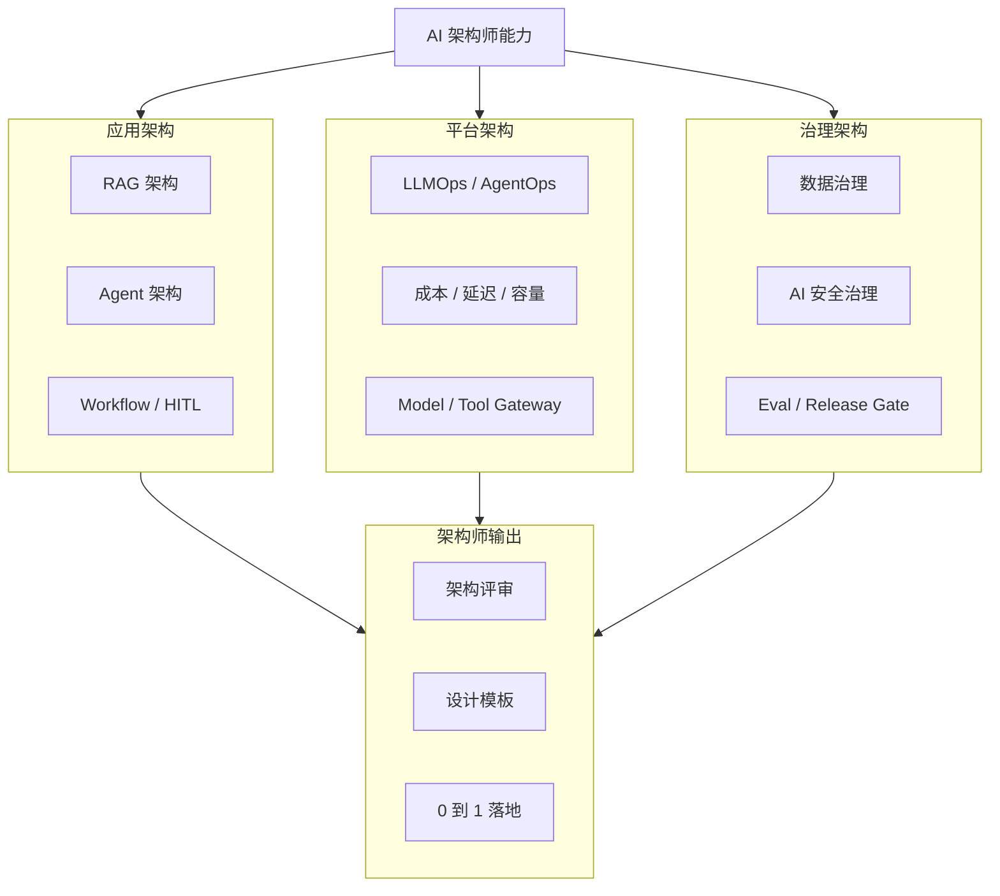

# AI 架构师专题分解图

## 读图方式

- 应用架构回答“AI 怎么完成任务”。
- 平台架构回答“AI 怎么稳定、低成本、可观测地运行”。
- 治理架构回答“AI 怎么安全、合规、可审计地上线”。
- 架构师输出是评审、设计和落地，而不是停留在概念学习。

## Drill-down

- [[../05-Topics/RAG 架构师视角|RAG 架构师视角]]
- [[../05-Topics/Agent 架构师视角|Agent 架构师视角]]
- [[../05-Topics/LLMOps 与 AgentOps 架构师视角|LLMOps 与 AgentOps 架构师视角]]
- [[../05-Topics/AI 安全治理架构师视角|AI 安全治理架构师视角]]
- [[../05-Topics/AI 成本、延迟与容量架构师视角|AI 成本、延迟与容量架构师视角]]
- [[../05-Topics/AI 数据治理架构师视角|AI 数据治理架构师视角]]

