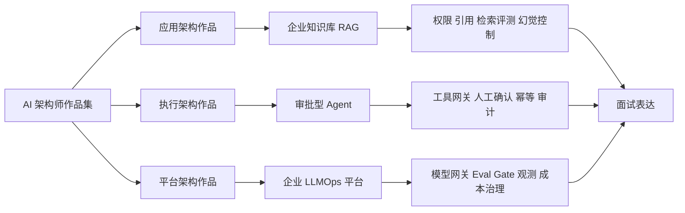

# AI 架构师作品集地图

> 作品集不是 demo 展示，而是“我能把 AI 系统带到生产”的证据链。

## 证据链分层

| 层级 | 要证明什么 | 典型证据 |
|---|---|---|
| 业务层 | 为什么这个问题值得做 AI | 业务痛点、目标用户、指标定义、非 AI 方案对比 |
| 架构层 | 为什么这样拆系统边界 | 架构图、请求链路、组件职责、降级策略 |
| 数据层 | AI 依据什么知识行动 | 数据源、权限、质量、更新、可追溯引用 |
| 评测层 | 如何知道系统变好了 | eval set、指标、bad case、上线门槛 |
| 治理层 | 如何控制风险 | 安全策略、审计、人工介入、回滚 |
| 运营层 | 如何长期运行 | 观测、成本、容量、反馈闭环、复盘 |

## 三条主线

### 1. 应用架构作品：RAG

- 入口：[[../09-Portfolio/企业知识库 RAG 架构作品集样例|企业知识库 RAG 架构作品集样例]]
- 核心问题：如何让企业知识“可问、可信、可追溯、可控权”。
- 关键取舍：召回率 vs 精确率、权限过滤前置 vs 后置、引用完整性 vs 延迟、知识新鲜度 vs 成本。

### 2. 执行架构作品：Agent

- 入口：[[../09-Portfolio/审批型 Agent 架构作品集样例|审批型 Agent 架构作品集样例]]
- 核心问题：如何让 AI 从“回答问题”进入“协助执行”，但不越权、不误操作。
- 关键取舍：自由规划 vs 固定 workflow、自动执行 vs 人工确认、工具能力开放 vs 风险收敛。

### 3. 平台架构作品：LLMOps

- 入口：[[../09-Portfolio/企业 LLMOps 平台架构作品集样例|企业 LLMOps 平台架构作品集样例]]
- 核心问题：如何把多个 AI 项目从手工作坊升级为可治理、可观测、可复用的平台能力。
- 关键取舍：统一网关 vs 团队自治、模型路由 vs 成本复杂度、严格 eval gate vs 交付速度。

## 推荐作品集组合

- 如果目标是 AI 应用架构师：`RAG + Agent`。
- 如果目标是 AI 平台架构师：`RAG + LLMOps`。
- 如果目标是 AI 架构负责人：`RAG + Agent + LLMOps`，并能解释三者如何组合成企业 AI 全景。

## 关联

- [[../09-Portfolio/作品集样例索引|作品集样例索引]]
- [[../07-Templates/AI 架构师作品集模板|AI 架构师作品集模板]]
- [[./AI 架构师专题分解图|AI 架构师专题分解图]]
- [[../10-Interview-Kit/AI 架构师表达总纲|AI 架构师表达总纲]]
