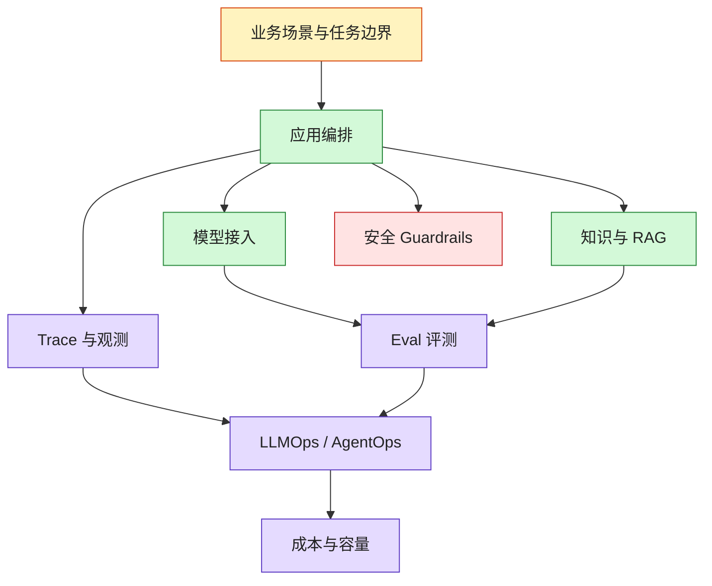

# AI 架构师工具链决策地图

> 目标：不是收藏工具，而是知道每类工具解决什么架构问题、什么时候该引入、什么时候不该引入，以及如何组合成 production-like AI stack。

## 一句话原则

AI 工具链选型要从架构能力出发：

`应用编排 -> 知识与检索 -> 模型网关 -> Eval -> Observability -> Guardrails -> LLMOps/AgentOps -> FinOps`

## 全景图

## 1. 应用编排层

解决问题：把 LLM、工具、状态、流程、人审节点组合成可运行应用。

| 工具/框架 | 适合场景 | 选型判断 |
|---|---|---|
| OpenAI Agents SDK | 需要快速构建 agent、tool、handoff、trace 的应用 | OpenAI 模型栈为主，想快速落地并保留 trace |
| LangGraph | 需要可控状态机、持久化、human-in-the-loop、多步骤 Agent | 企业 workflow / bounded agent / 长流程 |
| LlamaIndex | RAG 和数据连接器优先，知识系统复杂 | 文档、索引、检索、agent 都围绕数据展开 |
| Semantic Kernel | .NET / Microsoft 生态，企业集成和插件化 | 微软技术栈、企业应用集成 |

默认建议：

- 快速原型：OpenAI Agents SDK 或 LlamaIndex。
- 可控 Agent：LangGraph。
- 微软企业栈：Semantic Kernel。
- 不要一上来就追 autonomous agent；先用 workflow + bounded agent。

## 2. RAG 与知识层

解决问题：让模型基于企业知识回答，并处理权限、引用、更新和质量。

| 能力 | 常见选择 | 架构师关注 |
|---|---|---|
| 文档解析 | Unstructured、Docling、LlamaParse、云厂商 parser | 表格、PDF、图片、版面和权限元数据 |
| Chunking | 自研 pipeline、LlamaIndex、LangChain splitters | 语义完整性、标题路径、版本、Owner |
| 向量库 | Milvus、Qdrant、Weaviate、pgvector、Pinecone | 规模、过滤、租户隔离、运维成本 |
| 全文检索 | Elasticsearch、OpenSearch、Postgres FTS | hybrid search、可解释性、成熟运维 |
| Rerank | Cohere rerank、bge-reranker、云模型 | 召回质量 vs 成本延迟 |
| RAG Eval | RAGAS、DeepEval、Phoenix、人工 gold set | faithfulness、citation、context precision |

默认建议：

- 小团队先用 Postgres/pgvector 或托管向量库。
- 企业知识多且权限复杂时，必须 hybrid search + metadata ACL。
- 作品集必须展示 retrieval eval 和 citation accuracy。

## 3. 模型网关层

解决问题：统一模型调用、鉴权、路由、限流、成本、审计和 fallback。

| 能力 | 设计问题 |
|---|---|
| 统一 API | 应用是否必须通过 gateway 调模型 |
| Model routing | 简单任务走低成本模型，复杂任务走强模型 |
| Fallback | 模型失败、超时、限额时如何降级 |
| Prompt registry | prompt 如何版本化、审批和回滚 |
| Policy | 哪些应用能用哪些模型和能力 |
| Cost allocation | 成本如何按应用、团队、用户归集 |

可选工具：

- LiteLLM：常见模型代理、路由和成本观测。
- 自研 gateway：适合强治理、强审计、强合规环境。
- 云厂商模型平台：适合已有云治理体系的团队。

## 4. Eval 层

解决问题：把“感觉效果好”变成可回归的上线门槛。

| 工具 | 适合场景 | 关注点 |
|---|---|---|
| OpenAI Evals | 基于 OpenAI 栈的模型/任务评测 | 与模型调用和 grader 集成 |
| RAGAS | RAG faithfulness、context precision 等指标 | RAG 质量分析 |
| promptfoo | prompt 回归、红队、安全测试 | CLI 友好，适合 CI |
| DeepEval | LLM 应用指标和测试框架 | 单元测试式 eval |
| Phoenix | tracing + eval + 可视化分析 | RAG/LLM 观测和调试 |
| 人工 gold set | 高风险、高价值任务 | 最可靠但成本高 |

默认建议：

- 项目早期：人工 gold set + 表格记录。
- 准生产：promptfoo / DeepEval / RAGAS 进入 CI。
- 生产：eval + trace + bad case 回灌。

## 5. Trace 与 Observability 层

解决问题：线上失败时能复盘一次请求的完整链路。

| 工具 | 适合场景 | 关注点 |
|---|---|---|
| Langfuse | LLM trace、prompt、dataset、eval、成本 | 开源友好，产品化完整 |
| Phoenix | LLM/RAG observability、eval、可视化 | 调试和分析友好 |
| OpenTelemetry | 企业统一观测标准 | 和现有 APM/SRE 体系对接 |
| 云厂商 APM | 已有云观测体系 | 统一日志、指标、告警 |

必须记录：

- trace_id
- model / prompt_version
- retrieval docs
- tool calls
- latency / token / cost
- safety flags
- user feedback

## 6. Guardrails 与安全层

解决问题：控制 prompt injection、越权、敏感数据、tool abuse 和成本滥用。

| 能力 | 实现方式 |
|---|---|
| 输入安全 | prompt injection 检测、敏感信息检测、长度限制 |
| RAG 安全 | 权限前置过滤、来源可信度、引用校验 |
| 输出安全 | PII 脱敏、格式校验、危险建议拦截 |
| 工具安全 | tool gateway、schema、参数白名单、人工确认 |
| 成本安全 | rate limit、budget、quota、max token |
| 审计 | tool call、策略命中、人工确认、risk acceptance |

参考：

- OWASP LLM Top 10。
- OWASP Agentic AI Threats。
- NIST AI RMF。

## 7. LLMOps / AgentOps 层

解决问题：多个 AI 应用如何统一治理、发布、观测和迭代。

| 能力 | 判断问题 |
|---|---|
| Prompt registry | prompt 是否有版本、Owner、发布记录 |
| Dataset registry | eval set 是否有版本、来源、覆盖范围 |
| Release gate | 发布前是否必须通过 eval 和安全检查 |
| AgentOps | plan、tool、memory、handoff 是否可观测 |
| Incident | 质量、安全、成本问题是否有分级和响应 |
| Feedback loop | 线上 bad case 是否进入改进闭环 |

## 选型决策树

### 如果你只做第一个作品集

- 选企业知识库 RAG。
- 用最简单的技术组合：文档 -> 索引 -> retrieval -> generation -> eval -> trace。
- 工具可以少，但 eval、trace、安全边界必须有。

### 如果你要做 Agent 作品集

- 先选 bounded workflow。
- 优先选 LangGraph 或 OpenAI Agents SDK。
- 必须补 tool gateway、human-in-the-loop、trace、rollback。

### 如果你要做平台作品集

- 从 model gateway、prompt registry、eval gate、trace、cost dashboard 开始。
- 不要一开始做大平台，先做一个应用到平台能力的抽象。

## 常见错误

- 用框架替代架构判断。
- 只选向量库，不设计知识治理。
- 只做 chatbot，不做 eval。
- 只接工具，不做权限、幂等和审计。
- 只看效果，不看成本、延迟和失败恢复。
- 只收集开源项目，不形成选型原则。

## 外部参考

- [OpenAI Agents SDK](https://openai.github.io/openai-agents-python/)
- [LangGraph documentation](https://langchain-ai.github.io/langgraph/)
- [LlamaIndex documentation](https://docs.llamaindex.ai/)
- [Semantic Kernel documentation](https://learn.microsoft.com/en-us/semantic-kernel/)
- [RAGAS documentation](https://docs.ragas.io/)
- [promptfoo documentation](https://www.promptfoo.dev/docs/intro/)
- [DeepEval documentation](https://deepeval.com/docs/getting-started)
- [Langfuse documentation](https://langfuse.com/docs)
- [Phoenix documentation](https://arize.com/docs/phoenix)
- [OpenTelemetry documentation](https://opentelemetry.io/docs/)

## 关联

- [[./AI 架构师转型缺口审查|AI 架构师转型缺口审查]]
- [[../08-Playbooks/AI 生产化 Readiness Playbook|AI 生产化 Readiness Playbook]]
- [[../07-Templates/AI Eval 与 Trace 工作簿|AI Eval 与 Trace 工作簿]]
- [[../07-Templates/AI 安全威胁建模模板|AI 安全威胁建模模板]]
- [[../05-Topics/LLMOps 与 AgentOps 架构师视角|LLMOps 与 AgentOps 架构师视角]]
