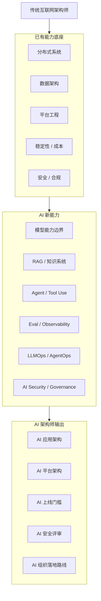

# AI 架构师迁移地图

> 图类型：capability-map。它回答“传统互联网架构师如何迁移到 AI 架构师”。

## 迁移视角

| 原能力 | 迁移到 AI 后 | 新增关键点 |
|---|---|---|
| API 架构 | Model Gateway / Tool Gateway | 模型路由、fallback、限流、审计 |
| 数据架构 | RAG / Knowledge Architecture | chunk、embedding、metadata、权限过滤 |
| 服务治理 | Agent Runtime / Workflow | 状态、工具、审批、回滚 |
| 监控告警 | LLMOps / AgentOps Observability | prompt、retrieval、tool trace、cost |
| 测试体系 | Eval / Regression Suite | golden set、human feedback、红队 |
| 安全架构 | AI Security / Trust Boundary | prompt injection、tool abuse、data leakage |
| 架构评审 | AI Release Gate | 模型、数据、prompt、工具、风险一起评审 |

## 推荐路径

1. 从熟悉的系统架构切入：model gateway、RAG、tool gateway。
2. 用一个业务场景做端到端 AI 应用架构。
3. 给它补 eval、observability、security、cost。
4. 把它抽象成可复用平台能力。
5. 再进入组织级 AI adoption 和 governance。

## Drill-down

- [[../05-Topics/AI 时代架构师能力全景|AI 时代架构师能力全景]]
- [[../05-Topics/传统互联网架构师转型 AI 架构师路线|传统互联网架构师转型 AI 架构师路线]]
- [[../../AI-Engineering/08-Maps/AI Engineering Stack Map|AI Engineering Stack Map]]
- [[../../AI-Engineering/08-Maps/Agent 平台技术栈图|Agent 平台技术栈图]]
- [[../../AI-Engineering/08-Maps/Agent Evaluation and Governance Map|Agent Evaluation and Governance Map]]

