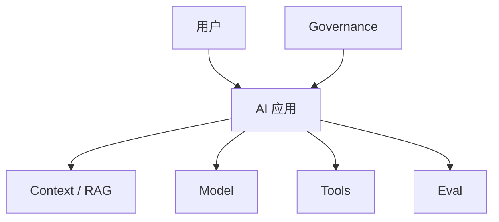

# AI 架构师作品集模板

> 用于把学习和项目沉淀成可面试、可晋升、可复盘的作品集。

## 基本信息

- 项目名称：
- 项目类型：RAG / Agent / Copilot / Workflow / LLMOps / AI Security / AI Platform
- 业务领域：
- 我的角色：
- 时间范围：
- 团队成员：

## 1. 业务背景

- 业务痛点：
- 为什么适合 AI：
- 如果不用 AI，会怎么做：
- 目标用户：
- 预期价值：

## 2. 任务边界

- AI 做什么：
- AI 不做什么：
- 输入：
- 输出：
- 人工介入点：
- 失败兜底：

## 3. 架构设计

- 架构模式：
- 核心组件：
- 数据流：
- 请求链路：
- 模型/工具链路：

## 4. 数据与知识

- 数据源：
- 权限策略：
- 敏感数据处理：
- RAG / knowledge design：
- 数据新鲜度：
- 引用和可追溯：

## 5. 模型与工具

- 模型选择：
- Prompt 策略：
- Tool calling：
- 工具权限：
- 高风险动作：
- fallback：

## 6. Eval 与上线

- eval set：
- 指标：
- 通过标准：
- 线上观测：
- 灰度策略：
- 回滚条件：

## 7. 安全与治理

- prompt injection 防护：
- RAG 泄露防护：
- tool abuse 防护：
- 日志脱敏：
- 审计链路：
- open risks：

## 8. 成本、延迟与容量

- p95 延迟：
- 成本估算：
- token 控制：
- cache / routing：
- 容量规划：

## 9. 结果与复盘

- 业务结果：
- 技术结果：
- 失败案例：
- 改进动作：
- 下一阶段：

## 10. 面试表达摘要

用 1 分钟讲：

> 

用 3 分钟讲：

> 

用 10 分钟讲：

> 

## 关联

- [[../09-Portfolio/作品集样例索引|作品集样例索引]]
- [[../10-Interview-Kit/AI 架构师表达总纲|AI 架构师表达总纲]]
- [[../10-Interview-Kit/AI 架构师面试题地图|AI 架构师面试题地图]]
- [[./AI 架构设计模板|AI 架构设计模板]]
