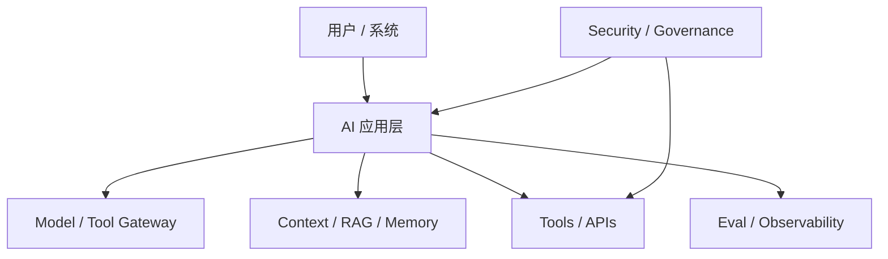

# AI 架构设计模板

```yaml
---
title:
type: ai-architecture-design
status: draft
domain: AI-Architect
owners: []
business_owner:
engineering_owner:
security_owner:
data_owner:
model_provider:
models: []
system_type: rag|agent|workflow|copilot|platform
risk_level: low|medium|high
created:
updated:
---
```

## 1. 背景与目标

- 业务背景：
- 目标用户：
- 要解决的任务：
- 不解决的任务：
- 成功指标：

## 2. 架构模式选择

- 使用模式：RAG / Agent / Workflow / Copilot / Platform
- 为什么选择这个模式：
- 为什么不选择其他模式：
- 是否需要 human-in-the-loop：

## 3. 高层架构



## 4. 用户请求链路

- 输入：
- 鉴权：
- 上下文构造：
- 检索：
- 模型调用：
- 工具调用：
- 输出：
- 审计：

## 5. 数据与知识架构

- 数据源：
- 文档/知识库：
- chunking 策略：
- embedding / retrieval：
- metadata：
- 权限过滤：
- 敏感数据：
- 数据保留与删除：

## 6. 模型与 Prompt 设计

- 模型列表：
- 路由策略：
- fallback：
- system prompt：
- prompt registry：
- structured output：
- 版本管理：

## 7. 工具调用与 Agent 边界

- 工具清单：
- 每个工具的权限：
- 高风险动作：
- 审批规则：
- 重试策略：
- 回滚策略：
- kill switch：

## 8. Eval 与质量门槛

- eval dataset：
- golden cases：
- 指标：
- 通过标准：
- 回归频率：
- 人工评审：
- 上线门槛：

## 9. 安全、隐私与治理

- prompt injection 控制：
- jailbreak 控制：
- RAG 泄露控制：
- tool abuse 控制：
- 日志脱敏：
- 审计要求：
- 合规要求：
- open risks：

## 10. 运行、成本与可靠性

- latency 目标：
- cost 目标：
- rate limit：
- cache：
- fallback：
- observability：
- incident response：
- SLO / SLA：

## 11. 灰度与上线计划

- 内测：
- shadow：
- 小流量：
- 灰度指标：
- 回滚条件：
- 运营 owner：

## 12. 风险与权衡

| 风险 | 影响 | 缓解措施 | owner | 截止时间 |
|---|---|---|---|---|
|  |  |  |  |  |

## 13. 评审结论

- 结论：可以上线 / 有条件上线 / 暂缓 / 不建议上线
- 条件：
- 后续动作：

## 关联

- [[../08-Playbooks/AI 架构评审 Playbook|AI 架构评审 Playbook]]
- [[../08-Playbooks/AI 项目从 0 到 1 落地 Playbook|AI 项目从 0 到 1 落地 Playbook]]
- [[../../AI-Engineering/09-Templates/AI 安全评审模板|AI 安全评审模板]]
- [[../../AI-Engineering/09-Templates/Agent 上线门槛模板|Agent 上线门槛模板]]

