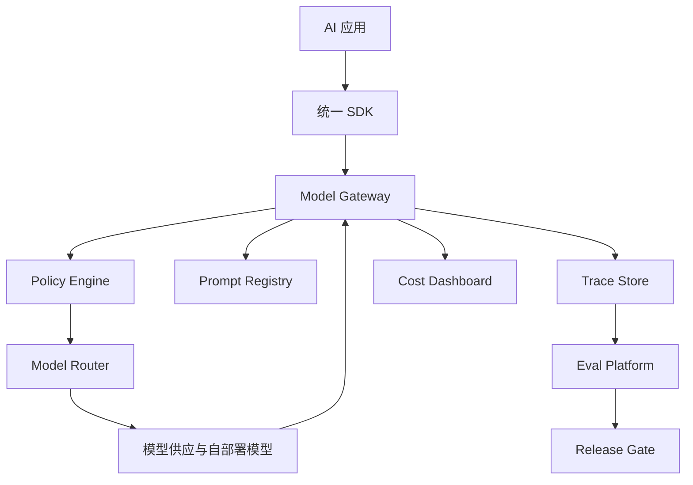

# 企业 LLMOps 平台架构作品集样例

> 样例定位：把多个 AI 应用从“各自接模型、各自写 prompt、各自看日志”升级为统一的平台能力。使用时请替换为你的真实组织、系统和指标。

## 基本信息

- 项目名称：企业 LLMOps 与 AI 应用治理平台
- 项目类型：LLMOps / AI Platform / Model Gateway / Eval Platform
- 业务领域：多业务线 AI 应用平台化
- 我的角色：平台架构、模型网关、eval gate、观测治理、成本治理设计
- 时间范围：12-20 周
- 团队成员：平台工程、AI 应用团队、安全、数据平台、SRE、FinOps

## 1. 业务背景

- 业务痛点：各团队重复接入模型，prompt 不可追踪，效果无法比较，成本不可控，安全策略不一致。
- 为什么适合平台化：多个 AI 应用有共性能力，包括模型调用、prompt 管理、eval、trace、限流、审计和成本分摊。
- 如果不用平台：每个团队重复造轮子，线上问题难排查，模型切换和合规治理成本高。
- 目标用户：AI 应用研发团队、架构师、业务 Owner、SRE、安全团队。
- 预期价值：降低接入成本，统一治理，提高上线质量，控制模型成本。

## 2. 任务边界

- AI 平台做什么：模型接入、路由、prompt registry、eval gate、trace、策略、配额、成本报表。
- AI 平台不做什么：不替业务团队定义业务目标，不强制统一所有应用架构模式。
- 输入：模型调用请求、prompt 版本、业务标签、eval 数据集、策略配置。
- 输出：模型响应、trace、指标、风险拦截、成本归集、上线准入结果。
- 人工介入点：模型升级、策略变更、高风险应用上线、重大成本异常。
- 失败兜底：模型 fallback、降级响应、熔断、回滚到上一 prompt 或模型版本。

## 3. 架构设计

- 架构模式：Model Gateway + Prompt Registry + Eval Platform + Observability + Governance Policy。
- 核心组件：统一 SDK、模型网关、路由策略、prompt registry、dataset registry、eval runner、trace store、policy engine、cost dashboard。
- 数据流：应用请求 -> SDK -> 网关鉴权 -> 策略检查 -> 模型路由 -> 响应 -> trace/eval/cost 记录。
- 模型/工具链路：所有模型调用必须通过网关，生产发布必须通过 eval gate。

## 4. 数据与知识

- 数据源：模型调用日志、prompt 版本、eval dataset、线上反馈、业务标签、成本账单。
- 权限策略：按团队、应用、环境和数据敏感级别授权。
- 敏感数据处理：输入输出脱敏、PII 检测、日志采样、敏感应用单独隔离。
- LLMOps design：prompt、dataset、模型、eval、发布记录必须可追溯。
- 数据新鲜度：线上 bad case 定期进入 eval set，模型升级前强制回归。
- 引用和可追溯：每次调用关联 app、user group、prompt version、model version、policy version。

## 5. 模型与工具

- 模型选择：支持商业模型、自部署模型和小模型，按场景路由。
- Prompt 策略：prompt registry 记录版本、Owner、适用场景、变更原因和回滚点。
- Tool calling：平台不直接开放业务工具，只提供工具调用 trace 和策略接口。
- 工具权限：业务工具由应用侧控制，平台负责统一审计和风险信号。
- 高风险动作：生产模型升级、策略放宽、敏感应用上线必须审批。
- fallback：模型失败时按优先级 fallback；高风险失败返回可解释降级信息。

## 6. Eval 与上线

- eval set：任务正确性、安全拒答、越权风险、格式稳定性、延迟成本、模型回归。
- 指标：quality score、safety score、latency、cost per task、error rate、fallback rate。
- 通过标准：关键 eval 不下降，安全指标不退化，成本和延迟在预算内。
- 线上观测：trace 每次请求的 prompt、模型、token、延迟、错误、策略命中和用户反馈。
- 灰度策略：按应用、用户组、流量比例和模型版本灰度。
- 回滚条件：质量下降、成本异常、错误率上升、安全策略误放行。

## 7. 安全与治理

- prompt injection 防护：平台提供检测和策略模板，应用按风险等级启用。
- RAG 泄露防护：敏感应用接入网关策略，要求记录知识源和权限检查结果。
- tool abuse 防护：Agent 应用必须上报工具 schema、风险等级和调用审计。
- 日志脱敏：默认不存完整敏感输入，按场景选择 hash、摘要或加密留存。
- 审计链路：模型调用、prompt 变更、eval 结果、发布审批和策略命中全链路可查。
- open risks：平台统一能力可能被绕过；需要组织规范和接入门禁。

## 8. 成本、延迟与容量

- p95 延迟：网关增加的额外延迟需要控制在可接受范围内。
- 成本估算：按应用、模型、token、缓存命中和 eval 运行成本拆账。
- token 控制：max token、上下文压缩、缓存、批处理、模型路由。
- cache / routing：简单任务低成本模型，复杂任务强模型，高频请求缓存。
- 容量规划：按峰值调用量、模型供应商限额、自部署推理容量和 eval 批量任务估算。

## 9. 结果与复盘

- 业务结果：新 AI 应用接入时间缩短，模型成本可归因，安全和发布门槛统一。
- 技术结果：形成 model gateway、prompt/dataset/eval registry、trace、cost 和 release gate。
- 失败案例：部分团队绕过平台；eval set 覆盖不足；过度统一影响业务迭代速度。
- 改进动作：统一 SDK 降低接入成本，设定平台准入规范，允许业务侧扩展自定义 eval。
- 下一阶段：引入 AgentOps，对 tool trace、plan quality 和任务完成率做平台级治理。

## 10. 面试表达摘要

用 1 分钟讲：

> 我做的是企业 LLMOps 平台，解决多个 AI 应用重复接模型、prompt 不可追踪、eval 缺失、成本不可控的问题。核心是模型网关、prompt registry、eval gate、trace、policy 和成本报表。这个项目证明我能从单个 AI 应用上升到组织级 AI 平台治理。

用 3 分钟讲：

> 背景是多个团队都在做 AI，但缺少统一接入和治理。我设计了统一 SDK 和 model gateway，把鉴权、路由、限流、策略、trace 和成本归集收敛到平台；同时建立 prompt registry、dataset registry 和 eval platform，让模型和 prompt 变更必须经过回归评测和灰度。平台不替业务做需求判断，而是提供工程底座和上线门槛。核心取舍是平台统一治理和业务团队灵活性之间的平衡。

用 10 分钟讲：

> 可以展开讲模型网关设计、prompt 版本管理、eval set 构建、release gate、trace schema、成本分摊、模型路由、安全策略、灰度发布、回滚、团队接入和治理机制。重点强调：LLMOps 的本质不是工具集合，而是把 AI 应用的质量、安全、成本和发布过程变成可治理的工程系统。

## 关联

- [[./作品集样例索引|作品集样例索引]]
- [[../05-Topics/LLMOps 与 AgentOps 架构师视角|LLMOps 与 AgentOps 架构师视角]]
- [[../05-Topics/AI 成本、延迟与容量架构师视角|AI 成本、延迟与容量架构师视角]]
- [[../05-Topics/AI 安全治理架构师视角|AI 安全治理架构师视角]]
- [[../07-Templates/AI 架构师作品集模板|AI 架构师作品集模板]]
