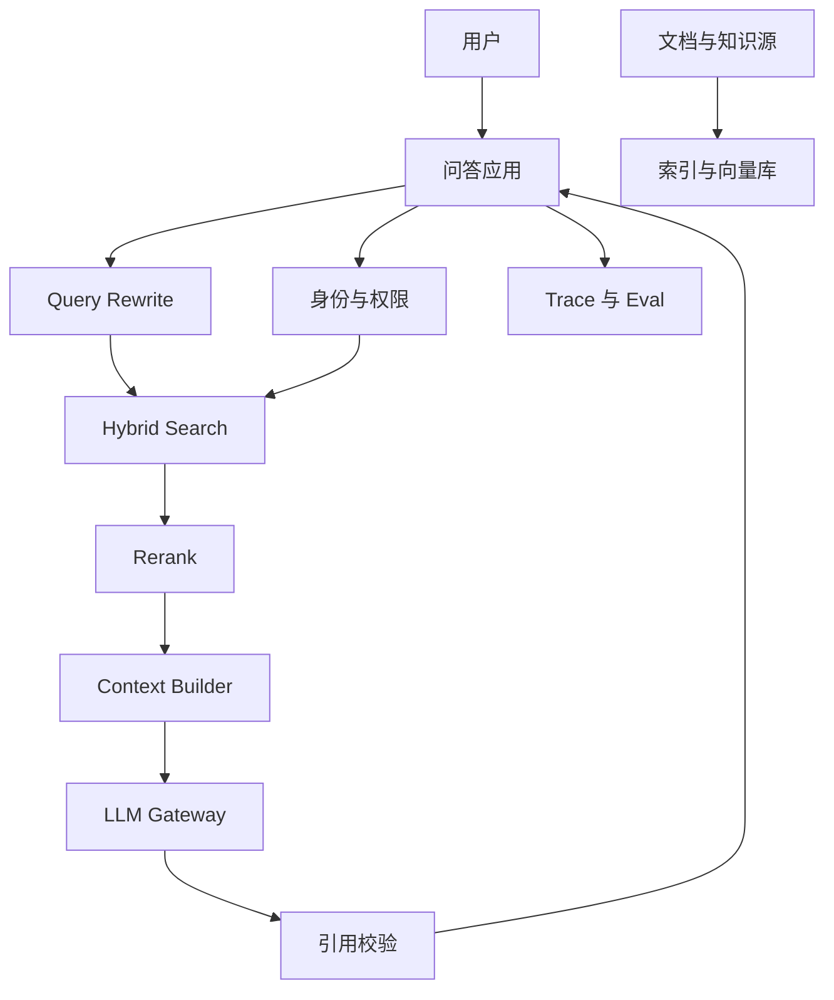

# 企业知识库 RAG 架构作品集样例

> 样例定位：把企业内部文档、制度、产品手册和故障知识沉淀成可信问答系统。使用时请替换成你的真实业务、数据和结果。

## 基本信息

- 项目名称：企业知识库智能问答平台
- 项目类型：RAG / Enterprise Search / Copilot
- 业务领域：客服、运营、研发支持、内部知识管理
- 我的角色：AI 架构设计、RAG 链路设计、eval 体系、安全治理评审
- 时间范围：8-12 周
- 团队成员：后端、数据平台、搜索、业务专家、安全合规、前端

## 1. 业务背景

- 业务痛点：知识分散在文档、工单、Wiki、IM 群和制度系统中，新人和一线人员检索成本高，回答口径不一致。
- 为什么适合 AI：问题通常是自然语言表达，答案依赖多源知识组合，需要引用和解释，而不是只返回关键词搜索结果。
- 如果不用 AI：只能继续依赖人工专家、传统搜索和 FAQ，更新慢、覆盖差、复用低。
- 目标用户：客服、运营、研发值班、销售支持、新员工。
- 预期价值：降低人工咨询量，提高首问解决率，缩短知识定位时间，沉淀高频问题。

## 2. 任务边界

- AI 做什么：回答制度、产品、流程、排障类问题，并给出引用来源。
- AI 不做什么：不替用户执行变更，不回答无权限知识，不对缺少证据的问题强行编造。
- 输入：用户问题、用户身份、业务上下文、知识库权限标签。
- 输出：答案、引用、置信度、推荐追问、无法回答原因。
- 人工介入点：低置信度、高风险政策解释、涉及客户或财务敏感信息的问题。
- 失败兜底：返回相关文档、转人工专家、记录 bad case 进入知识治理队列。

## 3. 架构设计

- 架构模式：权限感知 RAG，结合 hybrid search、rerank、引用约束生成和 trace。
- 核心组件：接入层、身份权限服务、知识入库管道、向量库、全文检索、reranker、LLM gateway、eval/trace。
- 数据流：文档采集 -> 清洗切分 -> 元数据标注 -> embedding -> 索引 -> 检索 -> rerank -> 生成 -> 引用校验。
- 请求链路：用户问题先经过身份和权限解析，再做 query rewrite、检索、rerank、上下文压缩和生成。

## 4. 数据与知识

- 数据源：Wiki、产品文档、流程制度、历史工单、FAQ、故障复盘。
- 权限策略：文档级 ACL、段落级敏感标签、用户身份组过滤，检索前过滤优先。
- 敏感数据处理：PII 脱敏、客户名替换、密钥和凭据检测、日志最小化。
- RAG 设计：按语义段落切分，保留标题路径、版本、Owner、更新时间和业务线标签。
- 数据新鲜度：增量入库，过期文档标记，热点知识每日重建索引。
- 引用和可追溯：答案必须绑定来源片段，无法引用则降级为“可能相关资料”。

## 5. 模型与工具

- 模型选择：通用大模型负责理解和生成，小模型或 embedding 模型负责召回。
- Prompt 策略：强制基于上下文回答，缺证据时拒答，输出引用和不确定性。
- Tool calling：只开放搜索、文档跳转、反馈提交，不开放业务写操作。
- 工具权限：工具调用继承用户权限，不允许模型绕过权限层访问索引。
- 高风险动作：政策解释、财务条款、客户敏感信息必须触发人工确认。
- fallback：检索无结果时返回搜索建议、候选文档和人工专家入口。

## 6. Eval 与上线

- eval set：高频问题、跨文档问题、权限隔离问题、过期知识问题、恶意提示问题。
- 指标：answer correctness、citation accuracy、retrieval recall、faithfulness、refusal quality、p95 latency。
- 通过标准：核心场景正确率达标，越权召回为 0，高风险问题能拒答或转人工。
- 线上观测：记录 query、召回片段、生成版本、引用命中、用户反馈和 bad case。
- 灰度策略：先内部专家试用，再小范围业务线灰度，最后开放全员。
- 回滚条件：出现越权泄露、关键制度回答错误、幻觉率明显上升。

## 7. 安全与治理

- prompt injection 防护：对用户输入和文档内容分别做指令隔离，文档内容不得覆盖系统策略。
- RAG 泄露防护：权限前置过滤，敏感标签拦截，引用可见性校验。
- tool abuse 防护：工具只读、参数校验、调用审计。
- 日志脱敏：用户问题和召回内容按敏感级别采样与脱敏。
- 审计链路：保留问题、知识版本、模型版本、prompt 版本、回答和引用。
- open risks：知识质量依赖 Owner 维护；跨文档推理仍需持续补 eval。

## 8. 成本、延迟与容量

- p95 延迟：目标控制在 3-5 秒，复杂问题允许异步增强。
- 成本估算：按 token、embedding 重建、rerank 调用和缓存命中拆分。
- token 控制：上下文压缩、片段去重、按问题类型选择上下文窗口。
- cache / routing：高频问答缓存，简单问题走低成本模型，复杂问题走强模型。
- 容量规划：按日活、峰值 QPS、平均检索片段数和模型并发估算。

## 9. 结果与复盘

- 业务结果：减少重复咨询，提升知识定位效率，让专家从重复答疑转向知识治理。
- 技术结果：形成权限感知 RAG、eval set、trace、bad case 运营闭环。
- 失败案例：文档过期导致错误回答；相似制度被错误召回；引用片段不足以支撑结论。
- 改进动作：建立知识 Owner 机制、热点问题专项 eval、召回和 rerank 分层优化。
- 下一阶段：接入工单系统，实现从问答到推荐处理方案，但保持人工确认。

## 10. 面试表达摘要

用 1 分钟讲：

> 我做的是一个企业知识库 RAG 系统，核心不是简单接一个向量库，而是把权限、引用、检索评测和知识新鲜度一起设计进去。系统按用户身份过滤知识，使用 hybrid search 和 rerank 提升召回质量，答案必须带引用，低置信度会转人工。这个项目证明我能把 AI 问答从 demo 推到可治理的生产系统。

用 3 分钟讲：

> 背景是企业知识分散，传统搜索难以回答自然语言问题。我先定义边界：AI 只回答有证据的问题，不做业务写操作，不访问用户无权限知识。架构上我设计了文档入库、权限标签、hybrid search、rerank、context builder、LLM gateway、引用校验和 trace/eval。上线前用高频问题、权限隔离、过期知识和 prompt injection 做 eval；上线后通过用户反馈和 bad case 迭代知识和检索。核心取舍是召回率、引用可信度、权限安全和延迟成本之间的平衡。

用 10 分钟讲：

> 可以展开讲业务指标、知识入库、chunk 策略、元数据设计、权限前置过滤、检索和 rerank 策略、prompt 约束、引用校验、eval set 构建、灰度上线、线上观测、成本优化和失败案例复盘。重点强调：RAG 的难点不是“向量检索”，而是知识质量、权限、引用、评测、反馈闭环和治理责任。

## 关联

- [[./作品集样例索引|作品集样例索引]]
- [[../05-Topics/RAG 架构师视角|RAG 架构师视角]]
- [[../05-Topics/AI 数据治理架构师视角|AI 数据治理架构师视角]]
- [[../05-Topics/AI 安全治理架构师视角|AI 安全治理架构师视角]]
- [[../07-Templates/AI 架构师作品集模板|AI 架构师作品集模板]]
