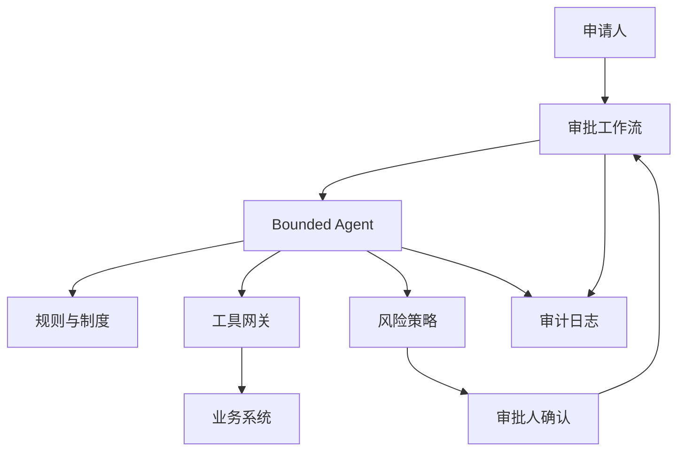

# 审批型 Agent 架构作品集样例

> 样例定位：让 AI 协助处理审批、资料核验、规则解释和动作编排，但所有高风险动作都必须受控。使用时请替换成你的真实业务流程。

## 基本信息

- 项目名称：审批流程智能助手
- 项目类型：Agent / Workflow / Tool Use / Human-in-the-loop
- 业务领域：采购审批、合同审核、报销审核、权限申请、运营变更
- 我的角色：Agent 架构设计、工具边界设计、风险控制、上线评审
- 时间范围：10-14 周
- 团队成员：业务流程 Owner、后端、工作流平台、安全、法务或财务、前端

## 1. 业务背景

- 业务痛点：审批材料不完整、规则解释依赖人工、跨系统查询耗时、审批人反复追问。
- 为什么适合 AI：流程中有大量自然语言材料、规则解释、资料核验和候选动作建议。
- 如果不用 AI：依赖审批人手动查系统、读制度、追资料，效率低且口径不一致。
- 目标用户：申请人、审批人、流程管理员。
- 预期价值：减少材料缺失，提高审批准备质量，缩短审批周期，降低误审风险。

## 2. 任务边界

- AI 做什么：理解申请、检查材料、解释规则、查询工具、生成审批建议和补充材料清单。
- AI 不做什么：不绕过审批人，不直接批准高风险请求，不修改核心业务数据。
- 输入：申请单、附件、用户身份、审批规则、历史审批样例、工具查询结果。
- 输出：材料完整性检查、风险点、建议动作、需要人工确认的问题。
- 人工介入点：批准、拒绝、金额超阈值、权限提升、合同条款异常。
- 失败兜底：回退到传统审批流程，保留 AI 建议但不自动执行。

## 3. 架构设计

- 架构模式：Bounded Agent + Deterministic Workflow，Agent 负责理解和建议，工作流负责状态推进。
- 核心组件：流程编排、Agent runtime、工具网关、规则引擎、风险策略、人审节点、审计日志。
- 数据流：申请进入 -> 材料解析 -> 规则检索 -> 工具查询 -> 风险评分 -> 建议生成 -> 人工确认 -> 工作流推进。
- 模型/工具链路：模型只能通过 tool gateway 调用白名单工具，工具结果进入可审计上下文。

## 4. 数据与知识

- 数据源：审批制度、历史审批记录、申请表单、附件、组织架构、预算和权限系统。
- 权限策略：Agent 只能读取申请相关数据，跨部门信息按审批角色授权。
- 敏感数据处理：合同、薪资、客户、财务数据按字段脱敏和最小化展示。
- knowledge design：规则条款结构化，历史样例只做参考，不作为自动批准依据。
- 数据新鲜度：制度版本和组织权限每日同步，审批规则变更需触发 eval 回归。
- 引用和可追溯：每个建议必须指向规则条款、工具返回或申请材料。

## 5. 模型与工具

- 模型选择：强推理模型处理复杂材料理解，轻量模型处理分类和摘要。
- Prompt 策略：要求输出“事实、规则、推理、建议、需确认项”，避免直接下结论。
- Tool calling：查询预算、供应商、权限、历史审批、合同风险和附件解析。
- 工具权限：工具网关做白名单、参数校验、速率限制、身份传递和审计。
- 高风险动作：批准、拒绝、转账、权限开通、合同生效必须人工确认。
- fallback：工具失败时标记为“无法核验”，不允许模型猜测。

## 6. Eval 与上线

- eval set：正常审批、材料缺失、规则冲突、金额超阈、恶意提示、工具超时、历史相似但规则已变更。
- 指标：建议准确率、风险召回率、材料缺失识别率、工具调用成功率、人工采纳率、误触发率。
- 通过标准：高风险漏检为 0，自动建议不越权，工具错误不导致错误审批。
- 线上观测：记录每一步计划、工具调用、规则引用、人工修改和最终结果。
- 灰度策略：先只读建议，再低风险流程辅助，最后扩大到多流程。
- 回滚条件：出现越权查询、高风险漏检、错误建议被高比例采纳。

## 7. 安全与治理

- prompt injection 防护：附件和申请理由不允许覆盖系统策略或工具权限。
- RAG 泄露防护：规则检索按角色过滤，历史案例脱敏。
- tool abuse 防护：工具 schema 固定，参数白名单，禁止自由 SQL 或任意 API。
- 日志脱敏：附件内容摘要化，敏感字段只记录哈希或类别。
- 审计链路：保留 Agent plan、工具输入输出、规则引用、人工确认和状态变更。
- open risks：历史审批样例可能携带旧规则偏差；复杂异常仍需人工主导。

## 8. 成本、延迟与容量

- p95 延迟：普通检查 5 秒内，复杂附件解析可异步。
- 成本估算：按申请量、附件长度、工具调用次数和模型推理成本估算。
- token 控制：附件先摘要，规则按结构检索，历史样例只取 Top K。
- cache / routing：常见规则解释缓存，低风险分类走轻量模型，高风险推理走强模型。
- 容量规划：按工作日峰值、批量审批窗口、附件解析队列和工具限流设计。

## 9. 结果与复盘

- 业务结果：申请材料更完整，审批人查询成本下降，规则口径更统一。
- 技术结果：形成 bounded agent、tool gateway、human-in-the-loop 和审计闭环。
- 失败案例：工具返回过期数据；模型把历史样例误当规则；附件中恶意指令诱导越权。
- 改进动作：工具结果加版本和时间戳，规则优先级高于历史样例，附件内容做指令隔离。
- 下一阶段：接入更多审批流程，但坚持“建议自动化，决策可审计”。

## 10. 面试表达摘要

用 1 分钟讲：

> 我做的是审批型 Agent，不是让模型自由批准，而是把 Agent 约束在固定 workflow 和工具网关内。它负责理解材料、查规则、调用工具和生成建议，高风险动作必须人工确认。这个项目证明我理解 Agent 落地的关键：边界、权限、工具、幂等、审计和 human-in-the-loop。

用 3 分钟讲：

> 背景是审批流程依赖人工查规则和跨系统核验。我把系统设计成 bounded agent 加确定性工作流：工作流控制状态，Agent 负责理解和建议，工具网关控制所有系统访问，风险策略决定是否进入人工确认。上线时先做只读建议，再进入低风险流程灰度。eval 覆盖材料缺失、规则冲突、金额超阈、工具失败和 prompt injection。核心取舍是自动化效率和业务风险之间的边界设计。

用 10 分钟讲：

> 可以展开讲任务边界、Agent plan、工具 schema、幂等设计、风险等级、人审策略、规则优先级、历史样例偏差、工具失败兜底、审计日志、灰度上线和回滚条件。重点强调：Agent 不是越自由越好，企业级 Agent 的第一原则是可控、可审计、可回滚。

## 关联

- [[./作品集样例索引|作品集样例索引]]
- [[../05-Topics/Agent 架构师视角|Agent 架构师视角]]
- [[../05-Topics/AI 安全治理架构师视角|AI 安全治理架构师视角]]
- [[../08-Playbooks/AI 项目从 0 到 1 落地 Playbook|AI 项目从 0 到 1 落地 Playbook]]
- [[../07-Templates/AI 架构师作品集模板|AI 架构师作品集模板]]
