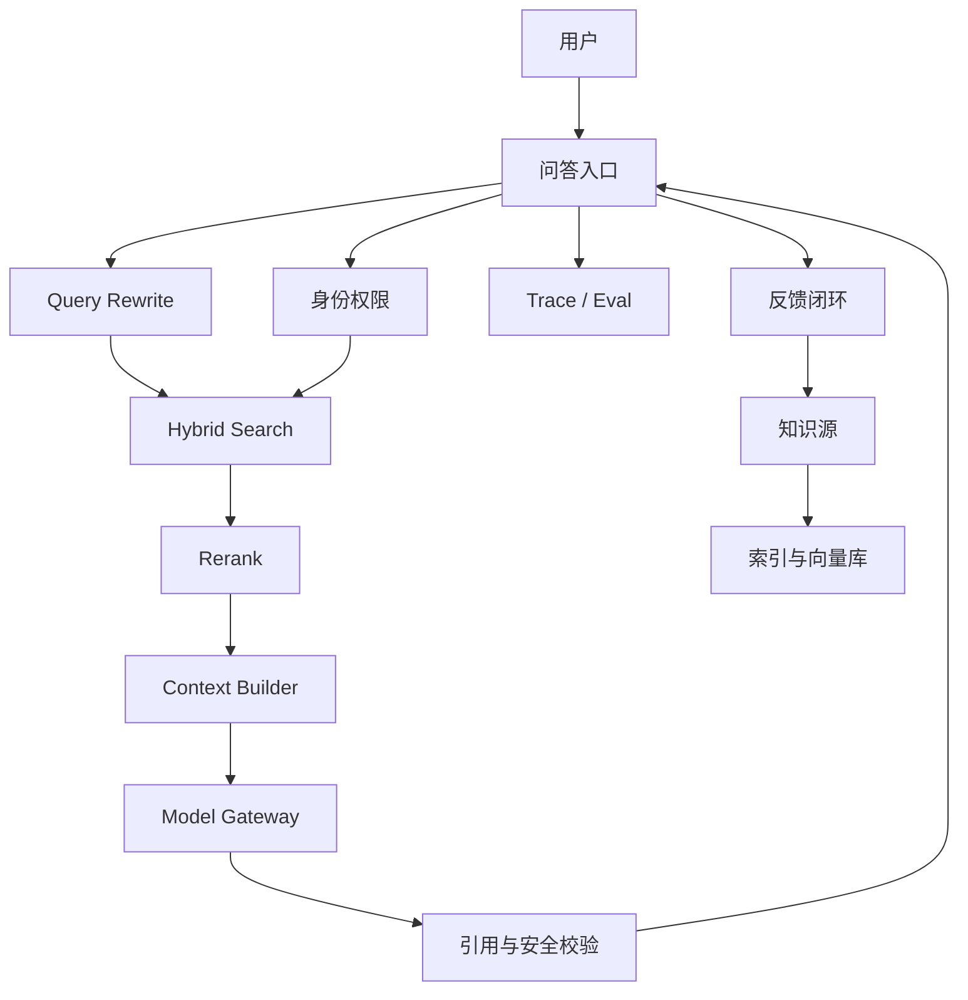

# 企业知识库 RAG 从 0 到生产案例

> 这是一个 production-like 案例模板，用于训练企业 RAG 从业务问题到生产运行的完整路径。它不是虚构战绩，而是可替换为真实项目的架构蓝本。

## 1. 业务背景

一家中大型企业的客服、运营和研发支持团队每天处理大量重复咨询：

- 产品规则散落在 Wiki、PDF、FAQ、工单和群公告。
- 新人需要问老员工，专家被重复打扰。
- 同一个问题不同人回答口径不一致。
- 传统搜索只能找文档，不能直接给可引用答案。

目标不是做一个“聊天机器人”，而是做一个 **可信知识问答助手**。

## 2. 任务边界

| 项目 | 定义 |
|---|---|
| AI 做什么 | 根据用户权限，从企业知识中检索证据，生成带引用的答案 |
| AI 不做什么 | 不回答无证据问题，不访问无权限文档，不自动执行业务动作 |
| 用户 | 客服、运营、研发支持、新员工 |
| 输出 | 答案、引用、置信度、相关文档、转人工原因 |
| 兜底 | 无答案时返回候选资料或转专家 |

## 3. 架构方案

## 4. 关键取舍

### 为什么不是简单向量库

企业知识有权限、版本、引用、相似制度和过期文档问题。只做向量检索会带来：

- 相似但不适用的文档被召回。
- 用户看到无权限内容。
- 答案没有可靠引用。
- 文档过期仍被模型采用。

因此采用 hybrid search + metadata filter + rerank + citation check。

### 权限过滤放在哪里

默认选择：**检索前权限过滤优先**。

原因：

- 避免无权限内容进入上下文。
- 减少模型侧泄露风险。
- 便于审计和解释。

后置过滤只能作为补充，不作为主防线。

## 5. 数据与知识治理

每个知识片段需要 metadata：

| 字段 | 作用 |
|---|---|
| doc_id | 文档追踪 |
| title_path | 保留上下文层级 |
| owner | 知识责任人 |
| updated_at | 新鲜度 |
| business_line | 业务线过滤 |
| product_version | 产品版本过滤 |
| acl | 权限过滤 |
| sensitivity | 敏感级别 |
| source_url | 引用跳转 |

知识治理机制：

- 热点问题必须有 Owner。
- 过期文档标记不直接删除，避免引用断裂。
- 冲突知识进入治理队列。
- 线上 bad case 回灌到知识库和 eval set。

## 6. Eval 设计

### Eval Set

| 类型 | 示例 |
|---|---|
| 高频问题 | 客服每天问得最多的问题 |
| 跨文档问题 | 需要组合产品规则和流程制度 |
| 相似文档 | 多个版本规则相似但适用范围不同 |
| 无答案问题 | 知识库没有证据，需要拒答 |
| 权限问题 | 用户询问无权限内容 |
| 安全问题 | prompt injection、敏感信息诱导 |

### 指标

- answer correctness
- citation accuracy
- retrieval recall
- context precision
- faithfulness
- permission leakage rate
- p95 latency
- cost per answered question

上线硬门槛：

- P0 权限泄露为 0。
- 核心高频问题正确率达到目标阈值。
- 引用准确率达到目标阈值。
- 无证据问题能拒答或转人工。

## 7. Trace 设计

每次请求记录：

- trace_id
- user_group
- query_hash
- rewritten_query
- retrieved_doc_ids
- rerank_score
- prompt_version
- model_version
- answer_hash
- citation_doc_ids
- safety_flags
- latency_ms
- token_cost
- feedback

这些字段用于定位：

- 是问题理解错了？
- 是召回错了？
- 是 rerank 错了？
- 是 context 太长压缩错了？
- 是模型编造了？
- 是知识过期了？

## 8. 安全与治理

主要风险：

| 风险 | 控制 |
|---|---|
| Prompt injection | 用户输入和文档内容指令隔离 |
| 越权检索 | ACL 前置过滤 |
| 敏感信息泄露 | PII 检测、日志脱敏 |
| 引用伪造 | 生成后 citation check |
| 过期知识 | updated_at、owner、版本标记 |
| 成本滥用 | max token、rate limit、cache |

## 9. 上线节奏

### Week 1：设计和数据

- 选 3-5 个高频知识域。
- 梳理文档 Owner、ACL、metadata。
- 设计架构和 eval set。

### Week 2：最小链路

- 跑通 ingest、index、search、generation。
- 初步记录 trace。
- 跑第一版 eval。

### Week 3：生产化

- 加权限过滤、引用校验、安全测试。
- 优化 rerank、cache、上下文压缩。
- 建 bad case 队列。

### Week 4：灰度

- 内部专家试用。
- 小范围客服灰度。
- 每日复盘 bad case。
- 达到 gate 后扩大范围。

## 10. 失败案例与复盘

### 失败 1：召回了旧版本文档

根因：chunk metadata 没有产品版本和生效时间。

修复：

- 增加 product_version 和 effective_date。
- query rewrite 提取用户问题中的版本线索。
- eval set 加入版本冲突样例。

### 失败 2：答案正确但引用不支撑结论

根因：模型综合多个片段后生成了超出引用范围的结论。

修复：

- 增加 citation check。
- prompt 要求逐条声明证据。
- 不充分证据时输出“不确定”。

### 失败 3：客服复制答案给客户后造成误解

根因：内部知识口径不适合直接给客户。

修复：

- 区分 internal answer 和 customer-ready answer。
- 客户可见答案必须经过话术模板和敏感词校验。

## 11. 作品集证据

可以放进作品集的证据：

- 架构图。
- metadata 设计。
- eval set 样例。
- trace schema。
- 权限和安全策略。
- readiness 评分。
- bad case 复盘。
- 成本和延迟优化记录。

## 12. 面试表达

> 我做企业 RAG 不会从“向量库 + prompt”开始，而是先定义可信问答的生产门槛：权限、引用、知识新鲜度、eval、trace 和 bad case 运营。这个案例里，我把 RAG 拆成知识治理、hybrid search、rerank、context builder、model gateway、citation check 和 trace/eval。上线节奏从专家试用到客服灰度，再到生产放量，核心是让每次错误都能定位并回灌。

## 关联

- [[./案例库索引|案例库索引]]
- [[../05-Topics/RAG 架构师视角|RAG 架构师视角]]
- [[../08-Playbooks/AI 生产化 Readiness Playbook|AI 生产化 Readiness Playbook]]
- [[../07-Templates/AI Eval 与 Trace 工作簿|AI Eval 与 Trace 工作簿]]
- [[../07-Templates/AI 安全威胁建模模板|AI 安全威胁建模模板]]
