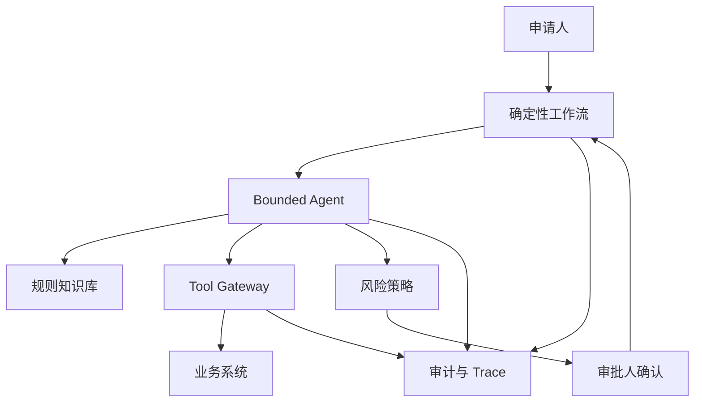

# 审批型 Agent 从 0 到生产案例

> 这是一个 bounded Agent 落地案例，用于训练“让 AI 协助执行，但不越权、不误操作、可审计、可回滚”的架构能力。

## 1. 业务背景

企业采购、合同、报销、权限申请等流程中，审批人经常遇到：

- 申请材料不完整。
- 制度条款分散，判断口径不一致。
- 需要跨系统查预算、供应商、合同、历史审批。
- 审批人时间被低价值核验占用。

目标不是让 Agent 自动替人审批，而是让 Agent 做 **材料检查、规则解释、风险提示和建议生成**。

## 2. 任务边界

| 项目 | 定义 |
|---|---|
| AI 做什么 | 检查材料、检索规则、查询工具、生成风险提示和审批建议 |
| AI 不做什么 | 不直接批准高风险申请，不绕过审批人，不修改核心业务数据 |
| 用户 | 申请人、审批人、流程管理员 |
| 输出 | 缺失材料、规则依据、工具结果、风险点、建议动作 |
| 兜底 | 工具失败则标记无法核验，进入人工处理 |

## 3. 架构方案

## 4. 关键取舍

### 为什么不用完全 autonomous agent

审批场景有明确状态、权限和责任边界。完全 autonomous agent 会带来：

- 自主调用高风险工具。
- 状态推进不可控。
- 审批责任不清。
- 工具误调用难以审计。

因此采用 **deterministic workflow + bounded agent**：

- workflow 控制状态。
- Agent 负责理解、核验和建议。
- tool gateway 控制工具。
- human-in-the-loop 控制高风险动作。

### 哪些可以自动化

| 动作 | 自动化级别 |
|---|---|
| 材料完整性检查 | 可自动 |
| 规则条款检索 | 可自动 |
| 预算和供应商查询 | 可自动，只读 |
| 审批建议生成 | 可自动，但必须展示依据 |
| 低风险通过 | 先人审，后续可灰度 |
| 高风险批准/拒绝 | 必须人工 |

## 5. 工具设计

工具按风险分级：

| 等级 | 示例 | 控制 |
|---|---|---|
| T0 只读 | 查询制度、预算余额、供应商状态 | 身份透传、审计 |
| T1 建议 | 生成补充材料清单、风险摘要 | 输出校验 |
| T2 低风险写 | 发起补充材料通知 | 幂等、撤回 |
| T3 高风险写 | 批准、拒绝、付款、开权限 | 人工确认、审批、双人复核 |

所有 tool call 必须记录：

- tool name
- args hash
- caller identity
- workflow state
- result status
- risk level
- approval id

## 6. Eval 设计

### Case 类型

- 正常低风险申请。
- 材料缺失申请。
- 金额超阈值。
- 供应商风险异常。
- 规则冲突。
- 历史样例相似但规则已变。
- prompt injection 附件。
- 工具超时或返回异常。

### 指标

- material completeness detection
- rule citation accuracy
- tool call accuracy
- risk recall
- high-risk false negative
- human acceptance rate
- rollback success
- p95 latency

上线硬门槛：

- 高风险漏检为 0。
- T3 工具无人工确认不得执行。
- 工具失败不得被模型猜测补全。
- 所有建议必须有规则或工具依据。

## 7. 安全威胁建模

| 风险 | 控制 |
|---|---|
| 附件 prompt injection | 附件内容作为 data，不作为 instruction |
| tool abuse | tool gateway、schema、白名单、风险分级 |
| goal manipulation | 系统目标和 workflow state 固定 |
| memory poisoning | 审批案例不写长期记忆，或需要审核 |
| 越权查询 | 工具继承审批角色和流程权限 |
| 审计缺失 | plan、tool、approval、state 全链路 trace |

## 8. 上线节奏

### 阶段 1：只读助手

- 只做材料检查和规则解释。
- 不调用写工具。
- 所有建议由审批人判断。

### 阶段 2：低风险辅助

- 接入只读工具。
- 输出风险摘要和建议动作。
- 收集人工采纳率。

### 阶段 3：受控自动化

- 低风险动作可半自动执行。
- T2 需要撤回和幂等。
- T3 继续人工确认。

### 阶段 4：平台化复用

- 把审批 Agent 模式抽象给合同、报销、权限申请等流程。
- 建统一 tool gateway、risk policy、approval trace。

## 9. 失败案例与复盘

### 失败 1：模型把历史审批当作当前规则

根因：历史样例没有规则版本和生效时间。

修复：

- 规则条款优先级高于历史样例。
- 历史审批只作为参考，不作为决策依据。
- eval 加入“历史相似但规则变化”的 case。

### 失败 2：工具返回异常，模型仍给出肯定建议

根因：prompt 没有要求工具失败必须显式暴露。

修复：

- 工具失败状态进入 context。
- 输出字段增加“无法核验项”。
- release gate 增加工具异常 eval。

### 失败 3：低风险自动通知重复发送

根因：写工具缺少幂等键。

修复：

- T2/T3 工具必须有 idempotency key。
- workflow state 校验后才能执行。
- trace 中记录 action_id。

## 10. 作品集证据

- Bounded Agent 架构图。
- 工具分级表。
- workflow 状态图。
- eval set。
- threat model。
- trace schema。
- human approval 记录。
- incident 复盘。

## 11. 面试表达

> 审批型 Agent 的关键不是让模型更自主，而是把自主性收敛到可控边界内。我会用 deterministic workflow 管状态，用 bounded agent 做理解和建议，用 tool gateway 控权限和工具，用 human-in-the-loop 控高风险动作。上线不是一步到位自动审批，而是从只读建议、低风险辅助、受控自动化逐步推进，每一阶段都有 eval、trace、审计和回滚。

## 关联

- [[./案例库索引|案例库索引]]
- [[../05-Topics/Agent 架构师视角|Agent 架构师视角]]
- [[../07-Templates/AI 安全威胁建模模板|AI 安全威胁建模模板]]
- [[../08-Playbooks/AI 生产化 Readiness Playbook|AI 生产化 Readiness Playbook]]
- [[../08-Playbooks/AI 生产运行 Runbook|AI 生产运行 Runbook]]
