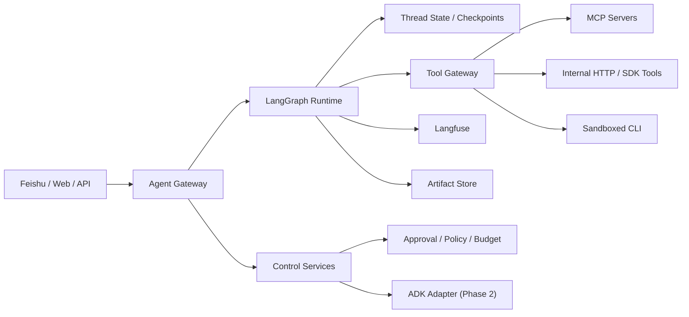

# Agent Platform V1 架构设计文档

## 1. 架构目标

为内部 `agent platform` 提供一个：

- 可恢复
- 可观测
- 可审批
- 可扩展
- 可兼容多工具面

的统一平台底座。

## 2. 核心技术判断

- `LangGraph`：执行内核
- `Langfuse`：trace / eval / prompt / experiment
- `Postgres`：thread state / metadata
- `Redis`：短期队列 / cache / async orchestration
- `S3 / MinIO`：artifacts
- `Feishu / Lark`：主要 channel
- `MCP + SDK/HTTP + safe CLI`：tool surface
- `ADK adapter`：phase 2 runtime interoperability

## 3. 高层架构

## 4. 组件说明

### 4.1 Agent Gateway

职责：

- 接收 channel 事件
- 归一化 `TurnRequest`
- 做 user / tenant / thread lookup
- 将请求路由到 runtime

### 4.2 LangGraph Runtime

职责：

- graph execution
- state transitions
- checkpoint / resume
- interrupt / approval continuation

### 4.3 Tool Gateway

职责：

- 统一注册 `ToolSpec`
- 路由到底层 transport
- 统一 timeout / retry / audit / auth

### 4.4 Approval / Policy Service

职责：

- 判断工具调用是否需要审批
- 记录审批状态
- 将审批结果写回 thread

### 4.5 Observability

职责：

- trace user turn
- trace model call
- trace tool spans
- 保存 prompt version 与 score

## 5. 数据流

### 5.1 用户对话流

1. 用户在 Feishu 发消息
2. Gateway 归一化为 `TurnRequest`
3. Runtime 读取 thread state
4. Runtime 调模型 / tools
5. Tool Gateway 执行 tool
6. Runtime 写 checkpoint
7. Langfuse 记录 trace
8. Gateway 回推消息

### 5.2 审批流

1. Runtime 判断某 tool action 高风险
2. Policy service 生成 approval request
3. Feishu 返回卡片或提示
4. 用户审批结果回传
5. Runtime resume 原 thread

## 6. 模块边界原则

- channel 不承载业务逻辑
- runtime 不承载 transport-specific tool logic
- tool gateway 不承载 channel state
- policy 不直接耦合具体 runtime 节点实现
- observability 不侵入业务逻辑 contract

## 7. 可扩展点

- Web channel
- Internal API channel
- richer memory service
- ADK remote worker
- A2A federation
- browser runtime

## 8. 关键权衡

### 8.1 为什么不是 ADK-first

因为 V1 的主问题是 thread / interrupt / checkpoint / approval，不是 multi-agent federation。

### 8.2 为什么 Langfuse 要第一天接入

因为 trace / prompt / eval 后补成本极高。

### 8.3 为什么 tools 不全做 MCP

因为内部工具和本地强动作场景里，`HTTP/SDK` 与 `CLI` 仍然有必要。
