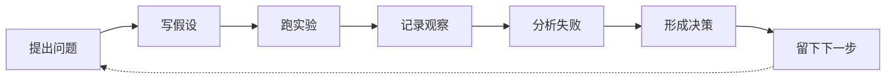

# Mac AI 工作台：从今天开始

这张页解决一个很具体的问题：今天打开 `MacBook Pro Max`，到底怎么玩、怎么学、怎么把零碎实验变成系统能力。

## 一句话定位

把 Mac 当成一个长期运行的 `AI personal lab`：

- `Ollama` 用来快速试模型、试 prompt、试 API
- `llama.cpp` 用来理解 `GGUF`、quantization、context、sampling、server runtime
- `MLX / MLX-LM` 用来走 Apple Silicon 原生路线，理解 unified memory、原生推理和微调
- `PyTorch MPS` 用来建立训练、tensor、autograd、optimizer 的基本肌肉记忆
- `RAG / Agent / Eval` 用来把模型变成系统，而不是停在“我跑起来了”

## 今日启动：20 分钟版本

如果今天只有 20 分钟，不要乱逛。只做这 5 件事：

1. 打开 [[项目总览]]，确认当前学习阶段
2. 打开 [[Mac AI 系统化实验路线图]]，选一个实验
3. 复制 [[Mac AI 实验记录模板]]，写下今天的问题和假设
4. 跑一个最小命令或最小脚本
5. 记录：结果、失败、下一步

> 关键不是今天多厉害，而是让每次打开 Mac 都能留下一个可复盘的实验痕迹。

## 今日启动：60 分钟版本

如果今天有 1 小时，按这个节奏：

| 时间 | 动作 | 输出 |
|---|---|---|
| 10 分钟 | 选问题 | 一个明确问题，例如“同一模型不同量化有什么差异？” |
| 20 分钟 | 跑实验 | 命令、脚本、模型、参数记录 |
| 15 分钟 | 做对比 | 速度、内存、质量、失败样例 |
| 10 分钟 | 写判断 | 什么场景选什么工具 |
| 5 分钟 | 留下一步 | 下次继续点 |

## 半天版本：一次完整小闭环

半天学习不要追求“看完很多资料”，而要完成一个闭环：

示例问题：

- `Ollama` 和 `MLX-LM` 跑同一个模型，首 token 延迟、吞吐和体感差异是什么？
- 同一模型 `Q4 / Q5 / Q8` 的质量损失是否真的能被我感受到？
- `PyTorch MPS` 能不能让我真正理解一个最小训练循环？
- 本地 RAG 的坏例子主要来自 chunking、embedding、rerank，还是 prompt？
- 一个本地 agent 的失败，是 planning 问题、tool schema 问题，还是上下文污染问题？

## 四层学习循环

### 1. 玩：先让系统动起来

目标：减少心理摩擦。

- 用 `Ollama` 跑本地模型
- 用 `curl` 或 Python 调一次本地 API
- 用最小 UI 做一个聊天窗口
- 换模型、换 system prompt、换 temperature

不要在这一层停太久。会跑只是入场券。

### 2. 学：解释为什么这样工作

目标：把工具背后的原理拆出来。

- tokenizer 如何影响上下文和成本
- quantization 为什么能省内存，但会损失精度
- `MPS` 为什么不是 `CUDA`
- `MLX` 为什么适合 Apple Silicon
- context window、KV cache、sampling 会如何影响体验

这一层对应：

- [[第 1 章：本地推理与模型运行]]
- [[第 2 章：PyTorch MPS 与训练基础]]
- [[第 3 章：MLX 与 Apple Silicon 原生实验]]

### 3. 做：把模型变成可用系统

目标：从 demo 变成小产品。

- 本地知识库问答
- 本地代码助手
- 游戏策划资料问答
- 安全知识库问答
- 带工具调用的 agent
- 带 bad-case 集的 eval harness

这一层对应：

- [[第 5 章：RAG、Agent 与本地应用开发]]
- [[Mac AI 实战项目清单]]

### 4. 讲：形成架构判断

目标：能向别人解释 tradeoff。

你应该能讲清：

- 为什么这个实验适合留在本地
- 什么时候应该迁到云上
- 为什么选 `Ollama` 而不是 `llama.cpp`
- 为什么选 `MLX-LM` 而不是 `PyTorch MPS`
- 评测指标、日志、trace、bad case 怎么沉淀
- 安全、隐私、成本、延迟怎么影响架构

这一层对应：

- [[第 6 章：从 Mac 实验室到云上系统]]
- [[Mac AI 专家验收清单]]

## 默认工具栈

| 层 | 推荐默认 | 你要学会的判断 |
|---|---|---|
| 包管理 | `Homebrew`、`uv` | 环境可复现，而不是靠记忆安装 |
| 快速推理 | `Ollama` | 快速试模型、API、embedding 和应用接入 |
| 底层 runtime | `llama.cpp` | `GGUF`、量化、server、sampling、context |
| Apple 原生 | `MLX / MLX-LM` | unified memory、原生推理、LoRA / fine-tuning |
| 训练基础 | `PyTorch MPS` | tensor、autograd、optimizer、fallback |
| 模型来源 | Hugging Face / Ollama Library | 模型、license、格式、量化版本 |
| 应用层 | Python、FastAPI、Streamlit、CLI | 快速做出可交互系统 |
| 评测层 | bad-case set、Ragas、Promptfoo、Langfuse / Phoenix | 不靠感觉判断效果 |

## 模型选择心法

不要一上来追最大模型。Mac AI 学习更适合按阶梯走：

1. `1B-3B`：快速理解 API、prompt、RAG、agent 流程
2. `7B-8B`：学习质量、速度、内存、量化之间的平衡
3. `14B+`：学习长上下文、复杂推理、吞吐和资源边界
4. 多模态模型：学习图像理解、OCR、截图问答、桌面工作流

每换一个模型，都要记录：

- 模型来源与 license
- 参数规模和量化格式
- 上下文长度
- 内存占用
- tokens/s 或体感速度
- 适合什么任务，不适合什么任务

## 每周固定节奏

| 周期 | 动作 | 产物 |
|---|---|---|
| 周一 | 选一个问题 | 本周实验问题 |
| 周二 | 跑 baseline | 初始结果 |
| 周三 | 做变量对比 | 参数 / 模型 / 数据对比 |
| 周四 | 收集 bad cases | 失败样例 |
| 周五 | 写判断 | 选型和架构结论 |
| 周末 | 小项目化 | 一个可演示原型或复盘文档 |

## 不要掉进这些坑

- 装了很多工具，但没有一个实验记录
- 跑了很多模型，但不知道差异来自模型、量化、prompt 还是数据
- 只看回答质量，不看延迟、内存、吞吐、失败样例
- 只做 RAG demo，不做 bad-case 和 retrieval 诊断
- 只追本地，不知道生产系统为什么还需要云上 serving、权限、安全和监控

## 下一步

按这个顺序开练：

1. [[Mac AI 系统化实验路线图]]
2. [[Mac AI 实验记录模板]]
3. [[Mac AI 专家 90 天路径]]
4. [[Mac AI 实战项目清单]]
5. [[Mac AI 专家验收清单]]

