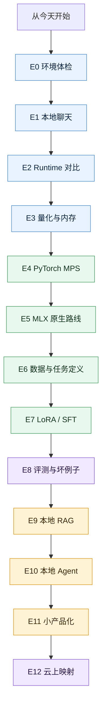

# Mac AI 系统化实验路线图

这张路线图不是“读书目录”，而是一组从浅到深的实验。每个实验都要留下一个 [[Mac AI 实验记录模板|实验记录]]。

## 总路线

## E0：环境体检

目标：确认 Mac 是可复现实验环境，而不是一次性手工环境。

- 跑通 `python --version`、`uv --version`、`git --version`
- 跑通 `torch.backends.mps.is_available()`
- 跑通 `ollama list`
- 跑通 `mlx_lm.generate --help`

输出：

- 环境版本记录
- 安装问题记录
- 可复现安装命令

对应阅读：[[第 0 章：环境与工具链搭建]]、[[第 0 章实操：把 Mac 变成 AI 实验室]]

## E1：本地聊天

目标：用最短路径形成正反馈。

- 用 `Ollama` 跑一个小模型
- 用 CLI 提问
- 用本地 API 调用
- 换 system prompt 和 temperature

输出：

- 一份 prompt 对比记录
- 一份模型体感记录

对应阅读：[[第 1 章：本地推理与模型运行]]

## E2：Runtime 对比

目标：理解不同 runtime 的边界。

| Runtime | 重点 | 适合问题 |
|---|---|---|
| `Ollama` | 快速运行和 API | 怎么最快接到应用里 |
| `llama.cpp` | `GGUF`、quantization、server | 模型格式和底层参数怎么影响运行 |
| `MLX-LM` | Apple Silicon 原生 | Mac 上原生推理和微调怎么做 |

输出：

- `Ollama vs llama.cpp vs MLX-LM` 对比表
- 一个默认选型规则

对应阅读：[[第 1 章实操：本地推理对比实验]]

## E3：量化与内存

目标：亲手感受质量、速度、内存之间的 tradeoff。

- 同一模型选择不同量化版本
- 比较内存占用、速度、回答质量
- 记录 bad cases
- 观察长上下文时的变化

输出：

- 量化对比表
- 个人默认量化选择规则

关联主题：[[../../07-Topics/本地 LLM 工具链：Ollama、llama-cpp、MLX-LM|本地 LLM 工具链：Ollama、llama.cpp、MLX-LM]]

## E4：PyTorch MPS 最小训练

目标：不要只会推理，要理解训练如何成立。

- 写一个最小 dataset
- 跑 forward / loss / backward / optimizer
- 对比 CPU 与 `mps`
- 记录 fallback 或不支持算子

输出：

- 最小训练脚本
- `CPU vs MPS` 观察笔记

对应阅读：[[第 2 章：PyTorch MPS 与训练基础]]、[[第 2 章实操：PyTorch MPS 最小训练实验]]

## E5：MLX 原生路线

目标：理解 Apple Silicon 上不只是“能跑 PyTorch”。

- 用 `MLX-LM` 跑生成
- 尝试加载不同大小模型
- 对比 `MLX-LM` 与 `Ollama`
- 记录 unified memory 带来的优势和边界

输出：

- `MLX-LM` 推理记录
- `MLX vs PyTorch MPS` 对比笔记

对应阅读：[[第 3 章：MLX 与 Apple Silicon 原生实验]]、[[第 3 章实操：MLX-LM 原生推理与最小 LoRA 实验]]

## E6：数据与任务定义

目标：开始从“玩模型”转向“解决任务”。

- 选一个真实小任务：知识库问答、游戏策划资料整理、安全事件解释、代码问答
- 做 20-50 条样本
- 标注好输入、期望输出、失败类型
- 分成 train / eval / bad-case

输出：

- 一个小数据集
- 一个任务说明
- 一个评测清单

关联主题：[[../../07-Topics/Prompt Registry、Datasets 与 Evals|Prompt Registry、Datasets 与 Evals]]

## E7：LoRA / SFT

目标：理解“改变模型行为”不是玄学。

- 先跑 baseline
- 再做最小 LoRA / SFT
- 对比 tuned 前后结果
- 重点分析无效、退化、过拟合

输出：

- 一次完整训练记录
- baseline vs tuned 对比表
- failure analysis

对应阅读：[[第 4 章：微调、LoRA 与评测]]、[[第 4 章实操：微调评测与 Failure Analysis]]

## E8：评测与坏例子

目标：不靠感觉判断模型。

- 固定一组 eval prompts
- 收集 bad cases
- 给每个 bad case 标注原因
- 记录每次改动是否真的变好

输出：

- 最小 eval set
- bad-case library
- 版本对比记录

关联主题：[[../../07-Topics/Evaluation and Benchmarks|Evaluation and Benchmarks]]、[[../../07-Topics/LLMOps、AgentOps 与 Observability|LLMOps、AgentOps 与 Observability]]

## E9：本地 RAG

目标：把知识库、资料和模型接起来。

- 选一批本地文档
- 做 chunking
- 做 embedding
- 做 retrieval
- 做回答归因
- 记录检索失败和幻觉样例

输出：

- 本地 RAG demo
- retrieval bad-case set
- chunking / embedding / prompt 对比表

对应阅读：[[第 5 章：RAG、Agent 与本地应用开发]]、[[第 5 章实操：本地 RAG 与 Agent Prototype]]

## E10：本地 Agent

目标：理解 agent 不是“模型更聪明”，而是 runtime、tools、memory、approval、eval 的组合。

- 至少接两个工具
- 给工具写 schema
- 设计权限边界
- 记录每次 tool call
- 分析失败路径

输出：

- 一个本地 agent 原型
- tool safety 记录
- agent failure analysis

关联主题：[[../../07-Topics/Agent Runtime Architecture|Agent Runtime Architecture]]、[[../../07-Topics/Prompt Injection Defense 与 Tool Safety|Prompt Injection Defense 与 Tool Safety]]

## E11：小产品化

目标：把实验变成能给别人演示的小系统。

- 做一个 CLI、Web UI 或本地 API
- 加配置文件
- 加日志
- 加简单错误处理
- 写 README

输出：

- 一个可演示原型
- 一个使用说明
- 一个限制说明

对应项目：[[Mac AI 实战项目清单]]

## E12：云上映射

目标：把个人实验翻译成团队架构。

- 哪些保留在本地
- 哪些迁到云上
- 是否需要模型服务、向量库、队列、缓存、权限、审计
- 成本、延迟、吞吐、安全如何估算

输出：

- 一份云上迁移设计文档
- 一份架构 tradeoff 说明

对应阅读：[[第 6 章：从 Mac 实验室到云上系统]]、[[第 6 章实操：从本地原型到云上系统设计]]

## 学习判定标准

你不是“跑完命令”就完成实验，而是要能回答：

- 我在解决什么问题？
- 这个实验验证了什么假设？
- 哪个变量造成了差异？
- 失败样例说明了什么？
- 如果要给团队用，下一步要补什么工程能力？

