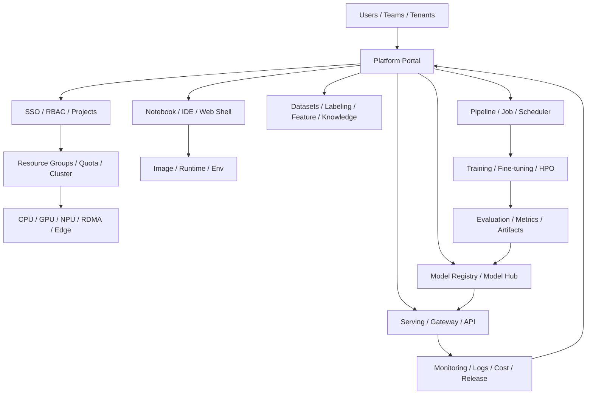

# AI 基础设施平台学习框架

这页用于快速看懂 `Cube Studio`、`Kubeflow`、`KServe`、`Ray`、`MLflow`、`W&B`、`BentoML`、`Seldon`、`Airflow / Argo / Flyte` 这类 AI 基础设施、MLOps、训推平台和 MaaS 平台。

核心判断：

> AI 基础设施平台不是“模型 API 管理后台”，而是把人、数据、算力、环境、训练、模型、服务、评测、监控和治理串起来的系统。

## 一张总图

## 看平台时先问 10 个问题

| 问题 | 为什么重要 |
|---|---|
| 谁是用户？ | 算法工程师、平台管理员、业务用户、数据标注员看到的是不同产品 |
| 租户和项目怎么隔离？ | 企业平台第一层就是 SSO、RBAC、namespace、quota |
| 算力怎么抽象？ | GPU / vGPU / NPU / RDMA / 多集群决定平台上限 |
| 环境怎么复现？ | Notebook、镜像、依赖、Web shell、镜像仓库决定研发效率 |
| 数据怎么进入训练？ | dataset、feature、labeling、knowledge base 是训练质量起点 |
| 训练怎么编排？ | pipeline、job、distributed training、HPO 决定算法链路是否可运营 |
| 模型怎么成为资产？ | model registry、model hub、version、metadata、lineage 决定复用能力 |
| 推理怎么上线？ | serving、gateway、autoscaling、canary、A/B、GPU 调度决定生产能力 |
| 怎么观测和治理？ | logs、metrics、cost、trace、eval、release gate 决定平台能否长期运行 |
| 能不能被企业改造？ | 私有化、源码、插件、国产算力、合规和运维能力决定落地难度 |

## 平台层次

| 层 | 典型系统 | 学习重点 |
|---|---|---|
| Portal / Product Layer | Cube Studio、Databricks、SageMaker Studio | 用户体验、权限、项目、资源、自助化 |
| Workflow Layer | Kubeflow Pipelines、Argo、Flyte、Airflow | DAG、任务依赖、重试、调度、artifact |
| Compute Layer | Kubernetes、Ray、Slurm、Volcano | 资源调度、GPU/NPU、分布式、队列 |
| Training Layer | PyTorch、DeepSpeed、Megatron、Unsloth | 数据、训练、微调、分布式优化 |
| Model Layer | MLflow、Model Registry、AIHUB、Hugging Face Hub | 模型版本、metadata、lineage、artifact |
| Serving Layer | KServe、vLLM、BentoML、Seldon、Triton | API、autoscaling、routing、canary、latency |
| Observability Layer | Prometheus、Grafana、Langfuse、W&B | metrics、trace、eval、cost、failure analysis |
| Governance Layer | RBAC、policy、audit、security gate | 合规、数据权限、secret、审批、审计 |

## Cube Studio 作为学习样本

`Cube Studio` 的价值在于它把很多平台层合在一起：

- 多租户和权限；
- 多资源组、多集群、GPU / vGPU、RDMA、国产异构算力；
- Notebook、在线构建镜像、Web shell；
- Pipeline、分布式训练、超参搜索；
- AIHUB 模型仓库、模型部署、推理、微调和二次开发；
- 私有知识库、AI 应用商店和大模型能力封装。

这说明它适合用来学习“平台产品如何把 AI 工程能力产品化”。

## 类似平台怎么分类

| 类别 | 代表 | 快速判断 |
|---|---|---|
| 一站式 AI 平台 | Cube Studio、SageMaker、Databricks、Vertex AI | 从开发到部署全链路，但复杂度和平台绑定更高 |
| Kubernetes AI 平台 | Kubeflow | 适合研究模块化、云原生 AI 生命周期 |
| Serving 平台 | KServe、BentoML、Seldon、Triton、vLLM | 聚焦模型服务、弹性、路由和推理性能 |
| Distributed Runtime | Ray | 聚焦分布式任务、训练和 serving runtime |
| Experiment / Registry | MLflow、W&B | 聚焦实验、artifact、模型注册和协作 |
| Workflow Orchestrator | Airflow、Argo、Flyte | 聚焦任务编排，不等于完整 AI 平台 |

## 学习路线

1. **先学平台全貌**：用 [[10-Knowledge/AI-Open-Source/03-Projects/Cube Studio]] 看一站式平台怎么组织。
2. **再学云原生参考架构**：用 [[10-Knowledge/AI-Open-Source/03-Projects/Kubeflow]] 看 Kubernetes AI platform。
3. **再学 serving 子系统**：用 [[10-Knowledge/AI-Open-Source/03-Projects/KServe]] 和 [[10-Knowledge/AI-Open-Source/03-Projects/vLLM]] 拆推理服务。
4. **再学 runtime 与任务调度**：用 Ray / Argo / Flyte 看分布式任务与工作流。
5. **最后做平台选型**：回到 [[10-Knowledge/AI-Engineering/07-Topics/Enterprise MLOps 与 LLMOps Vendor Tradeoffs]]。

## 快速接新工作的方法

接到一个新 AI 平台相关工作时，按这个顺序问：

1. 当前平台服务谁：算法团队、业务团队、平台团队，还是外部客户？
2. 平台最大的瓶颈是算力、环境、数据、训练、部署、评测，还是组织流程？
3. 它是想做一站式平台，还是只补某个子系统？
4. 当前最危险的点是稳定性、成本、权限、安全，还是模型效果？
5. 有没有清晰的标准产物：dataset、pipeline、model、service、eval、release？

## Related

- [[10-Knowledge/AI-Open-Source/03-Projects/Cube Studio]]
- [[10-Knowledge/AI-Open-Source/03-Projects/Kubeflow]]
- [[10-Knowledge/AI-Open-Source/03-Projects/KServe]]
- [[10-Knowledge/AI-Open-Source/03-Projects/vLLM]]
- [[10-Knowledge/AI-Engineering/07-Topics/Enterprise MLOps 与 LLMOps Vendor Tradeoffs]]
- [[10-Knowledge/AI-Engineering/07-Topics/Open-Source、Self-Hosting 与 Managed LLMOps]]
- [[10-Knowledge/AI-Engineering/05-Deployment/部署索引]]

## Sources

- [Cube Studio GitHub](https://github.com/data-infra/cube-studio)
- [Cube Studio Wiki](https://github.com/data-infra/cube-studio/wiki)
- [Kubeflow GitHub](https://github.com/kubeflow/kubeflow)
- [KServe](https://kserve.github.io/website/)

