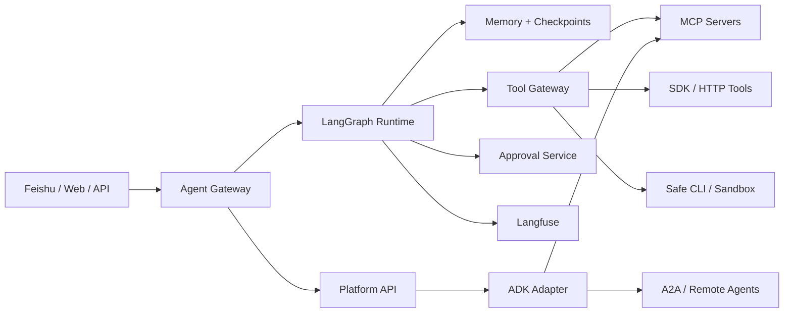

# Agent 平台架构（LangGraph、Langfuse、ADK）

## 先给结论

如果我们现在要搭一个真正可扩展的 `agent platform`，我更推荐：

- `LangGraph` 作为主 runtime
- `Langfuse` 作为 trace / eval / prompt / experiment 平台
- `Google ADK` 作为第二运行时与互操作层，而不是一开始就做唯一底座
- `Feishu / Lark`、Web、API 作为 channel adapter
- `MCP + internal SDK/HTTP tools + safe CLI` 组成 tool surface

## 为什么我不建议一开始就 ADK-first

不是说 `ADK` 不好，而是平台最早要解决的痛点通常是：

- thread state
- checkpoint / resume
- interrupt / approval
- trace / eval / regression
- channel adapter
- tenant / audit / policy

这些点上，`LangGraph + Langfuse` 的组合更像“平台骨架”，而 `ADK` 更像一个很强的 runtime / ecosystem adapter。

这里的判断是工程判断，不是 Google 官方给出的标准答案。

## 一个推荐的分层架构



## 各层职责

### 1. Channel Layer

- Feishu / Lark
- Web chat
- Internal API

负责：用户入口、消息输入、异步结果输出。

### 2. Gateway Layer

负责：

- auth
- tenant
- request normalization
- thread routing
- channel-neutral request model

### 3. Runtime Layer

以 `LangGraph` 为主，负责：

- graph execution
- thread state
- checkpoint / resume
- interrupt / approval continuation

### 4. Tool Layer

- `MCP`
- internal SDK / HTTP tools
- safe CLI

由 `Tool Gateway` 收口治理。

### 5. Control Layer

- approval
- policy
- budget
- secret
- sandbox
- audit

### 6. Observability Layer

以 `Langfuse` 为主，负责：

- trace
- prompt versions
- evals / scores
- regressions
- artifacts / release comparisons

### 7. Interop Layer

用 `ADK` 承接：

- Google 生态 agent runtime
- `A2A`
- remote worker / sub-agent
- runtime experimentation

## 为什么这是更稳的 V1

### LangGraph-first

因为平台早期最难的是 thread / state / interrupt / resume。

### Langfuse-first

因为 trace / prompt / eval 如果不从第一天接入，后面会非常难补。

### ADK-as-adapter

因为这样既能保留 Google 生态与 `A2A` 方向，又不会让平台从第一天就变成“双主运行时耦合”。

## V1 应该先做什么

### V1.1

- 单 agent
- Feishu channel
- LangGraph runtime
- Langfuse tracing
- human approval

### V1.2

- `MCP` + SDK / HTTP tools + safe CLI
- prompt versioning
- eval / regression basics
- artifact store

### V1.3

- ADK adapter
- remote workers
- selected `A2A` experiments

## 一个很实用的 monorepo 结构

```text
agent-platform/
├── apps/
│   ├── gateway-api
│   ├── feishu-bot
│   ├── web-console
│   └── eval-worker
├── packages/
│   ├── agent-sdk
│   ├── graph-runtime
│   ├── adk-adapter
│   ├── tool-gateway
│   ├── approval-service
│   ├── memory-service
│   └── observability
├── infra/
│   ├── postgres
│   ├── redis
│   ├── minio
│   └── langfuse
└── agents/
    ├── support-agent
    ├── ops-agent
    └── research-agent
```

## 哪些东西不要太早做

- 不要一开始就双主运行时
- 不要把所有工具都强行 MCP 化
- 不要让 Feishu webhook 直接承载全部业务逻辑
- 不要等平台复杂了才补 Langfuse
- 不要在没有 thread / approval / trace 的情况下先做复杂 multi-agent

## 我最推荐的默认路线

1. `LangGraph-first runtime`
2. `Langfuse-first observability`
3. `MCP + SDK tools + safe CLI`
4. `Feishu / Lark as channel adapter`
5. `ADK as adapter / remote worker layer`
6. `A2A` 在 phase 2 进入

## 推荐继续往下读

- [[Agent SDK 设计]]
- [[Tool Gateway、MCP Servers 与 SDK Tools]]
- [[飞书与 Lark 作为 Agent Channel Adapter]]
- [[Agent Runtime Architecture]]
- [[Harness Engineering]]
- [[Eval Harness 与 Regression Suites]]

## 关联

- [[../../AI-Learning/06-Topics/Agent 平台|Agent 平台]]
- [[../../AI-Learning/09-Systems/Google Agent Development Kit（ADK）|Google Agent Development Kit（ADK）]]
- [[../../AI-Learning/09-Systems/LangGraph|LangGraph]]
- [[../../AI-Learning/09-Systems/Langfuse|Langfuse]]
- [[Agent SDK 设计]]
- [[Tool Gateway、MCP Servers 与 SDK Tools]]
- [[飞书与 Lark 作为 Agent Channel Adapter]]
- [[Agent Runtime Architecture]]
- [[Harness Engineering]]
- [[Eval Harness 与 Regression Suites]]
- [[Human-in-the-Loop and Approval Gates]]
- [[../08-Maps/Agent 平台技术栈图|Agent 平台技术栈图]]

## 资料

- [ADK Overview](https://google.github.io/adk-docs/)
- [ADK Agents](https://google.github.io/adk-docs/agents/)
- [ADK MCP Tools](https://google.github.io/adk-docs/tools-custom/mcp-tools/)
- [ADK A2A Introduction](https://google.github.io/adk-docs/a2a/intro/)
- [LangGraph Overview](https://docs.langchain.com/oss/python/langgraph/overview)
- [LangGraph Durable Execution](https://docs.langchain.com/oss/python/langgraph/durable-execution)
- [LangGraph Human-in-the-Loop](https://docs.langchain.com/oss/python/langgraph/human-in-the-loop)
- [Langfuse Self-Hosting](https://langfuse.com/docs/self-hosting)
- [Langfuse LangChain Tracing](https://langfuse.com/docs/integrations/langchain/tracing)
- [Lark Developer](https://open.larksuite.com/?lang=en-US)
