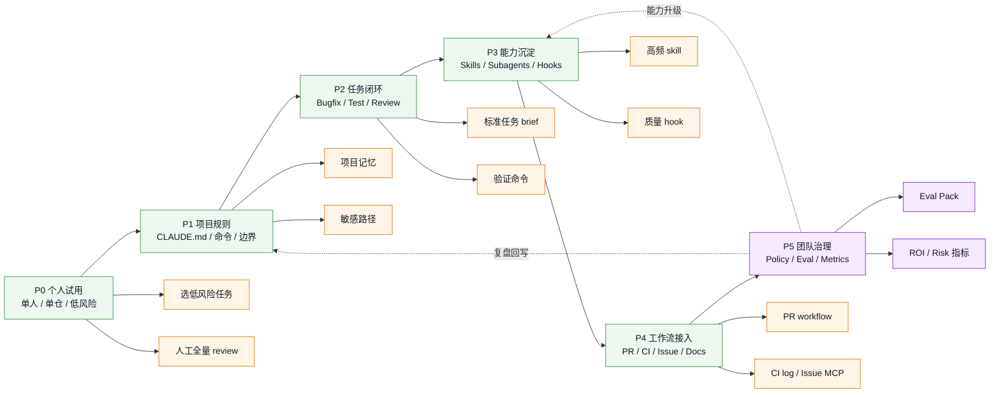

# AI Coding 团队落地路线图

## 图谱意图

这是一张 `roadmap`，回答一个问题：

> 团队如何从个人试用 coding agent，走到可治理、可评估、可规模化的 AI Coding 工作方式？

## 图谱

## 落地判断

- 如果没有 `P1 项目规则`，不要急着上团队插件
- 如果没有 `P2 任务闭环`，不要把 agent 接入 PR / CI
- 如果没有 `P5 团队治理`，不要给 agent 高权限工具和生产数据
- 最好每一阶段都有明确验收指标，而不是靠“感觉效率变高”

## 阶段验收

| 阶段 | 验收问题 |
|---|---|
| P0 | 是否能稳定完成低风险任务 |
| P1 | 项目规则是否足够让 agent 自己进入状态 |
| P2 | 是否有标准 brief、验证命令和 review 输出 |
| P3 | 是否沉淀出复用 skill / subagent / hook |
| P4 | 是否能安全接入 PR、CI、issue、docs |
| P5 | 是否有 eval、权限、审计、ROI 和失败复盘 |

## 相关

- [[../07-Topics/Claude Code Harness 工程实践|Claude Code Harness 工程实践]]
- [[../07-Topics/Harness Engineering|Harness Engineering]]
- [[Coding Agent Workflow Engineering Map]]
- [[AI Coding 安全治理决策图]]
- [[../../AI-Learning/06-Topics/AI Coding 专家能力体系|AI Coding 专家能力体系]]

