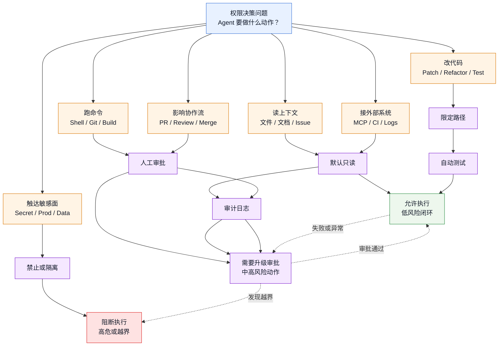

# AI Coding 安全治理决策图

## 图谱意图

这是一张 `decision-map`，回答一个问题：

> 当 coding agent 要获得文件、命令、MCP、PR、CI、数据库等能力时，应该如何决定权限和门禁？

## 图谱

## 决策原则

- 读上下文：默认允许，但要控制敏感路径和数据范围
- 改代码：限定目录和任务范围，必须能 diff 和 review
- 跑命令：危险 shell / destructive git 默认人工审批
- 接外部系统：先只读，再逐步开放写入动作
- 影响协作流：PR comment 可以低风险，merge / release 必须人工控制
- 触达敏感面：secret、生产数据、支付、安全配置默认阻断或隔离环境执行

## 推荐门禁组合

- `低风险任务`：只读上下文 + 限定文件修改 + 局部测试
- `中风险任务`：人工审批 + CI / review + 审计日志
- `高风险任务`：sandbox / worktree / staging + 安全审查 + release gate
- `禁止任务`：生产 secret、生产写库、绕过鉴权、破坏性 Git 历史改写

## 相关

- [[../07-Topics/Agent Security、Sandbox 与 Approval Architecture|Agent Security、Sandbox 与 Approval Architecture]]
- [[../07-Topics/Prompt Injection Defense 与 Tool Safety|Prompt Injection Defense 与 Tool Safety]]
- [[../07-Topics/Agent 上线门槛与安全 Release Gates|Agent 上线门槛与安全 Release Gates]]
- [[AI Coding 团队落地路线图]]
- [[../../AI-Learning/06-Topics/AI Coding 专家能力体系|AI Coding 专家能力体系]]

