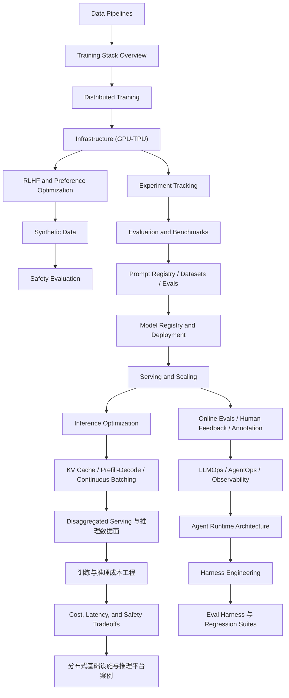

# AI Engineering Stack Map

## 阅读顺序

### 训练主线

- [[../07-Topics/Training Stack Overview|Training Stack Overview]]
- [[../07-Topics/Data Pipelines|Data Pipelines]]
- [[../07-Topics/Tokenization|Tokenization]]
- [[../07-Topics/Distributed Training|Distributed Training]]
- [[../07-Topics/Infrastructure (GPU-TPU)|Infrastructure (GPU-TPU)]]
- [[../07-Topics/RLHF and Preference Optimization|RLHF and Preference Optimization]]
- [[../07-Topics/Synthetic Data|Synthetic Data]]
- [[../07-Topics/Safety Evaluation|Safety Evaluation]]

### 推理与成本主线

- [[../07-Topics/Serving and Scaling|Serving and Scaling]]
- [[../07-Topics/Inference Optimization|Inference Optimization]]
- [[../07-Topics/Disaggregated Serving 与推理数据面|Disaggregated Serving 与推理数据面]]
- [[../07-Topics/训练与推理成本工程|训练与推理成本工程]]
- [[../07-Topics/Cost, Latency, and Safety Tradeoffs|Cost, Latency, and Safety Tradeoffs]]
- [[../07-Topics/分布式基础设施与推理平台案例：Cloud TPU、TorchTitan、Dynamo、Groq、Fireworks|分布式基础设施与推理平台案例：Cloud TPU、TorchTitan、Dynamo、Groq、Fireworks]]

### Agent 与 Harness 主线

- [[../07-Topics/Agent Runtime Architecture|Agent Runtime Architecture]]
- [[../07-Topics/Harness Engineering|Harness Engineering]]
- [[../07-Topics/Eval Harness 与 Regression Suites|Eval Harness 与 Regression Suites]]
