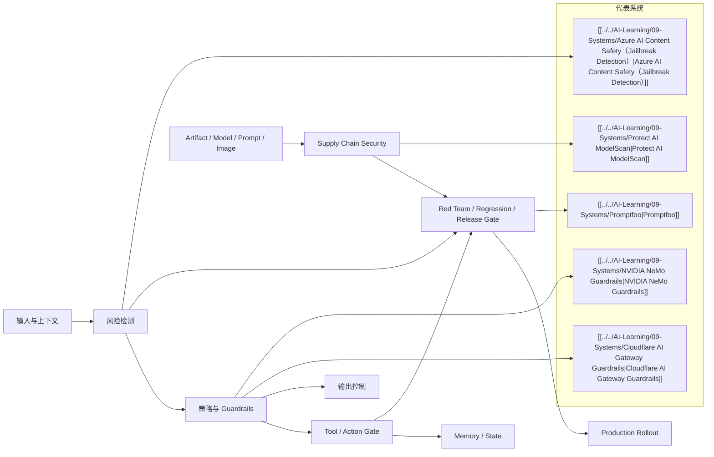

# AI Security 控制点图

## 怎么读

- 先看威胁从哪里进来
- 再看系统在哪个控制点接入
- 最后看 release gate 是否真的把这些控制点连成闭环

## 关联

- [[AI Security Engineering Map]]
- [[../07-Topics/AI 安全案例与失败模式|AI 安全案例与失败模式]]
- [[../07-Topics/Agent 上线门槛与安全 Release Gates|Agent 上线门槛与安全 Release Gates]]
- [[../../AI-Learning/07-Maps/AI Security Threat Map|AI Security Threat Map]]
