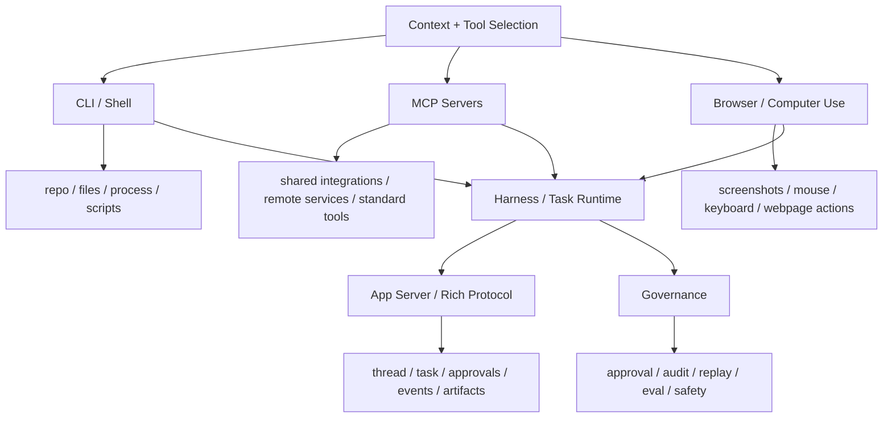

# Agent Action Surfaces and Protocols Map

## 怎么读这张图

- `CLI`、`MCP`、`Browser / Computer Use` 是三种常见动作面
- 真正成熟的 agent 系统，通常不会只停在其中一种
- `Harness / Task Runtime` 会把这些动作面收进同一个工作台
- `App Server / Rich Protocol` 则把任务会话、审批和事件流暴露给客户端

## 推荐顺序

1. [[../07-Topics/Tool Calling and Action Execution|Tool Calling and Action Execution]]
2. [[../07-Topics/MCP 与 CLI 模式|MCP 与 CLI 模式]]
3. [[../07-Topics/Computer Use Runtime and Safety|Computer Use Runtime and Safety]]
4. [[../07-Topics/App Server 与 Rich Agent Protocols|App Server 与 Rich Agent Protocols]]
5. [[../07-Topics/Harness Engineering|Harness Engineering]]

## 关联

- [[Agent Context and Integration Engineering Map]]
- [[Agent Runtime Engineering Map]]
- [[../07-Topics/Harness Engineering|Harness Engineering]]
- [[../../AI-Learning/07-Maps/Agent Prompt-Context-Harness Map|Agent Prompt-Context-Harness Map]]
