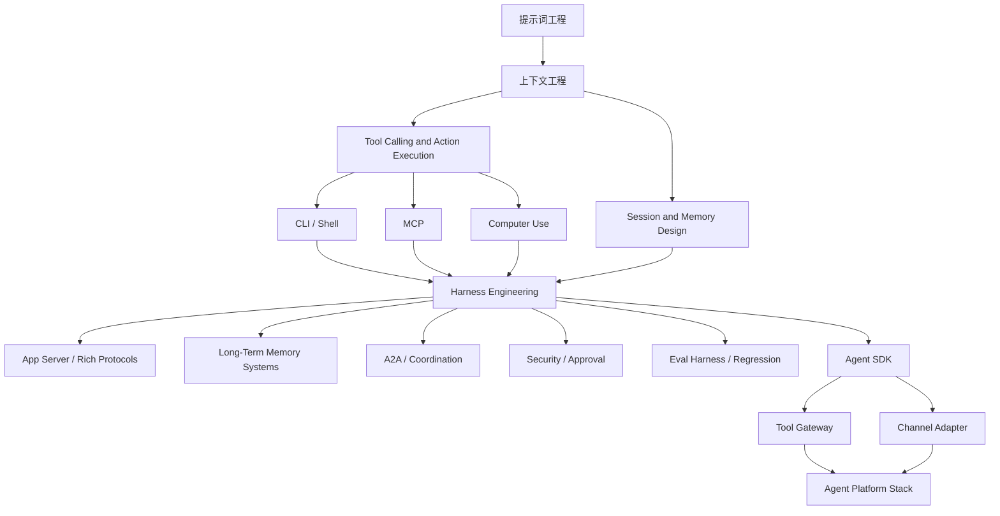

# Agent Context and Integration Engineering Map

## 怎么读这张图

- 从 `提示词工程` 进入，最初只是 instruction 设计
- 到 `上下文工程`，问题开始变成信息装配与状态组织
- 一旦进入 `tool calling`，就会遇到 `CLI`、`MCP`、`Computer Use` 这几种动作面
- 再往上，成熟系统会把这些动作面收进 `Harness`
- 当系统继续放大时，真正难的就变成：
  - 长期记忆
  - 协作协议
  - 安全与审批
  - 评测闭环

## 推荐顺序

1. [[../../AI-Learning/06-Topics/提示词工程|提示词工程]]
2. [[../../AI-Learning/06-Topics/上下文工程|上下文工程]]
3. [[../../AI-Learning/06-Topics/MCP（Model Context Protocol）|MCP（Model Context Protocol）]]
4. [[../../AI-Learning/06-Topics/Browser Agents 与 Computer Use|Browser Agents 与 Computer Use]]
5. [[../07-Topics/Tool Calling and Action Execution|Tool Calling and Action Execution]]
6. [[../07-Topics/MCP 与 CLI 模式|MCP 与 CLI 模式]]
7. [[../07-Topics/App Server 与 Rich Agent Protocols|App Server 与 Rich Agent Protocols]]
8. [[../07-Topics/Computer Use Runtime and Safety|Computer Use Runtime and Safety]]
9. [[../07-Topics/Harness Engineering|Harness Engineering]]
10. [[../07-Topics/长期运行 Agent 的记忆系统|长期运行 Agent 的记忆系统]]
11. [[../07-Topics/A2A 与 Multi-Agent Coordination|A2A 与 Multi-Agent Coordination]]
12. [[../07-Topics/Agent Security、Sandbox 与 Approval Architecture|Agent Security、Sandbox 与 Approval Architecture]]
13. [[../07-Topics/Eval Harness 与 Regression Suites|Eval Harness 与 Regression Suites]]
14. [[../07-Topics/Agent SDK 设计|Agent SDK 设计]]
15. [[../07-Topics/Tool Gateway、MCP Servers 与 SDK Tools|Tool Gateway、MCP Servers 与 SDK Tools]]
16. [[../07-Topics/飞书与 Lark 作为 Agent Channel Adapter|飞书与 Lark 作为 Agent Channel Adapter]]
17. [[../07-Topics/Agent 平台架构（LangGraph、Langfuse、ADK）|Agent 平台架构（LangGraph、Langfuse、ADK）]]

## 关联

- [[地图索引]]
- [[Agent Runtime Engineering Map]]
- [[Agent Action Surfaces and Protocols Map]]
- [[Agent 协作、记忆与信任边界图]]
- [[Agent Evaluation and Governance Map]]
- [[Agent 平台技术栈图]]
- [[../../AI-Learning/07-Maps/Agent Prompt-Context-Harness Map|Agent Prompt-Context-Harness Map]]
- [[../../AI-Learning/07-Maps/Agent 平台生态图|Agent 平台生态图]]
