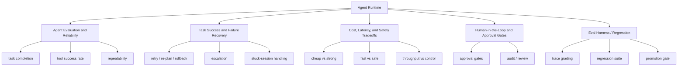

# Agent Evaluation and Governance Map

## 怎么读这张图

- 左边是 agent 系统进入生产后的四个核心治理问题
- 上面更偏“怎么评这个系统到底稳不稳”
- 下面更偏“当系统真的跑起来时，怎么在成本、速度和风险之间做决策”
- 这张图最适合和 `Agent Runtime Engineering Map` 配合看：前者讲怎么搭，后者讲怎么管

## 推荐顺序

1. [[../07-Topics/Agent Runtime Architecture|Agent Runtime Architecture]]
2. [[../07-Topics/Tool Calling and Action Execution|Tool Calling and Action Execution]]
3. [[../07-Topics/Harness Engineering|Harness Engineering]]
4. [[../07-Topics/Eval Harness 与 Regression Suites|Eval Harness 与 Regression Suites]]
5. [[../07-Topics/Agent Evaluation and Reliability|Agent Evaluation and Reliability]]
6. [[../07-Topics/Task Success and Failure Recovery|Task Success and Failure Recovery]]
7. [[../07-Topics/Human-in-the-Loop and Approval Gates|Human-in-the-Loop and Approval Gates]]
8. [[../07-Topics/Cost, Latency, and Safety Tradeoffs|Cost, Latency, and Safety Tradeoffs]]

## 关联

- [[Agent Runtime Engineering Map]]
- [[Harness Feedback Loop Map]]
- [[Coding Agent Workflow Engineering Map]]
- [[../07-Topics/Evaluation and Benchmarks|Evaluation and Benchmarks]]
- [[../07-Topics/Safety Evaluation|Safety Evaluation]]
