# Agent Runtime Engineering Map

```mermaid
flowchart TD
  A["Agent Runtime Architecture"] --> T["Tool Calling and Action Execution"]
  A --> S["Session and Memory Design"]
  A --> B["Background Agents"]
  A --> D["Delegation and Task-Oriented Agents"]
  D --> M["Multi-Agent Coding Workflow"]
  A --> F["Runtime failures / postmortems"]
  F --> R["Rollout / release gates / blast radius"]
  R --> P["Plugin / memory / background failures"]
  A --> M1["MCP / CLI / Browser"]
  A --> AP["App Server / Rich Protocols"]
  A --> H["Harness Engineering"]
  A --> EH["Eval Harness / Regression"]
  A --> LM["Long-Term Memory Systems"]
  A --> SEC["Security / Sandbox / Approval"]
  A --> C["A2A / Multi-Agent Coordination"]
  A --> O["Long-Running Agent Operations"]

  B --> B1["async execution / progress / handoff"]
  D --> D1["task contract / acceptance / review"]
  S --> S1["request state / session state / durable memory / artifacts"]
  M1 --> M2["action surfaces"]
  H --> H1["environment / policy / feedback"]
  EH --> EH1["trace grading / regression / promotion"]
  LM --> LM1["thread state / durable memory / consolidation"]
  SEC --> SEC1["permissions / watch mode / audit"]
  C --> C1["delegation / remote agents / trust boundaries"]
```

## 怎么读这张图

- runtime 不是单点技术，而是一组必须同时成立的工程能力。
- 新补的主干是：`runtime -> session/memory -> background -> delegation -> multi-agent`。
- 这轮又往下补成了：`runtime -> failures/postmortems -> rollout gates -> plugin-memory-background failures`。
- 如果这几层没补齐，系统更像 tool-using chat，而不是长期工作的 agent runtime。

## 推荐阅读顺序

1. [[../07-Topics/Agent Runtime Architecture|Agent Runtime Architecture]]
2. [[../07-Topics/Tool Calling and Action Execution|Tool Calling and Action Execution]]
3. [[../07-Topics/Session and Memory Design|Session and Memory Design]]
4. [[../07-Topics/Background Agents|Background Agents]]
5. [[../07-Topics/Delegation and Task-Oriented Agents|Delegation and Task-Oriented Agents]]
6. [[../07-Topics/Multi-Agent Coding Workflow|Multi-Agent Coding Workflow]]
7. [[../07-Topics/Agent Runtime 失败模式、事故复盘与 Postmortems|Agent Runtime 失败模式、事故复盘与 Postmortems]]
8. [[../07-Topics/Runtime 发布门槛、灰度与 Blast Radius 控制|Runtime 发布门槛、灰度与 Blast Radius 控制]]
9. [[../07-Topics/Plugin、Memory 与 Background Task 失效模式|Plugin、Memory 与 Background Task 失效模式]]
10. [[../07-Topics/Harness Engineering|Harness Engineering]]
