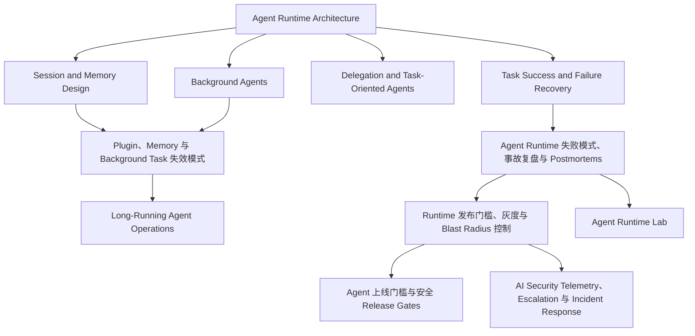

# Agent Runtime 失败、发布与恢复图

## 怎么读这张图

- runtime 的下半场不是“加更多工具”，而是：
  - 失败模式
  - rollout 控制
  - 恢复能力
- 新补的三页本质上是在回答：
  - 为什么 runtime 会出事故
  - 为什么 rollout 容易把事故放大
  - 为什么 plugin / memory / background 这三层最容易把问题藏起来

## 推荐阅读顺序

1. [[../07-Topics/Agent Runtime Architecture|Agent Runtime Architecture]]
2. [[../07-Topics/Session and Memory Design|Session and Memory Design]]
3. [[../07-Topics/Background Agents|Background Agents]]
4. [[../07-Topics/Task Success and Failure Recovery|Task Success and Failure Recovery]]
5. [[../07-Topics/Agent Runtime 失败模式、事故复盘与 Postmortems|Agent Runtime 失败模式、事故复盘与 Postmortems]]
6. [[../07-Topics/Runtime 发布门槛、灰度与 Blast Radius 控制|Runtime 发布门槛、灰度与 Blast Radius 控制]]
7. [[../07-Topics/Plugin、Memory 与 Background Task 失效模式|Plugin、Memory 与 Background Task 失效模式]]
8. [[../06-Projects/Agent Runtime Lab/项目总览|Agent Runtime Lab]]
