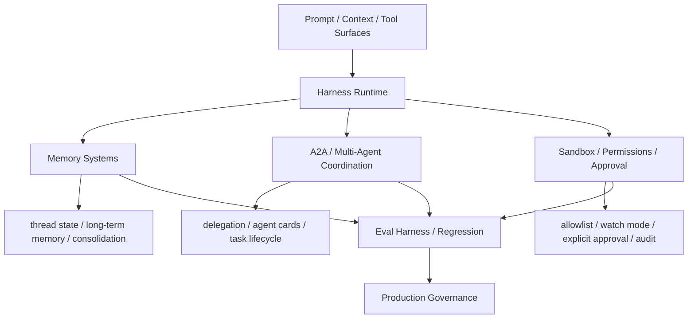

# Agent 协作、记忆与信任边界图

## 怎么读这张图

- `Harness Runtime` 是中枢
- 记忆、协作、安全不是三条并列装饰线，而是长期 agent 系统的三大硬边界
- 它们最后都必须回到 `Eval Harness / Regression`，否则只能靠 demo 和直觉判断系统好坏

## 推荐顺序

1. [[../07-Topics/Harness Engineering|Harness Engineering]]
2. [[../07-Topics/长期运行 Agent 的记忆系统|长期运行 Agent 的记忆系统]]
3. [[../07-Topics/A2A 与 Multi-Agent Coordination|A2A 与 Multi-Agent Coordination]]
4. [[../07-Topics/Agent Security、Sandbox 与 Approval Architecture|Agent Security、Sandbox 与 Approval Architecture]]
5. [[../07-Topics/Eval Harness 与 Regression Suites|Eval Harness 与 Regression Suites]]

## 关联

- [[Agent Runtime Engineering Map]]
- [[Agent Context and Integration Engineering Map]]
- [[Harness Feedback Loop Map]]
- [[Agent Evaluation and Governance Map]]
