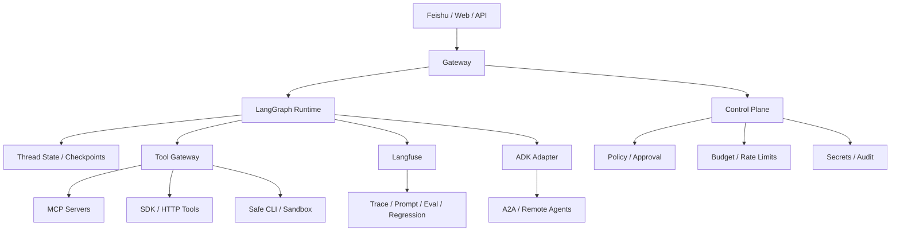

# Agent 平台技术栈图

## 这张图想表达什么

- `LangGraph` 更像主 runtime
- `Langfuse` 更像观察、评测和版本控制面
- `ADK` 更像互操作层和第二运行时
- `MCP / SDK / CLI` 是三类工具面，不该互相替代
- `Feishu / Web / API` 是 channel layer，不应该直接承载核心业务逻辑

## 推荐顺序

1. [[../07-Topics/Agent Runtime Architecture|Agent Runtime Architecture]]
2. [[../07-Topics/Harness Engineering|Harness Engineering]]
3. [[../07-Topics/Agent SDK 设计|Agent SDK 设计]]
4. [[../07-Topics/Tool Gateway、MCP Servers 与 SDK Tools|Tool Gateway、MCP Servers 与 SDK Tools]]
5. [[../07-Topics/飞书与 Lark 作为 Agent Channel Adapter|飞书与 Lark 作为 Agent Channel Adapter]]
6. [[../07-Topics/Agent 平台架构（LangGraph、Langfuse、ADK）|Agent 平台架构（LangGraph、Langfuse、ADK）]]

## 关联

- [[Agent Context and Integration Engineering Map]]
- [[Agent Action Surfaces and Protocols Map]]
- [[Harness Feedback Loop Map]]
- [[../../AI-Learning/07-Maps/Agent 平台生态图|Agent 平台生态图]]
