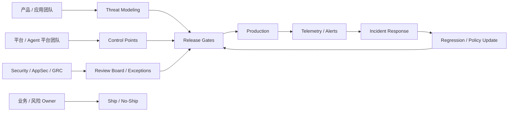

# Enterprise AI Security Operating Model Map

## 怎么读

- 左边是组织角色
- 中间是控制和审批
- 右边是生产、事件与回流闭环

## 关联

- [[AI Security 控制点图]]
- [[../07-Topics/Enterprise AI Security Operating Model|Enterprise AI Security Operating Model]]
- [[../07-Topics/AI Security Telemetry、Escalation 与 Incident Response|AI Security Telemetry、Escalation 与 Incident Response]]
- [[../06-Projects/AI Security Governance/项目总览|AI Security Governance]]
