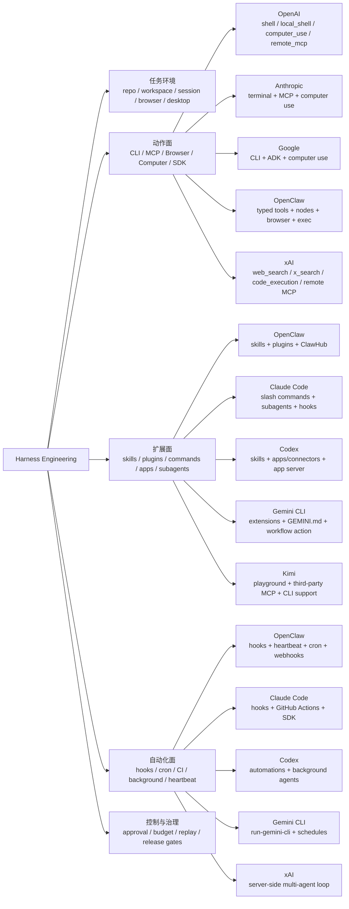

# Harness Engineering 与 Agent 扩展生态图

## 这张图怎么读

- 左边是 `Harness Engineering` 的抽象结构。
- 中间三层是最值得学的实际问题：动作面、扩展面、自动化面。
- 右边是各家厂商把这些层做成了什么具体产品能力。

## 推荐阅读顺序

1. [[../07-Topics/Harness Engineering|Harness Engineering]]
2. [[../07-Topics/MCP 与 CLI 模式|MCP 与 CLI 模式]]
3. [[../07-Topics/Computer Use Runtime and Safety|Computer Use Runtime and Safety]]
4. [[../07-Topics/技能、插件、应用与自动化：Harness 的扩展面|技能、插件、应用与自动化：Harness 的扩展面]]
5. [[../07-Topics/Harness 工作流模式：Terminal、Desktop、Cloud 与 Channel|Harness 工作流模式：Terminal、Desktop、Cloud 与 Channel]]
6. [[../07-Topics/Hooks、Cron、CI 与 Background Agents：Harness 自动化闭环|Hooks、Cron、CI 与 Background Agents：Harness 自动化闭环]]
7. [[../07-Topics/Harness 工程案例：Codex、Claude Code、OpenClaw、Gemini CLI|Harness 工程案例：Codex、Claude Code、OpenClaw、Gemini CLI]]
8. [[../../AI-Learning/09-Systems/OpenClaw 的技能、插件、应用与自动化生态|OpenClaw 的技能、插件、应用与自动化生态]]
9. [[../../AI-Learning/09-Systems/Agent 能力扩展对比：OpenClaw、Codex、Claude Code、Gemini CLI、Grok、Kimi|Agent 能力扩展对比：OpenClaw、Codex、Claude Code、Gemini CLI、Grok、Kimi]]
10. [[Harness 工作流与自动化模式图]]
11. [[Harness Engineering 深度学习导航.canvas|Harness Engineering 深度学习导航（Canvas）]]
12. [[Harness Engineering 深度学习导航.base|Harness Engineering 深度学习导航（Base）]]

## 关联

- [[../07-Topics/Harness Engineering|Harness Engineering]]
- [[../07-Topics/技能、插件、应用与自动化：Harness 的扩展面|技能、插件、应用与自动化：Harness 的扩展面]]
- [[Harness 工作流与自动化模式图]]
- [[Agent Runtime Engineering Map]]
- [[Agent Action Surfaces and Protocols Map]]
- [[Harness Feedback Loop Map]]
