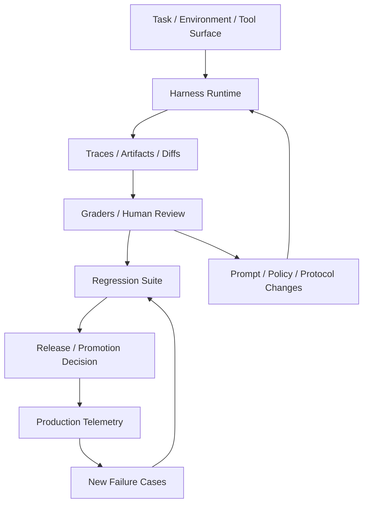

# Harness Feedback Loop Map

## 怎么读这张图

- harness 不只是执行环境，还要和 `trace -> grading -> regression -> promotion` 连成闭环
- 线上 telemetry 和 incident case 不是尾部工作，而是 regression suite 的补样入口
- 所以成熟 agent 团队往往不是“写 prompt -> 看感觉”，而是“改 harness -> 跑 suite -> 比版本 -> 再放量”

## 推荐顺序

1. [[../07-Topics/Harness Engineering|Harness Engineering]]
2. [[../07-Topics/Eval Harness 与 Regression Suites|Eval Harness 与 Regression Suites]]
3. [[../07-Topics/Agent Evaluation and Reliability|Agent Evaluation and Reliability]]
4. [[../07-Topics/Task Success and Failure Recovery|Task Success and Failure Recovery]]
5. [[../07-Topics/Cost, Latency, and Safety Tradeoffs|Cost, Latency, and Safety Tradeoffs]]

## 关联

- [[Agent Runtime Engineering Map]]
- [[Agent Evaluation and Governance Map]]
- [[Agent Context and Integration Engineering Map]]
