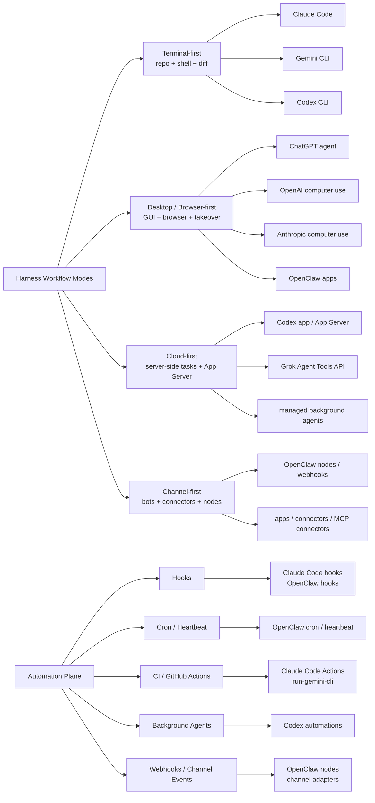

# Harness 工作流与自动化模式图

## 这张图怎么用

- 先看上半部分：任务更自然地属于哪一种工作流模式。
- 再看下半部分：这个模式通常怎样进入自动化闭环。
- 最后再回到具体厂商，判断它的优势是不是刚好匹配你的任务。

## 推荐顺序

1. [[../07-Topics/Harness Engineering|Harness Engineering]]
2. [[../07-Topics/Harness 工作流模式：Terminal、Desktop、Cloud 与 Channel|Harness 工作流模式：Terminal、Desktop、Cloud 与 Channel]]
3. [[../07-Topics/Hooks、Cron、CI 与 Background Agents：Harness 自动化闭环|Hooks、Cron、CI 与 Background Agents：Harness 自动化闭环]]
4. [[../07-Topics/Harness 工程案例：Codex、Claude Code、OpenClaw、Gemini CLI|Harness 工程案例：Codex、Claude Code、OpenClaw、Gemini CLI]]
5. [[Harness Engineering 与 Agent 扩展生态图]]
6. [[../06-Projects/Harness Lab/项目总览|Harness Lab]]

## 关联

- [[Harness Engineering 与 Agent 扩展生态图]]
- [[Harness Feedback Loop Map]]
- [[Agent Action Surfaces and Protocols Map]]
- [[../07-Topics/Harness Engineering|Harness Engineering]]
- [[../07-Topics/技能、插件、应用与自动化：Harness 的扩展面|技能、插件、应用与自动化：Harness 的扩展面]]
