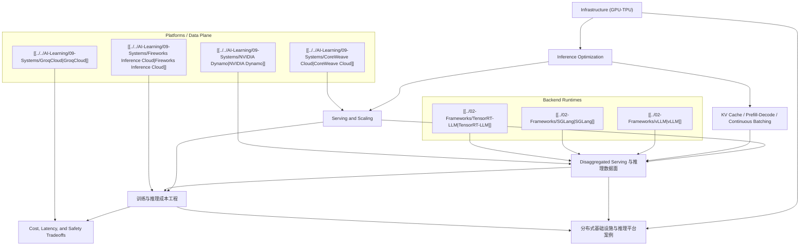

# Inference and Serving Map

## 怎么读这张图

- 左边主线：从 infra、runtime、serving 到 data plane 的工程主线。
- 中间新增：把成本工程和 cost-latency-safety tradeoff 接到 serving 主线里。
- 右侧案例：用 `Dynamo / Groq / Fireworks / CoreWeave` 把抽象层落回真实平台。

## 推荐阅读顺序

1. [[../07-Topics/Infrastructure (GPU-TPU)|Infrastructure (GPU-TPU)]]
2. [[../07-Topics/Inference Optimization|Inference Optimization]]
3. [[../07-Topics/Serving and Scaling|Serving and Scaling]]
4. [[../07-Topics/Disaggregated Serving 与推理数据面|Disaggregated Serving 与推理数据面]]
5. [[../07-Topics/训练与推理成本工程|训练与推理成本工程]]
6. [[../07-Topics/Cost, Latency, and Safety Tradeoffs|Cost, Latency, and Safety Tradeoffs]]
7. [[../07-Topics/分布式基础设施与推理平台案例：Cloud TPU、TorchTitan、Dynamo、Groq、Fireworks|分布式基础设施与推理平台案例：Cloud TPU、TorchTitan、Dynamo、Groq、Fireworks]]
