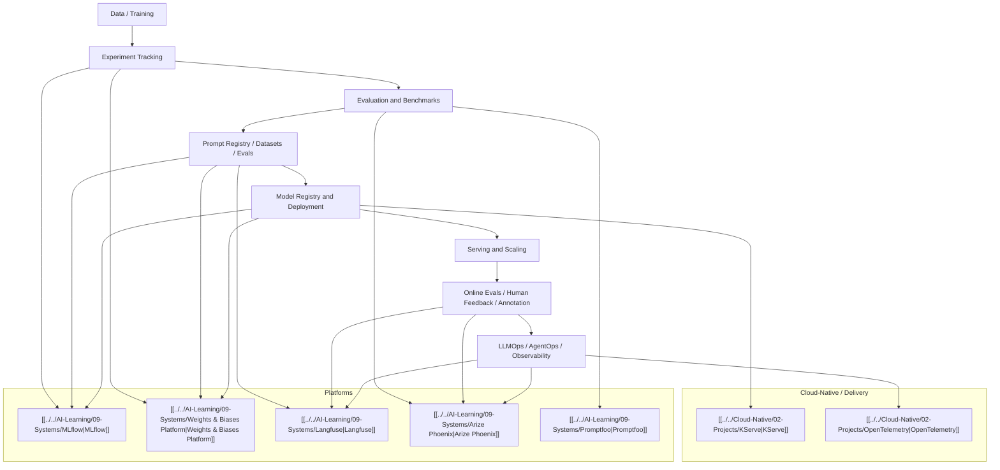

# MLOps 与 LLMOps 工程图

## 这张图想说明什么

- `MLOps` 不是单点工具，而是一条生命周期
- `LLMOps` 让 prompt、dataset、trace 和 human feedback 成为一等资产
- `AgentOps` 不是另起炉灶，而是在 observability 和 release gate 上再加 action / memory / approval 维度

## 推荐顺序

1. [[../07-Topics/Experiment Tracking|Experiment Tracking]]
2. [[../07-Topics/Evaluation and Benchmarks|Evaluation and Benchmarks]]
3. [[../07-Topics/Prompt Registry、Datasets 与 Evals|Prompt Registry、Datasets 与 Evals]]
4. [[../07-Topics/Model Registry and Deployment|Model Registry and Deployment]]
5. [[../07-Topics/Online Evals、Human Feedback 与 Annotation|Online Evals、Human Feedback 与 Annotation]]
6. [[../07-Topics/LLMOps、AgentOps 与 Observability|LLMOps、AgentOps 与 Observability]]

## 关联

- [[AI Engineering Stack Map]]
- [[Inference and Serving Map]]
- [[../../AI-Learning/07-Maps/MLOps 与 LLMOps 生态图|MLOps 与 LLMOps 生态图]]
