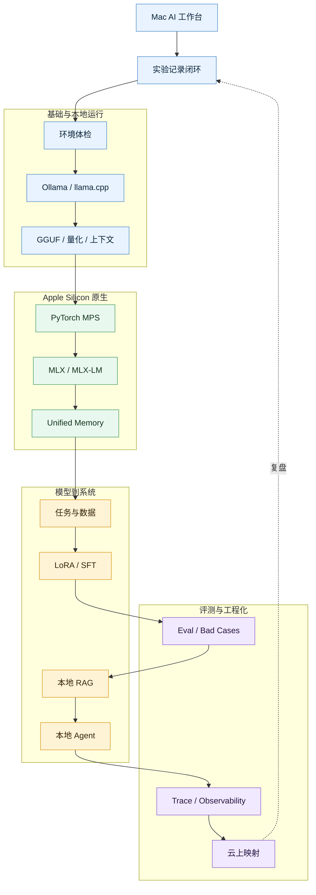

# Mac 本地 AI 专家路径图

## 阅读入口

- [[../06-Projects/Mac AI Expert Path/Mac AI 工作台：从今天开始|Mac AI 工作台：从今天开始]]
- [[../06-Projects/Mac AI Expert Path/Mac AI 系统化实验路线图|Mac AI 系统化实验路线图]]
- [[../06-Projects/Mac AI Expert Path/Mac AI 专家 90 天路径|Mac AI 专家 90 天路径]]
