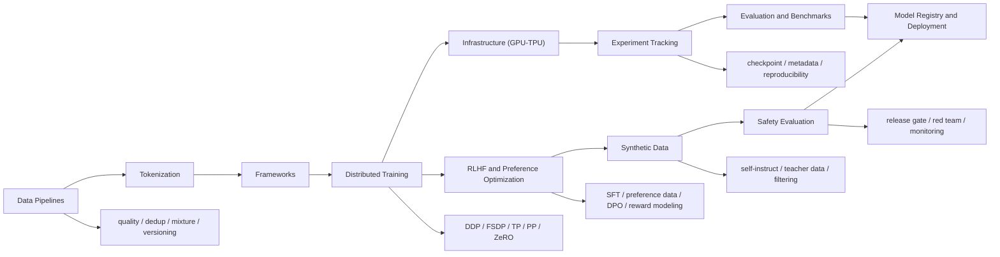

# Training Pipeline Map

## 地图目标

- 用一张图把训练基础主线串成真正可学习的系统，而不是零散术语。
- 明确 pretraining、post-training、safety eval 与 release 的衔接关系。

## 推荐阅读顺序

1. [[../07-Topics/Training Stack Overview|Training Stack Overview]]
2. [[../07-Topics/Data Pipelines|Data Pipelines]]
3. [[../07-Topics/Tokenization|Tokenization]]
4. [[../07-Topics/Frameworks (PyTorch-JAX-TensorFlow)|Frameworks (PyTorch-JAX-TensorFlow)]]
5. [[../07-Topics/Distributed Training|Distributed Training]]
6. [[../07-Topics/Infrastructure (GPU-TPU)|Infrastructure (GPU-TPU)]]
7. [[../07-Topics/RLHF and Preference Optimization|RLHF and Preference Optimization]]
8. [[../07-Topics/Synthetic Data|Synthetic Data]]
9. [[../07-Topics/Safety Evaluation|Safety Evaluation]]
10. [[../07-Topics/Experiment Tracking|Experiment Tracking]]
11. [[../07-Topics/Evaluation and Benchmarks|Evaluation and Benchmarks]]
12. [[../07-Topics/Model Registry and Deployment|Model Registry and Deployment]]

## 这张图最该帮你建立的判断

- 训练问题通常不是单点问题，而是跨层问题。
- post-training 和 safety eval 不是附录，而是训练主线的后半段。
- 没有实验记录、评测和 release gate，训练栈就不能算成熟。
