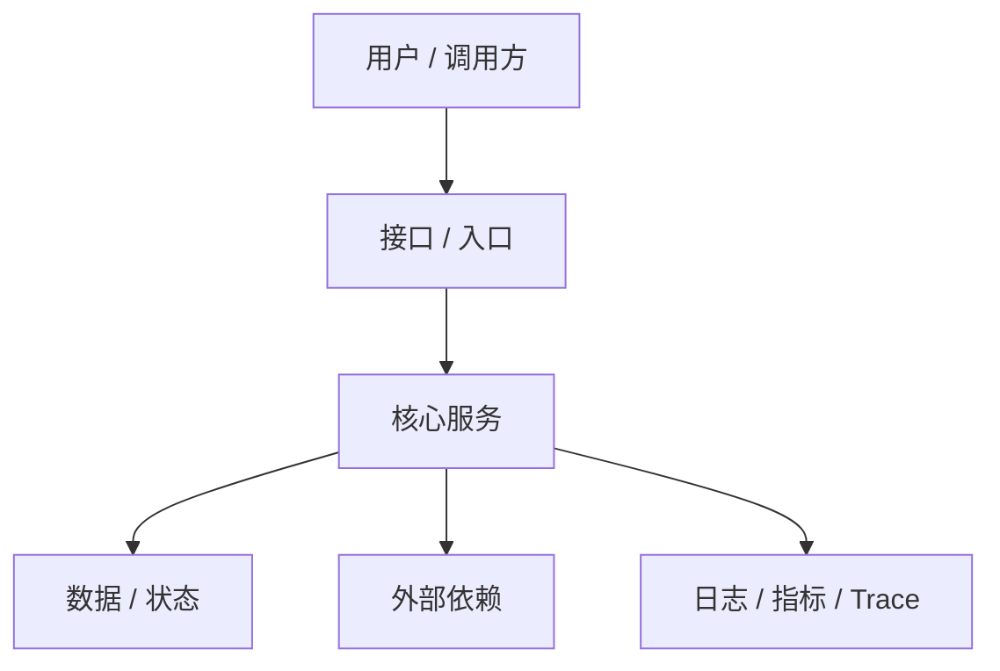

# 技术设计模板

## 架构目标

- 要解决的核心问题：
- 设计成功的判断标准：
- 主要约束：
- 不做什么：

## 背景与现状

- 当前系统状态：
- 现有痛点：
- 相关历史决策：
- 已知限制：

## 技术选型

| 选项 | 优点 | 缺点 | 风险 | 结论 |
|---|---|---|---|---|
|  |  |  |  |  |

## 高层架构图



## 高层架构

- 入口层：
- 核心服务层：
- 数据层：
- 外部依赖：
- 运维与观测：

## 组件说明

| 组件 | 职责 | 输入 | 输出 | 依赖 |
|---|---|---|---|---|
|  |  |  |  |  |

## 数据流

### 主流程

1.
2.
3.

### 异常流程

1.
2.

## 数据模型

```yaml
Entity:
  id:
  status:
  created_at:
  updated_at:
```

## 接口与协议

- API：
- Event：
- Job：
- Webhook：
- MCP / tool：

## 状态与一致性

- 状态来源：
- 幂等策略：
- 重试策略：
- 事务 / 最终一致性：
- 数据修复方式：

## 安全与权限

- 认证：
- 授权：
- 敏感数据：
- 审计：
- 滥用 / 越权风险：

## 可观测性

- logs：
- metrics：
- traces：
- alerts：
- dashboards：

## 性能与容量

- 关键路径：
- QPS / 并发：
- 延迟目标：
- 成本估算：
- 扩容策略：

## 风险与权衡

| 风险 | 影响 | 方案 | 剩余风险 |
|---|---|---|---|
|  |  |  |  |

## 扩展点

- 未来可替换组件：
- 未来可扩展场景：
- 暂时不做但预留的点：

## 测试与验证

- 单元测试：
- 集成测试：
- E2E：
- 压测：
- 安全测试：
- 回归测试：

## 发布与回滚

- 发布方式：
- 灰度策略：
- 回滚条件：
- 数据回滚：
- 兼容策略：

## 关联

- [[需求文档模板]]
- [[AI 实现任务包模板]]
- [[Agent 上线门槛模板]]
